# Mining Geotechnics & Ground Control

## Objective

Ensure workforce safety, structural stability, and operational continuity across surface open pits and underground mines through systematic ground control, rock mass characterization, and automated geotechnical-hydrological monitoring.

---

## 1. The Operational Challenge in Mining

Unlike civil infrastructure designed with high factors of safety ($FS \ge 1.5$) for 100-year lifespans, mining excavations are dynamic, aggressive operations balancing resource extraction economics with transient risk management ($FS \approx 1.2 - 1.3$).

Mining geotechnical engineering encompasses two primary environments:

1. **Surface Mining (Open Pit & Strip Mines)**: Multi-bench rock slopes reaching depths exceeding 500 m to 1,000 m. Stability is controlled by rock mass structural discontinuities, bench berm retention, pore water pressures within pit walls, and blasting-induced dynamic vibration damage.
2. **Underground Mining**: Deep shafts, declines, haulage roadways, longwalls, and stopes operating in high in-situ virgin stress environments ($\sigma_v = \rho g z$, with tectonic horizontal stresses often $\sigma_h / \sigma_v > 1.5 - 2.5$). Hazards include strainbursting, rockbursts, squeezing ground, cutter roof failure, pillar collapse, and tailings paste backfill bulkhead breach.

---

## 2. Integrated Framework: From Ground Control to ADAQS

```mermaid
flowchart TD
    subgraph GEOLOGY["1. Geology & Rock Mass Characterization"]
        G1["Core Logging & Discontinuity Mapping"]
        G2["Intact Rock Strength (UCS / Triaxial)"]
        G3["Rock Mass Classification (GSI, RMR, Q)"]
    end

    subgraph DESIGN["2. Mine Design & Ground Support"]
        D1["Pit Slope Angles (Inter-ramp & Overall)"]
        D2["Pillar Sizing (ALPS / ARMPS / Tributary Area)"]
        D3["Support Systems: Rebar, Split Sets, Cablebolts, Shotcrete"]
    end

    subgraph HAZARDS["3. Mine Hazards & Triggers"]
        H1["Highwall / Bench Ravelling & Deep Toppling"]
        H2["High Pore Pressure / Hydrostatic Cleft Pressure"]
        H3["Stress Redistribution & Dynamic Rockbursts"]
        H4["Tailings Storage Facility (TSF) Liquefaction"]
    end

    subgraph ADAQS["4. Automated Monitoring & Sensor Telemetry"]
        M1["Ground-Based Real-Time Slope Stability Radar (SSR)"]
        M2["Vibrating Wire Piezometers (VWP) in Deep Boreholes"]
        M3["Borehole Magnetic Extensometers & MPBX"]
        M4["Microseismic Sensor Network (Geophones & Accelerometers)"]
        M5["Borehole Pressure Cells (BPC) in Coal/Rock Pillars"]
    end

    subgraph ACTION["5. Trigger Action Response Plans (TARP)"]
        T1["Green: Normal Production Mining"]
        T2["Amber: Restricted Access, Enhanced Telemetry, Secondary Reinforcement"]
        T3["Red: Emergency Evacuation, Equipment Extraction, Stope Closure"]
    end

    GEOLOGY --> DESIGN
    DESIGN --> HAZARDS
    HAZARDS --> ADAQS
    ADAQS --> ACTION
```

---

## 3. Surface Mining: Open Pit Slope Stability

### Failure Modes in Open Pits
- **Bench-scale planar & wedge sliding**: Discontinuities daylighting on individual bench faces.
- **Inter-ramp & overall slope circular failure**: Occurs in highly fractured, altered, or weathered rock masses ($GSI < 40$) governed by Hoek-Brown shear strength criteria.
- **Toppling failure**: Steeply dipping joints dipping into the slope causing tall columns to topple outward.
- **Hydrogeological pore pressure surge**: Rainwater ingress filling tension cracks behind pit crests, multiplying driving forces while halving effective normal stresses ($\sigma' = \sigma - u$).

### Monitoring Regimes for Open Pits
| Instrumentation System | Measured Parameter | Application & Role |
|------------------------|--------------------|--------------------|
| **Slope Stability Radar (SSR / InSAR)** | Sub-millimeter LOS line-of-sight displacement | Real-time 24/7 scanning across pit walls; detects accelerating deformation leading to slope collapse |
| **Robotic Total Stations (RTS) + Prisms** | 3D $(x, y, z)$ vector coordinates | Long-term target tracking on crests, ramps, and haul roads |
| **Vibrating Wire Piezometers (VWP)** | Deep pore water pressure ($u$) | Evaluating depressurization boreholes and water table drawdown behind highwalls |
| **In-Place Inclinometers (IPI)** | Deep shear displacement vs depth | Pinpoints exact shear plane depth and slip velocity in overburden or weak fault zones |
| **Time Domain Reflectometry (TDR)** | Coaxial cable crimping/severing | Identifies onset of shear displacement along deep bedding slip horizons |

---

## 4. Underground Mining: Rock Mechanics & Ground Support

### Key Challenges in Underground Openings
1. **Stress Concentration**: Excavation changes stress field; tangential stresses ($\sigma_\theta$) around opening exceed intact compressive rock strength ($\sigma_c$), causing rock spalling, shearing, and cutter roof development.
2. **Pillar Design**: In room-and-pillar or longwall mining, pillars must support tributary overburden weight. Under-designed pillars yield violently, transferring load to adjacent pillars and inducing domino-style collapses.
3. **Rockbursts**: Deep mining ($> 1,000\text{ m}$) stores immense elastic strain energy ($U_e = \sigma^2 / 2E$). Fault slippage or excavation collapse triggers violent seismic energy ejection.

### Monitoring Regimes for Underground Excavations
| Instrumentation System | Measured Parameter | Application & Role |
|------------------------|--------------------|--------------------|
| **Multi-Point Borehole Extensometers (MPBX)** | Relative rock dilation at various depths (1–15 m) | Measures loosening and delamination of roof strata above bolted horizon |
| **Microseismic Monitoring Networks** | Event hypocenter location, magnitude ($M_L$), energy release | Maps stress redistribution, locates active fracturing zones, and provides early warning of rockbursts |
| **Borehole Pressure Cells (BPC / CPC)** | Change in stress within pillars ($\Delta\sigma$) | Monitors load transfer onto abutment pillars during retreat mining or longwall retreat |
| **Instrumented Rockbolts / Load Cells** | Axial load and strain distribution along bolt tendon | Verifies that ground support capacity is not exceeded by rock dilation |
| **Digital Convergence Meters** | Roof-to-floor and rib-to-rib closure | Validates numerical modelling (FLAC3D, RS2) and detects roadway closure rates |

---

## 5. Tailings Storage Facilities (TSFs) in Mining

Tailings dams represent the greatest catastrophic environmental and life-safety liability in the mining sector. As detailed in **ICOLD Bulletin 194**, monitoring TSFs requires:
- Multi-piezometer strings across dam crest, starter dam, and downstream toe to confirm phreatic line depression.
- Automated seepage monitoring flumes with turbidity sensors to flag internal erosion (piping).
- Continuous real-time InSAR satellite and GNSS displacement tracking for crest settlement and lateral spreading.

---

## 6. Comprehensive References in This Knowledge Base

This Mining section links directly into the core engineering manuals and textbooks available across this platform:

- **[Practical Rock Engineering (Dr. Evert Hoek)](../../reference-manuals/practical-rock-engineering/index.md)**: Intact rock strength, Hoek-Brown failure criterion, Geological Strength Index (GSI), rockbolt design, shotcrete support, blasting damage, and underground cavern stability.
- **[Tailings Dam Safety (ICOLD Bulletin 194)](../../reference-manuals/tailings-dam-safety/index.md)**: Critical geotechnical stewardship of mine waste storage facilities, liquefaction failure mechanisms, and emergency action plans.
- **[Physical Geology (Steven Earle)](../../reference-manuals/physical-geology/index.md)**: Structural geology, rock-forming minerals, faulting, folding, weathering, and mass wasting processes.
- **[Monitoring Dam Performance (ASCE MOP-135)](../../reference-manuals/monitoring-dam-performance/index.md)**: Failure mode analysis, surveillance philosophies, and instrument lifecycle management.
- **[Dunnicliff — Geotechnical Instrumentation](../../reference-manuals/dunnicliff/index.md)**: Fundamental instrumentation principles, procurement, sensor calibration, and systematic planning.
- **[FHWA Geotechnical Instrumentation Reference Manual](../../reference-manuals/fhwa/index.md)**: Deep foundations, rock cut slopes, and earth retaining structures.
- **[The Grand Vision & Integrated Framework](../../reference-manuals/overarching-vision.md)**: The complete synthesis linking planetary crustal geology down to automated daily sensor telemetries.
