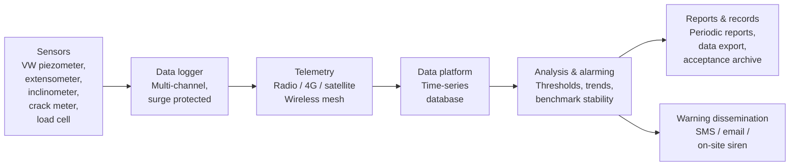

# Compliance Matrix — Decree 114/2018/ND-CP & TCVN 9398:2012

!!! abstract "What this document is"
    This is a **compliance matrix** that maps the legal obligations for **dam and reservoir safety management** and the technical requirements for **deformation monitoring of works** onto what an **Automatic Data Acquisition System (ADAQS)** must actually be able to do.

    Its purpose is to let owners, dam operators, design consultants and monitoring contractors answer one question:
    **"Does my monitoring system satisfy the law and the standards — and what is my evidence?"**

---

## 1. Purpose and scope

| Item | Content |
| --- | --- |
| **Purpose** | Turn legal and standards requirements into verifiable technical requirements for a monitoring system |
| **Intended users** | Dam owners; operators; design consultants; supervision consultants; monitoring contractors; inspection bodies |
| **Works covered** | Dams and reservoirs; buildings and industrial works; tunnels; deep excavations; embankments and soft ground |
| **Primary basis** | Decree 114/2018/ND-CP; TCVN 9398:2012 |
| **Principle** | Every requirement row must answer: *what is measured — how often — how accurately — when does it alarm — where is the record kept* |

---

## 2. Legal basis and current status

!!! warning "Check currency before relying on this"
    Vietnamese dam-safety law is **in transition**. The table below reflects the position at the time of writing — always re-check against the original texts and the latest amendments.

| Instrument | Subject | Status |
| --- | --- | --- |
| **Decree 114/2018/ND-CP** (4 Sep 2018) | Dam and reservoir safety management | **In force** — the primary basis of this document |
| **Resolution 12/2026/NQ-CP** (effective 15 May 2026) | Urgent measures in dam and reservoir safety management in emergency situations | **In force**, applying **until the decree replacing Decree 114/2018/ND-CP takes effect** |
| Decree replacing Decree 114/2018/ND-CP | Being finalised by the Ministry of Agriculture and Environment for submission to the Government | **Draft — not yet issued** (monitor closely) |
| **TCVN 9398:2012** | Surveying work in construction — General requirements | **In force** — Clause 9 governs settlement and displacement measurement |
| **TCVN 9360:2012** (and the **2024** revision) | Determining settlement of civil and industrial works by geometric levelling | **In force** — directly referenced by TCVN 9398 |

!!! danger "Compliance risk to act on now"
    Resolution 12/2026/NQ-CP is an **emergency instrument** and will lapse when the replacement decree is issued. Any monitoring dossier that cites Resolution 12/2026 must be **re-reviewed** once the new decree is published. This is precisely why an ADAQS that can **reconfigure thresholds and frequencies** — rather than hard-coding them — has long-term compliance value.

---

## 3. Part A — Decree 114/2018/ND-CP compliance matrix

### A.0 — Scope and classification of works

| Legal requirement | Content | What it means for the monitoring system |
| --- | --- | --- |
| **Article 1** | Applies to **dams from 5 m in height** or **reservoirs from 50,000 m³ in total capacity** | Establish up front whether the work falls within scope |
| **Article 3** | Classification: **especially important / large / medium / small** by dam height, reservoir capacity and downstream criticality | The class determines **monitoring frequency, instrument count and degree of automation** |

**Classification table (Article 3) — used to size the monitoring investment:**

| Class | Dam height | Reservoir capacity |
| --- | --- | --- |
| **Especially important** | ≥ 100 m | ≥ 1,000,000,000 m³ (or 500–1,000 million m³ with a critical downstream area) |
| **Large** | 15 m – < 100 m (or 10–<15 m with dam length ≥ 500 m, design spillway discharge > 2,000 m³/s) | 3,000,000 – < 1,000,000,000 m³ |
| **Medium** | 10 m – < 15 m | 500,000 – < 3,000,000 m³ |
| **Small** | < 10 m | < 500,000 m³ |

### A.1 — Obligation to install monitoring equipment

| Article | Legal requirement | Responsible party | Derived technical requirement | ADAQS solution |
| --- | --- | --- | --- | --- |
| **Article 5** | Design/construction must include **monitoring equipment per current standards**; gated dams must have an **operation monitoring system** and **information/warning equipment**; large free-spillway dams must have warning equipment | Investor / design consultant | The equipment schedule must be **quantified in the design dossier** | Instrument register with identifiers, layout drawing, channel configuration |
| **Article 14** | The owner must **install monitoring equipment** per standards; the operator must **monitor, analyse, detect abnormalities, archive and report** | Owner + operator | Must demonstrate **abnormality-detection capability** — i.e. thresholds and time-series comparison | Automatic alarm thresholds; trend detection; event log |
| **Article 20** | Gated dams in operation without an operation monitoring system and warning equipment must install them **within 2 years**; large free-spillway dams **within 3 years** | Owner (bears the cost) | A **hard deadline** — use it to plan investment | Upgrade path: analogue → digital → automated |

### A.2 — Specialised hydro-meteorological monitoring frequency (Article 15)

!!! note "This is the most-requested table — the minimum monitoring frequency"
    Source: Article 15(4), Decree 114/2018/ND-CP.

| Dam type | Dry season | Flood season | During flood-control operation | Reservoir at/above spillway crest | Above design flood level |
| --- | --- | --- | --- | --- | --- |
| **Gated (flood-regulating) dam** | 2×/day (07:00, 19:00) | 4×/day (01:00, 07:00, 13:00, 19:00) | ≥ 1×/hour | — | 4×/hour |
| **Free-spillway dam** | 2×/day (07:00, 19:00) | 4×/day (01:00, 07:00, 13:00, 19:00) while level is below the spillway crest | — | **1×/hour** | **4×/hour** |

**Consequences for the ADAQS:**

| Requirement | Technical interpretation |
| --- | --- |
| **4×/hour** frequency | Sampling interval ≤ **15 minutes** in emergency mode |
| Mode switching driven by **reservoir level** | The system must **escalate frequency automatically** on threshold, with no manual step |
| Fixed clock times (01:00, 07:00…) | Requires **time synchronisation** and trustworthy timestamps |
| Publishing data to a website | Requires an **API/data portal** able to export reports and raw data |
| Sending data to several agencies | Requires **role-based access and multiple output formats** from a single data source |

### A.3 — Dam safety inspection and audit

| Article | Obligation | Timing | Monitoring data required |
| --- | --- | --- | --- |
| **Article 16** | Continuous inspection; **pre-flood-season inspection**; **post-flood-season inspection**; inspection after heavy rain/flood or earthquake | Reports before **15 April** (Northern, North Central, Central Highlands, Southern regions) and before **15 August** (South Central region) | Reports must contain **analysed and processed monitoring results**; highest reservoir level; largest flood inflow |
| **Article 18** | **First audit**: in year **3** from impoundment to normal raised water level (or year **5**); **periodic audit every 5 years**; **extraordinary audit** on discovery of damage | 3–5 years / 5-year cycle | Requires **analysis of the historical monitoring series**, supplementary survey, check of hidden defects, settlement, landsliding |

**Implication:** monitoring data **cannot be recreated**. If a cycle is lost, the periodic audit lacks its evidence. This is the strongest technical argument for **automating and backing up** data from day one.

### A.4 — Warning thresholds and emergency situations

| Basis | Content | What it means for the system |
| --- | --- | --- |
| **Article 2** (definition) | "Emergency situation" = rain/flood exceeding design frequency; earthquake exceeding the design standard; or another impact endangering the dam | The system needs a **separate emergency mode**, distinct from normal operation |
| **Article 15(4)** | The **spillway crest level** and the **design flood level** are the two escalation thresholds for monitoring frequency | Requires **elevation-based thresholds** and automatic frequency change |
| **Article 25** | Owner/operator must prepare and review **annually** a disaster-response and emergency-response plan | The plan must be tied to the system's **actual alarm thresholds** |
| **Article 27** | Downstream flood maps must be produced within **3 years** | Requires a sufficiently long, reliable level record to calibrate the model |
| **Resolution 12/2026/NQ-CP** | Governs reservoir operation in emergency situations; prioritises flood-cutting storage | The system must **share level/discharge data in real time** across reservoirs in the basin |

---

## 4. Part B — TCVN 9398:2012 compliance matrix

### B.1 — Where deformation monitoring sits

| Clause | Requirement | Interpretation |
| --- | --- | --- |
| **4.2 c)** | Surveying for deformation monitoring comprises: **establishing the base control network, the reference benchmark network and check points** | Three tiers of monuments are **mandatory** — a few scattered measuring points will not do |
| **9.1.1** | Purpose: determine **absolute and relative** settlement/displacement, find the cause, establish stability parameters | Requires both **absolute** displacement (against the reference) and **relative** displacement (between points) |
| **9.1.2** | Measure settlement and displacement **during construction and service, until stability is achieved** | Monitoring is a **long-term obligation**, not something that ends at handover |
| **9.1.3** | Must determine: vertical displacement (settlement, deflection, heave); horizontal displacement; inclination; cracks | **Four families of quantity** → at least four families of instrument |

### B.2 — Accuracy: the most demanding requirement in the standard

**General principle (Clause 4.5):**

> The measure of accuracy is the **mean square error**. **Limit error = 2 × mean square error.**

**Accuracy classes and limit errors (Clause 9, Table 6):**

| Accuracy class | Limit error — **settlement** | Limit error — **horizontal displacement** | Typical application |
| --- | --- | --- | --- |
| **1** | 1 mm | 2 mm | Hard / semi-hard ground; design life > 50 years; important works |
| **2** | 1 mm | 5 mm | Sand and clay; highly deformable ground |
| **3** | 3 mm | 10 mm | Fill, soft ground, heavily compressed ground |

**Allowable horizontal-displacement error by anticipated magnitude and stage (Clause 9, Table 5):**

| Anticipated settlement/horizontal displacement | Sand — construction | Clay — construction | Sand — service | Clay — service |
| --- | --- | --- | --- | --- |
| < 50 mm | 1 mm | 1 mm | 1 mm | 1 mm |
| 50 – < 100 mm | 2 mm | 1 mm | 1 mm | 1 mm |
| 100 – < 250 mm | 5 mm | 2 mm | 1 mm | 2 mm |
| 250 – < 500 mm | 10 mm | 5 mm | 2 mm | 5 mm |
| > 500 mm | 15 mm | 10 mm | 5 mm | 10 mm |

**Limit error for horizontal displacement by ground type (Clause 9.3.2.4):**

| Ground / work type | Limit error |
| --- | --- |
| Bedrock | **± 1 mm** |
| Sand, clay and other compressible soils and rock | **± 3 mm** |
| Earth-rock dams under high pressure | **± 5 mm** |
| Fill and poorly compressible mud | **± 10 mm** |
| Earth-fill works | **± 15 mm** |

> Where the **direction of displacement is unknown**, monitoring must be carried out **along two mutually perpendicular directions**.

**Inclination measurement error (Clause 9.3.3.1):**

| Object | Allowable error |
| --- | --- |
| Large foundation rafts, combined machinery | 0.000 01 × *L* (L = base length) |
| Walls of industrial and civil works | 0.000 1 × *H* (H = height) |
| Chimneys, towers, tall columns | 0.000 5 × *H* |

!!! tip "This is the single most important technical selling point"
    An error of **± 1 mm to ± 3 mm** cannot be achieved by **periodic manual measurement**. This is exactly the gap that **vibrating-wire (VW) sensors, digital inclinometers and automated acquisition systems** fill — and the technical argument for moving from manual reading to an ADAQS.

### B.3 — Reference benchmarks and stability assessment

| Clause | Requirement | Implementation implication |
| --- | --- | --- |
| **9.2.2** | A **reference benchmark network** must be established before measuring horizontal displacement and inclination | Benchmarks must lie outside the deformation influence zone |
| **9.2.3** | The **stability of the benchmark network must be assessed in every cycle** | Benchmarks cannot be assumed fixed — the processing software needs a **stability-check algorithm** |
| **9.1.4** | Sequence: prepare the technical scheme → design reference and measuring monuments → set out → install → measure → compute and analyse | A **technical scheme** must be approved before construction |

### B.4 — Monitoring cycles

| Clause | Provision |
| --- | --- |
| **9.1.2** | Cycles are tied to **achieving stability**; no single fixed interval is prescribed |
| **9.3.4.2 / 9.3.4.3** | Crack measurement must follow **fixed cycles**, with **position and date marked** |
| **9.2.3** | Benchmark network stability must be assessed **in every cycle** |

!!! note "Monitoring cycle = legal frequency (Decree 114) ∩ stability condition (TCVN 9398)"
    Decree 114 sets a **frequency floor** (how many times per day). TCVN 9398 sets the **stopping condition** (when stability is achieved). A good ADAQS must satisfy **both simultaneously**.

### B.5 — Methods and referenced standards

| Clause | Quantity | Methods | Reference |
| --- | --- | --- | --- |
| **9.3.1.1** | Settlement | Geometric levelling; trigonometric levelling; hydrostatic levelling; photogrammetry | Most common: **geometric levelling** |
| **9.3.1.2** | Settlement | Technical procedure | **TCVN 9360:2012** |
| **9.3.2.1** | Horizontal displacement | Alignment method; angle–distance measurement | |
| **9.3.2.3** | Horizontal displacement (where no alignment can be established) | Angular/side intersection; triangulation; polygon traverse | |
| **9.3.3.2** | Inclination | Coordinates; horizontal angle; small angle; vertical projection; small zenith angle | |
| **9.3.4.4** | Cracks | Where width exceeds **1 mm**, the **depth** must be measured | |

### B.6 — Records, archiving and acceptance

| Clause | Requirement | Evidence required |
| --- | --- | --- |
| **10.2** | Records of the control network, setting-out network and **displacement monitoring work** must be **compiled, accepted and handed over to the investor for retention** throughout construction and service | Acceptance minutes; as-built monitoring dossier; a queryable digital database |

---

## 5. Part C — ADAQS requirements derived from Parts A + B

From the two sets of obligations, the **minimum architecture** of a monitoring system with sufficient compliance capability can be derived:

**Traceability matrix — legal requirement ↔ system capability:**

| # | Derived requirement | Basis | Mandatory system capability | Compliance evidence |
| --- | --- | --- | --- | --- |
| 1 | Continuous monitoring independent of people | Decree 114 Art. 14 | Automatic logger, backup battery, buffered memory | Activity log, data-coverage chart |
| 2 | Frequency escalating on reservoir level | Decree 114 Art. 15(4) | Configurable thresholds + emergency mode | Approved threshold configuration sheet |
| 3 | Settlement error ≤ 1–3 mm | TCVN 9398 Table 6 | High-resolution sensors, periodic calibration | Calibration certificates |
| 4 | Horizontal displacement error ≤ 1–5 mm | TCVN 9398 9.3.2.4 | Inclinometer/alignment system meeting class 1–2 | Repeat-measurement results, error analysis |
| 5 | Benchmark stability assessed every cycle | TCVN 9398 9.2.3 | Processing software with stability checking | Benchmark stability report |
| 6 | Abnormality detection and timely alarm | Decree 114 Art. 14, 25 | Automatic thresholds, multi-channel notification | Alarm log, handling minutes |
| 7 | Long-term archiving and handover to the investor | TCVN 9398 10.2; Decree 114 Art. 18 | Backed-up database, raw data export | Digital dossier handover minutes |
| 8 | Reports to multiple agencies, on time | Decree 114 Art. 16 | Report templates, role-based access | Submitted reports with timestamps |
| 9 | Support for the 5-year periodic audit | Decree 114 Art. 18 | Continuous, unbroken historical data | Intact historical data series |

---

## 6. Part D — Phase-by-phase implementation checklist

=== "Phase 1 — Design"

    - [ ] Determine whether the work falls within Decree 114 scope (Article 1)
    - [ ] Classify the work (Article 3) → determine the monitoring class
    - [ ] Prepare the monitoring technical scheme (TCVN 9398 – 9.1.4)
    - [ ] Determine the target accuracy class (Table 6) and limit errors
    - [ ] Design the base control network + reference benchmark network + check points (4.2c)
    - [ ] Define the quantities to be measured: settlement, horizontal, inclination, cracks (9.1.3)

=== "Phase 2 — Construction and installation"

    - [ ] Install monitoring equipment per current standards (Articles 5, 14)
    - [ ] Install the operation monitoring system + warning equipment (Articles 5, 20)
    - [ ] Configure alarm thresholds against reservoir elevations (Article 15(4))
    - [ ] Calibrate sensors and retain calibration certificates
    - [ ] Verify benchmark stability in the first cycle (9.2.3)

=== "Phase 3 — Operation"

    - [ ] Monitor at or above the minimum frequency (Article 15(4))
    - [ ] Escalate frequency automatically on threshold
    - [ ] Analyse, detect abnormalities, act (Article 14)
    - [ ] Pre-flood-season / post-flood-season inspection (Article 16)
    - [ ] Periodic reports before 15 April or 15 August (Article 16(3))
    - [ ] Archive, back up and hand over records (TCVN 9398 – 10.2)

=== "Phase 4 — Audit"

    - [ ] First audit in year 3 or year 5 (Article 18)
    - [ ] Periodic audit every 5 years (Article 18)
    - [ ] Extraordinary audit on discovery of damage (Article 18)
    - [ ] Analyse the historical monitoring series
    - [ ] Re-check the legal basis once the decree replacing Decree 114 is issued

---

## 7. Part E — Minimum compliance dossier

| # | Document | Basis | Update frequency |
| --- | --- | --- | --- |
| 1 | Monitoring technical scheme | TCVN 9398 – 9.1.4 | Once, revised on change |
| 2 | Measuring point and benchmark layout drawing | TCVN 9398 – 4.2c | Once |
| 3 | Equipment calibration certificates | TCVN 9398 – 9 | Per manufacturer schedule |
| 4 | Benchmark network stability report | TCVN 9398 – 9.2.3 | Every cycle |
| 5 | Alarm threshold configuration sheet | Decree 114 – Art. 15(4), 25 | Reviewed annually |
| 6 | Monitoring log and alarm log | Decree 114 – Art. 14 | Continuous |
| 7 | Pre-/post-flood-season inspection report | Decree 114 – Art. 16 | Twice a year |
| 8 | Dam safety audit report | Decree 114 – Art. 18 | Every 5 years |
| 9 | Monitoring dossier handover minutes | TCVN 9398 – 10.2 | On handover/closure |

---

## 8. Appendices

### AP-1 — Consolidated monitoring frequency table

| Mode | Applies to | Minimum frequency | Suggested ADAQS sampling interval |
| --- | --- | --- | --- |
| Dry season | All dam types | 2×/day | Once per hour (background) |
| Flood season | All dam types | 4×/day | Every 15 minutes |
| Flood-control operation | Gated dams | ≥ 1×/hour | Every 5 minutes |
| Level at/above spillway crest | Free-spillway dams | 1×/hour | Every 5 minutes |
| Above design flood level | All dam types | 4×/hour | Every 1 minute (emergency) |

### AP-2 — Accuracy classes at a glance

| Class | Settlement limit error | Horizontal limit error | Typical ground |
| --- | --- | --- | --- |
| 1 | 1 mm | 2 mm | Bedrock, hard/semi-hard ground, important works |
| 2 | 1 mm | 5 mm | Sand, clay, highly deformable ground |
| 3 | 3 mm | 10 mm | Fill, soft ground, heavily compressed ground |

### AP-3 — Instrument families mapped to standard requirements

| Quantity (TCVN 9398 – 9.1.3) | Typical accuracy class | Instrument family | Typical application |
| --- | --- | --- | --- |
| Pore water pressure / groundwater level | — | Vibrating-wire piezometer, pneumatic piezometer | Seepage through dam body and foundation, deep excavation |
| Horizontal displacement in borehole | 1–2 | Inclinometer (in-place array, manual probe, digital system) | Slope failure, tunnel walls, excavation retaining walls |
| Horizontal displacement outside the structure | 1–2 | Tiltmeter, optical alignment | Walls, columns, high-rise structures |
| Settlement / vertical displacement | 1–3 | Extensometer, magnetic settlement system, geometric levelling | Embankments, soft-soil consolidation, foundations |
| Inclination | 9.3.3.1 | Tiltmeter, structural tilt sensor | Towers, chimneys, retaining walls |
| Cracks | — | Crack meter, joint meter | Concrete structures, walls, tunnels |
| Load / stress | — | Load cell, strain gauge, stressmeter | Anchors, struts, steel structures |
| Vibration / blasting | — | Blast vibration monitor | Sites near residential areas |

### AP-4 — English–Vietnamese glossary

| English | Tiếng Việt |
| --- | --- |
| Automatic Data Acquisition System (ADAQS) | Hệ thống thu thập dữ liệu tự động |
| Vibrating wire (VW) sensor | Cảm biến dây rung |
| Piezometer | Đầu đo áp lực nước lỗ rỗng / áp kế |
| Extensometer | Thiết bị đo biến dạng dọc trục |
| Inclinometer | Thiết bị đo chuyển dịch ngang lỗ khoan |
| Tiltmeter | Đầu đo độ nghiêng |
| Crack meter / joint meter | Đầu đo vết nứt / khe nối |
| Load cell | Đầu đo tải trọng |
| Strain gauge | Tenzơ đo biến dạng |
| Data logger | Đầu ghi dữ liệu |
| Telemetry | Truyền dữ liệu từ xa |
| Reference benchmark | Mốc chuẩn |
| Control network | Lưới khống chế |
| Monitoring cycle | Chu kỳ quan trắc |
| Warning threshold | Ngưỡng cảnh báo |
| Settlement | Độ lún |
| Horizontal displacement | Chuyển dịch ngang |
| Pore water pressure | Áp lực nước lỗ rỗng |
| Seepage | Thấm |
| Spillway | Tràn xả lũ |
| Normal raised water level (MNDBT) | Mực nước dâng bình thường |
| Design flood level (MNLTK) | Mực nước lũ thiết kế |
| As-built records | Hồ sơ hoàn công |
| Acceptance | Nghiệm thu |

---

## 9. Disclaimer

!!! warning "Read before using this in a statutory dossier"
    This document is a **technical reference**, prepared to help engineers and owners understand and organise legal requirements. It is **not a legal instrument and does not replace the original texts**.

    - The provisions quoted from Decree 114/2018/ND-CP and TCVN 9398:2012 have been **summarised and regrouped by theme**; **article numbers, clause numbers and specific figures must be verified against the original texts** before being used in a design dossier, acceptance dossier or report to a regulator.
    - Dam-safety provisions **are being amended**; always check the currency of the instrument and of any replacement at the time of use.
    - The suggested ADAQS sampling intervals are **technical recommendations**, not legal requirements.

    *Compiled and maintained by: Vietnam Geotechnical Knowledge Base — RST Affinity.*

---

*Sources checked: Decree 114/2018/ND-CP; Resolution 12/2026/NQ-CP; TCVN 9398:2012; TCVN 9360:2012 (and the 2024 revision).*
