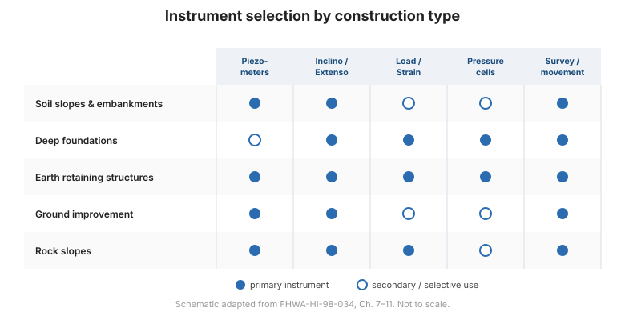

# Chapter 1 — Introduction and the Key to Success

## 1.1 Scope of this module

There are two general categories of measuring instrument in geotechnical work:

1. **Subsurface investigation instruments** — used during the *design phase* to
   determine soil and rock properties such as strength, compressibility, and
   permeability (for example, in-situ tests and borings).
2. **Performance-monitoring instruments** — used during the *construction and
   operation phases* to monitor how the ground and the structure actually behave,
   typically measuring groundwater pressure, total stress, deformation, load, or
   strain.

This reference is concerned **only with the second category**. It covers the
hardware for measuring groundwater pressure, deformation, total stress in soil,
and load and strain in structural members; a systematic approach to planning
monitoring programs; instrument selection for each type of construction; and the
general field tasks of calibration, maintenance, installation, data collection,
processing, presentation, interpretation, and reporting.

## 1.2 The general role of geotechnical instrumentation

Every geotechnical design is, to some degree, **hypothetical**. Natural materials
were created by processes that seldom produce uniform conditions, and exploratory
procedures cannot detect in advance every significant property or condition.
The designer must therefore make assumptions that may differ from reality, and
the constructor must choose equipment and procedures without full knowledge of
what will be encountered.

Field observations — including quantitative measurements from instrumentation —
are the means by which the engineer can, despite these limitations, design a
project that is safe and efficient, and by which the constructor can execute the
work with safety and economy. This is why geotechnical engineering differs from
most other branches of engineering, where practitioners have far greater control
over the materials they use. For the geotechnical engineer, instrumentation is
not an optional extra — **it is a working tool**.

The practice of geotechnical instrumentation is a **marriage between the
capabilities of measuring instruments and the capabilities of people**. Pulling
an instrument from a shelf, installing it, and taking readings may look simple,
but obtaining useful information requires considerable engineering and planning.

## 1.3 The key to success — a chain of links

Full benefit is achieved only if **every step** in the planning and execution
process is carried out with great care. The useful analogy is a **chain with many
potential weak links**: a monitoring program breaks down more easily and more
often than most other geotechnical endeavors, and the failure can usually be
traced to a weakness in one or more links.

The program has:

- **21 planning links** (Phase I), defined in [Chapter 6](chapter-06-planning.md),
  from *define the project conditions* through *write specifications for field
  instrumentation services*.
- **10 execution links** (Phase II), discussed in
  [Chapter 13](chapter-13-data-interpretation.md), from *procure instruments*
  through *implement*.

The strength of these **31 links** depends on both the instruments and the people.
Success is maximized by maximizing the strength of **every** link.

## 1.4 The golden rule

> Every instrument on a project should be selected and placed to assist with
> answering a **specific question**: **if there is no question, there should be no
> instrumentation.**

This rule, restated throughout the manual, is the single most important filter in
instrumentation planning. Instruments installed without a question become
clutter, consume budget, and — worse — can be ignored, discrediting the value of
monitoring altogether.

## 1.5 Course objectives

On completing the material in this reference, the reader should be able to:

1. **Select monitoring equipment** knowledgeably from the range of available
   instrumentation.
2. **Plan instrumentation programs** in a systematic way.
3. Understand the general role of instrumentation, the principal geotechnical
   questions, and the applicable instruments for:
    - soil slopes and embankments,
    - deep foundations,
    - earth retaining structures,
    - ground improvement techniques,
    - rock slopes.
4. Understand practical methods for calibration and maintenance, installation,
   data collection, processing and presentation, interpretation, and reporting.
5. Apply the **golden rule** to every instrument on a project.

**Figure.** Which instrument families answer the questions raised by each type of construction — the map for Chapters 7–11 (after FHWA-HI-98-034, Ch. 7–11).

## 1.6 Key takeaways

- Instrumentation for **performance monitoring** is a distinct discipline from
  subsurface investigation.
- Geotechnical design is hypothetical; instrumentation is how we test it in the
  field.
- A monitoring program is a **chain of 31 links** (21 planning + 10 execution) —
  one weak link can break it.
- **No question, no instrument.** The golden rule governs every decision.
