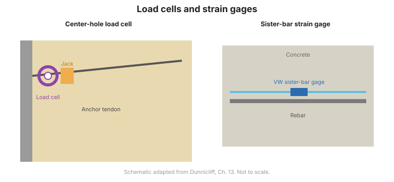

# Chapter 5 — Load, Strain & Temperature

## 5.1 Introduction

This chapter covers instruments that measure the **load** carried by a structural
member, the **strain** (and hence stress) in it, and the **temperature** that
affects both. These measurements are central to load tests on deep foundations
([Chapter 8](chapter-08-deep-foundations.md)) and to monitoring struts, anchors,
and ties in earth retaining structures ([Chapter 9](chapter-09-earth-retaining.md)).

## 5.2 Load cells

A **load cell** measures the force in a member it is inserted into or placed under:

- **Hydraulic load cells** — a fluid-filled pad; applied load raises the fluid
  pressure, which is read on a gage or transducer. Robust and simple.
- **Electrical resistance load cells** — strain gages bonded to a member convert
  load to an electrical signal.
- **Calibrated hydraulic jacks with a center hole** — used to apply and measure
  load in tensioning operations (for example, anchors and rock bolts). A caution:
  the load determined from fluid pressure in a jack can carry a **systematic error**
  from friction, so jacks must be **calibrated**.

**Figure.** Load cells and strain gages: hydraulic and electrical load cells measure member force, while bonded and vibrating-wire gages measure strain (after FHWA-HI-98-034, Ch. 5).

## 5.3 Surface-mounted strain gages

- **Mechanical strain gages** — e.g., the **Demec** gage, which measures the change
  in distance between two reference discs on a surface.
- **Surface-mounted vibrating-wire strain gages** — welded or bonded to a steel
  member; robust and suited to long-term monitoring.
- **Surface-mounted electrical resistance strain gages** — bonded foil gages for
  short-term, high-resolution measurements.

**Relationship between strain and stress:** converting measured strain to stress
requires the member's **elastic modulus** ($\sigma = E\varepsilon$). This conversion
is a common source of error and must be handled explicitly.

## 5.4 Embedment strain gages

- **Vibrating-wire embedment strain gages** — cast into concrete to measure internal
  strain over the long term.
- **Electrical resistance embedment gages** — for shorter-term measurements.
- **Relationship between strain and stress** — as above, but for concrete the
  modulus, creep, and thermal effects all require care.

## 5.5 Sister bars

A **sister bar** is a short length of reinforcing bar instrumented with
vibrating-wire gages, tied alongside the main reinforcement. It measures the strain
in the rebar at that location, which is used to estimate the load the concrete
section carries — a standard technique for load tests and for monitoring
instrumented sections.

## 5.6 Multiple telltales for stress determination

**Multiple telltales** — anchors at several depths referenced to a stable head —
resolve the relative movement between points, from which the **strain** in each
interval (and hence the load distribution) can be determined.

## 5.7 Temperature measurement

Temperature affects vibrating-wire and strain instruments, and thermal movement can
dominate measured deformation. Temperature is measured with:

- **Thermistors and resistance temperature detectors (RTDs)** — accurate, easily
  logged.
- **Thermocouples** — wide range, lower absolute accuracy.
- **Vibrating-wire temperature sensors** — convenient when sharing the same logger
  as the strain instruments.

Instruments and dataloggers should record temperature alongside strain so that
**thermal corrections** can be applied.

## 5.8 Key takeaways

- **Load cells** measure member force; **strain gages** measure strain, which
  converts to stress via the **elastic modulus**.
- **Calibrate hydraulic jacks** — fluid-pressure readings carry friction error.
- **Sister bars** and **multiple telltales** are the practical way to instrument
  reinforcement and resolve load distribution.
- Always record **temperature** with load/strain data so corrections can be made.
