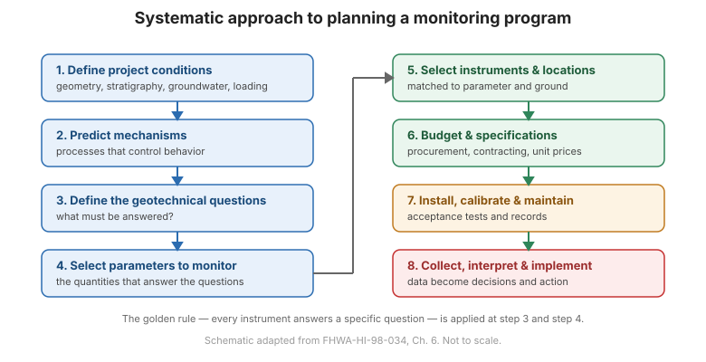

# Chapter 6 — Systematic Approach to Planning Monitoring Programs

## 6.1 Introduction

Planning is the **hub** of a successful monitoring program. The FHWA manual
organizes it as a disciplined sequence of steps, each of which is a link in the
chain of 31 (21 planning + 10 execution). Skipping a step weakens the chain. The
process begins with a definition of the objective and ends only when the data are
**implemented** — that is, used to make a decision.

The planning steps below correspond to **Table 1-1** of the manual.

## 6.2 The 21 planning steps (Phase I)

1. **Define the project conditions** — geometry, stratigraphy, groundwater, loading,
   and construction sequence.
2. **Predict mechanisms that control behavior** — what physical processes will
   govern the response (e.g., consolidation, shear, seepage)?
3. **Define the geotechnical questions that need to be answered** — the questions
   drive everything that follows.
4. **Define the purpose of the instrumentation** — what decision will the data
   inform?
5. **Select the parameters to be monitored** — the quantities that answer the
   questions.
6. **Predict magnitudes of change** — expected values set the required range,
   resolution, and accuracy.
7. **Devise remedial action** — decide in advance what will be done if thresholds
   are exceeded.
8. **Assign tasks** — for design, construction, and operation phases; use a task
   assignment chart.
9. **Select instruments** — matched to parameter, range, and ground conditions.
10. **Select instrument locations** — where the measurement best answers the
    question.
11. **Plan recording of factors that may influence measured data** — weather,
    construction activity, load, temperature.
12. **Establish procedures for ensuring reading correctness** — calibration, checks,
    and cross-checks.
13. **List the specific purpose of each instrument** — the golden rule, written down.
14. **Prepare a budget.**
15. **Prepare the instrumentation system design report.**
16. **Write instrument procurement specifications.**
17. **Plan installation.**
18. **Plan regular calibration and maintenance.**
19. **Plan data collection, processing, presentation, interpretation, reporting, and
    implementation.**
20. **Write specifications for field instrumentation services.**
21. **Update the budget.**

## 6.3 The 10 execution steps (Phase II)

1. Procure instruments.
2. Perform pre-installation acceptance tests.
3. Install instruments.
4. Perform post-installation acceptance tests.
5. Calibrate and maintain instruments.
6. Collect data.
7. Process and present data.
8. Interpret data.
9. Report conclusions.
10. **Implement** — act on the conclusions.

**Figure.** The systematic planning workflow: define conditions → predict mechanisms → define questions → select parameters → select instruments and locations → budget and specify → install → collect, process, interpret, and implement (after FHWA-HI-98-034, Ch. 6).

## 6.4 Specifications and contracting

Procurement is part of planning, not an afterthought. The manual gives contents for:

- **Low-bid specifications for procurement of instrumentation materials.**
- **Low-bid specifications for field instrumentation services.**
- **Possible unit-price payment items.**

Clear specifications — covering calibration, acceptance testing, installation
tolerances, and documentation — are what make the difference between a system that
works and one that quietly fails.

## 6.5 The golden rule, applied

At **Step 13**, every instrument must have a written, specific purpose. This is the
golden rule of [Chapter 1](chapter-01-introduction.md) turned into a planning
deliverable: if you cannot write the question the instrument answers, delete the
instrument.

## 6.6 Key takeaways

- Planning is a **sequence of 21 steps**; execution adds 10 more.
- **Questions come first** — parameters, instruments, and locations all follow.
- **Predict magnitudes** to set the required range and resolution.
- **Decide the remedial action** before you need it.
- **Specifications and budgets are part of planning.**
- Write down the **purpose of every instrument** — no question, no instrument.
