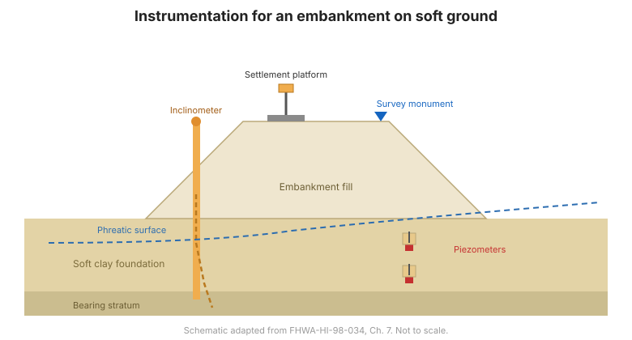

# Chapter 7 — Instrumentation for Soil Slopes & Embankments

## 7.1 Introduction

For each type of construction, the FHWA manual presents two things: the **general
role** of geotechnical instrumentation, and the **principal geotechnical questions**
that may arise together with the instruments that can help answer them. This
chapter covers soil slopes and embankments.

## 7.2 Embankments on soft ground

**General role.** Instrumentation monitors consolidation, stability, and the
effectiveness of staged construction. Pore-pressure response controls the safe rate
of fill placement; settlement and horizontal movement show whether the foundation
is behaving as predicted.

**Principal geotechnical questions:**

- Is the embankment stable, or is a bearing-capacity / slope failure developing?
- How fast is the soft foundation consolidating, and is staged construction
  proceeding safely?
- How much settlement has occurred, and where?

**Suitable instruments** (Table 7-1) typically include: **piezometers** (pore
pressure), **settlement platforms** and **subsurface settlement points** (settlement),
**inclinometers** (lateral movement), and **liquid-level gages** (settlement
profile).

## 7.3 Cut slopes in soil

**General role.** Instrumentation detects the onset of instability and measures the
rate of movement, so that construction or traffic can be adjusted.

**Principal geotechnical questions:**

- Is the cut slope stable, and what is the rate of movement?
- Where is the active shear zone?
- Is pore pressure rising toward a critical condition?

**Suitable instruments** (Table 7-2) typically include: **inclinometers** (shear
zone and movement), **piezometers** (pore pressure), **crack gages** (tension
cracks), and **survey monuments**.

## 7.4 Landslides in soil

**General role.** Instrumentation characterizes an existing or reactivated landslide
— its geometry, rate, and controlling pore pressures — to guide stabilization and
monitor its effectiveness.

**Principal geotechnical questions:**

- How deep and how fast is the landslide moving?
- What pore pressures drive it, and how do they respond to rainfall?
- Is the stabilization working?

**Suitable instruments** (Table 7-3) typically include: **inclinometers** and
**TDR** (shear zone and rate), **piezometers** (pore pressure), **surface survey**
and **extensometers** (movement), and **rain gauges** (triggering).

**Figure.** Typical instrumentation for a soil slope / embankment: inclinometer and piezometer in the slope, settlement platforms on the embankment, and survey monuments (after FHWA-HI-98-034, Ch. 7).

## 7.5 Student exercise — planning a soil-slope program

The manual includes a worked **student exercise** for planning a monitoring program
for a soil slope. It steps through the planning process:

- **Step 1** — definition of project conditions.
- **Step 3** — predict mechanisms that control behavior.
- **Step 4** — define the geotechnical questions that need to be answered.
- **Step 6** — select the parameters to be monitored.
- **Step 7** — predict magnitudes of change.
- **Step 10** — select instruments.
- **Step 12** — plan recording of factors that may influence measured data.

Worked example results are provided in **Appendix C** (see
[Chapter 14](chapter-14-references-appendices.md)).

## 7.6 Key takeaways

- For embankments on soft ground, **pore pressure controls the safe rate of
  filling** — instrument it first.
- For cut slopes and landslides, the **inclinometer** locates the shear zone and
  measures rate; **piezometers** explain the driving pressures.
- Combine **surface survey** with **subsurface instruments** for a complete picture.
- The **student exercise** is the planning process ([Chapter 6](chapter-06-planning.md))
  applied end-to-end — practice it.
