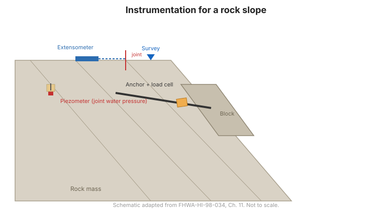

# Chapter 11 — Instrumentation for Rock Slopes

## 11.1 Introduction

Rock slopes fail along **discontinuities** — joints, bedding planes, and faults —
rather than through intact rock. Instrumentation for rock slopes therefore focuses
on the movement of discrete blocks and on the water pressures acting on the
discontinuities that could trigger sliding.

## 11.2 Cut slopes in rock

**General role.** Instrumentation detects block movement and the water pressures
driving it, so that support or drainage can be adjusted.

**Principal geotechnical questions:**

- Are individual blocks moving, and how fast?
- What water pressures act on the discontinuities?
- Is the support (bolts, anchors, mesh) performing as intended?

**Suitable instruments** (Table 11-1) typically include: **inclinometers and
extensometers** (block movement), **crack/block gages** (relative movement of
blocks), **piezometers** (joint water pressure), **load cells** (anchor/bolt loads),
and **survey**.

## 11.3 Landslides in rock

**General role.** Instrumentation characterizes the geometry and rate of a rock
slide and the pore pressures controlling it, to guide stabilization and verify its
effectiveness.

**Principal geotechnical questions:**

- How deep and how fast is the slide?
- What joint water pressures drive it?
- Is the stabilization (anchors, drainage) working?

**Suitable instruments** (Table 11-2) typically include: **inclinometers and TDR**
(shear zone and rate), **piezometers** (joint water pressure), **extensometers**,
**load cells** on anchors, and **rain gauges**.

**Figure.** Instrumentation for a rock slope: extensometers and inclinometers to detect block movement, piezometers to measure joint water pressure, load cells on anchors, and surface survey (after FHWA-HI-98-034, Ch. 11).

## 11.4 Key takeaways

- Rock slopes fail along **discontinuities** — instrument the **blocks**, not the
  intact rock.
- **Joint water pressure** is the key driving variable; measure it with piezometers.
- **Extensometers, crack gages, and survey** capture block movement.
- **Load cells on anchors and bolts** confirm the support is carrying load.
