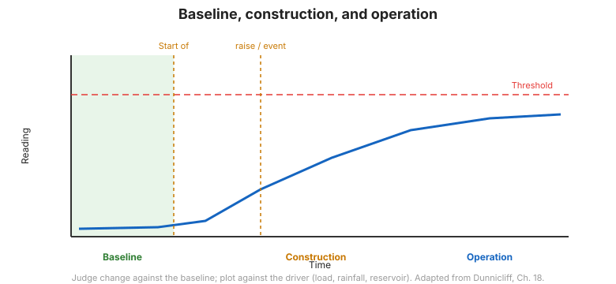

# Chapter 13 — Data Collection, Processing, Interpretation & Reporting

## 13.1 Introduction

Data are only valuable when they are collected reliably, processed consistently,
interpreted correctly, and **reported to the people who can act**. This chapter
covers the last execution links of the chain — the ones that convert readings into
decisions.

## 13.2 Data collection

- **Frequency** should match the rate of change: read more often when the risk is
  highest (during critical construction stages, after rainfall, after seismic
  events).
- Use **field data sheets** (Figure 12-2 shows a typical probe-extensometer sheet)
  so that raw readings, instrument ID, and conditions are captured consistently.
- Record the **factors that may influence the data** — weather, construction
  activity, load, and temperature — alongside the reading, so cause and effect can
  later be established.

## 13.3 Processing and presentation

- Convert raw readings to engineering units using the **current calibration**.
- Present data as **time-series plots** and, where relevant, as **profile plots**
  (e.g., inclinometer deflection with depth).
- Plot the **influencing factors** on the same time axis — load, rainfall, pond
  level — so that relationships are visible.

## 13.4 Interpretation

Interpretation asks *what the data mean*, not merely *what the numbers are*:

- Compare against **predicted magnitudes** from planning
  ([Chapter 6](chapter-06-planning.md)).
- Look for **cause-and-effect relationships** — for example, settlement of soft
  ground below an embankment plotted against fill height (Figure 12-3).
- Identify **trends and rates** — a steady rate of movement is more alarming than a
  single reading.
- Be alert to **instrument error** before concluding the ground is behaving
  abnormally.

**Figure.** Interpreting a monitoring time series: baseline, construction response, and a developing trend that triggers action (after FHWA-HI-98-034, Ch. 12–13).

## 13.5 Reporting

Reports must be clear and timely:

- State the **conclusion** and the **action required**, not just the readings.
- Show the data against **thresholds and predicted values**.
- Distribute reports to everyone who needs to act, on a schedule that matches the
  risk.

## 13.6 Student exercise — evaluation of data

The manual includes a **student exercise on the evaluation of data**, with
suggested evaluations in **Appendix F** (see
[Chapter 14](chapter-14-references-appendices.md)). Examples include interpreting
**optical survey data** and identifying **correct vs. erroneous inclinometer
data** — the practical skill of separating signal from noise.

## 13.7 Implementation — the final link

The chain is not complete until the data are **implemented**: a decision is made,
an action is taken, and the outcome is recorded. Monitoring that never changes a
decision has failed, regardless of how good the instruments were.

## 13.8 Key takeaways

- **Read more often when risk is highest.**
- Record the **influencing factors** with every reading.
- **Plot and interpret** against predicted magnitudes and thresholds.
- Separate **signal from noise** — check the instrument before blaming the ground.
- **Report to the decision-makers**, and **implement** — that is the point.
