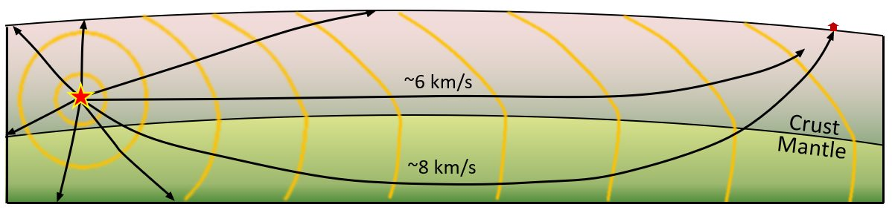
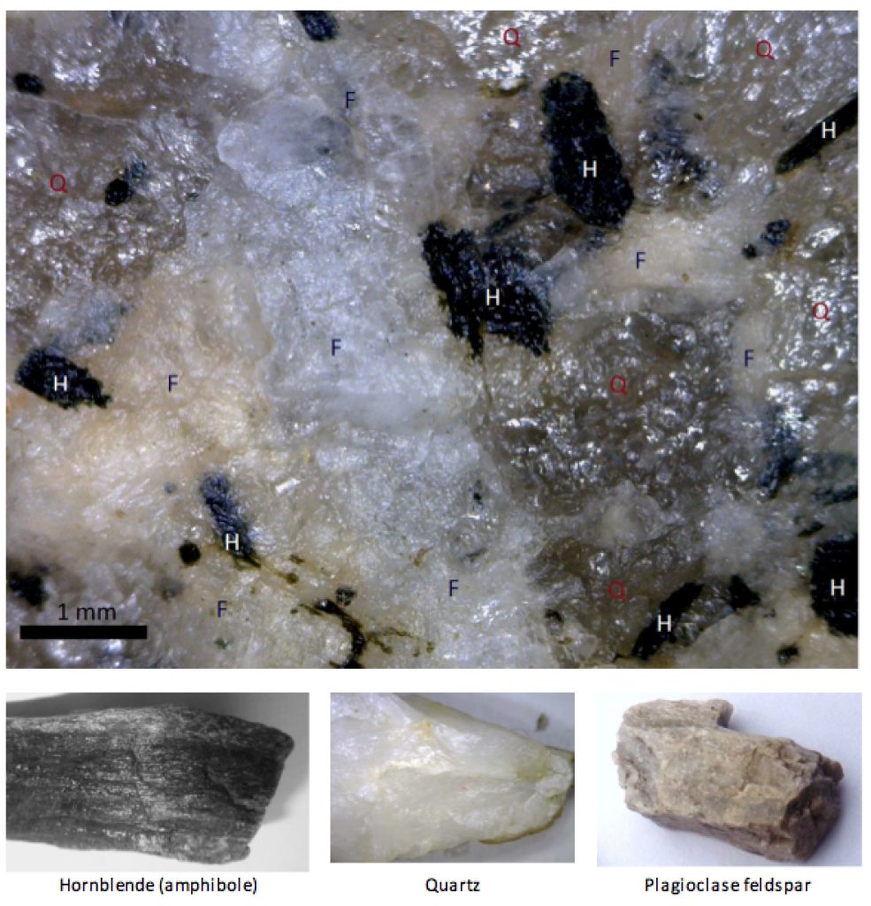
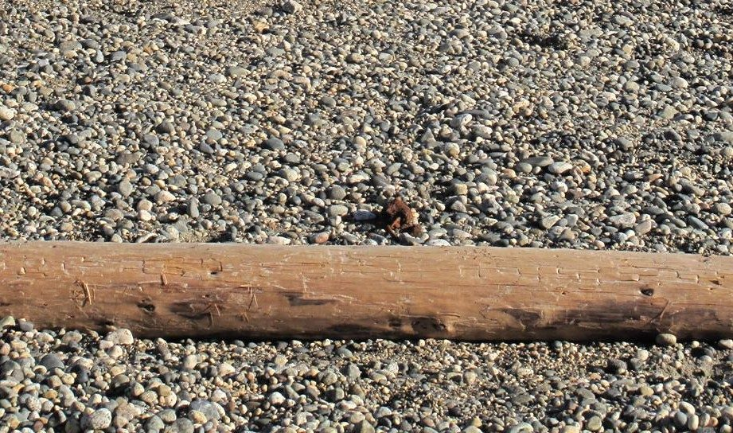
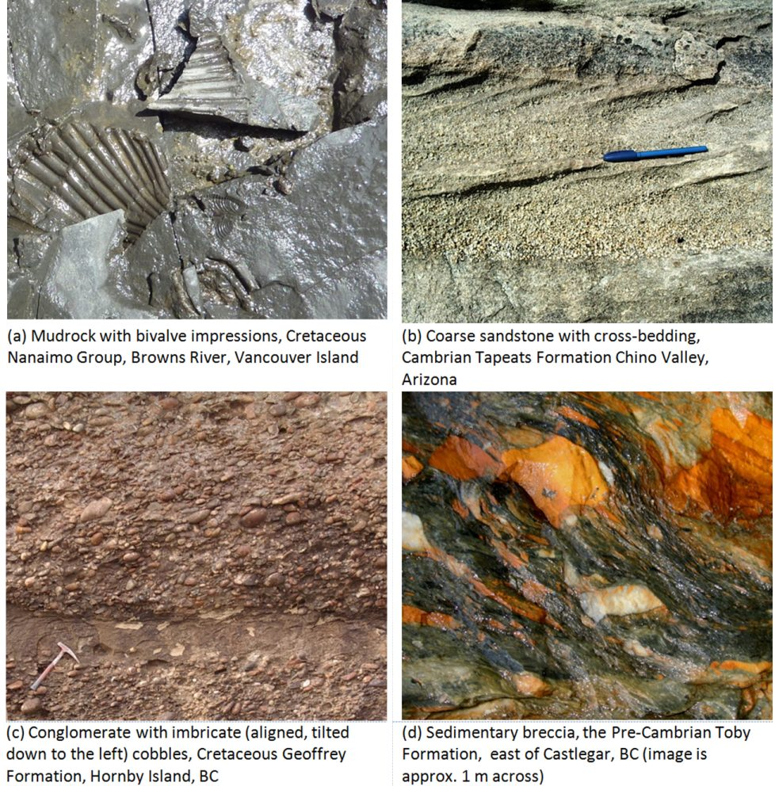
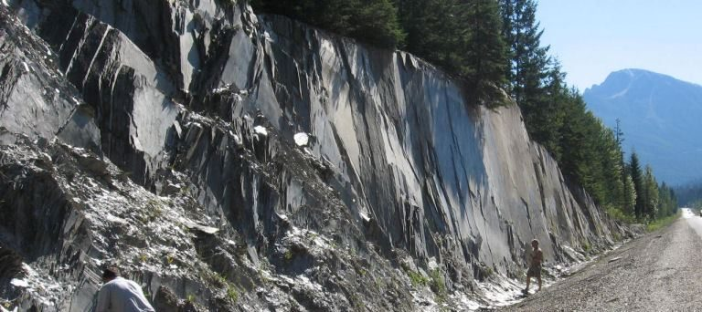
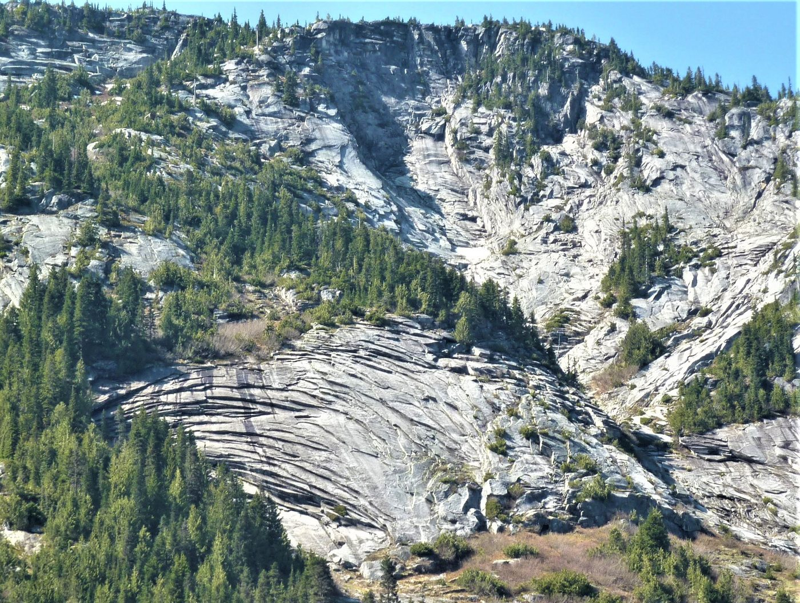
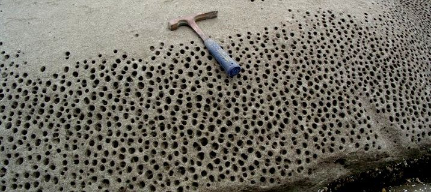
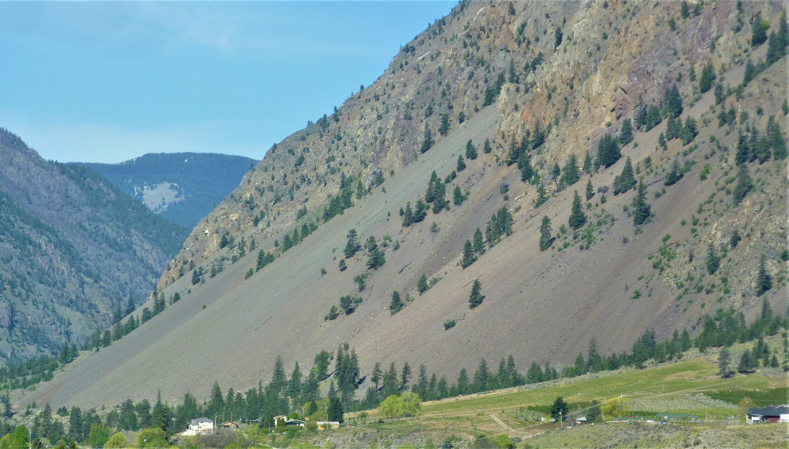
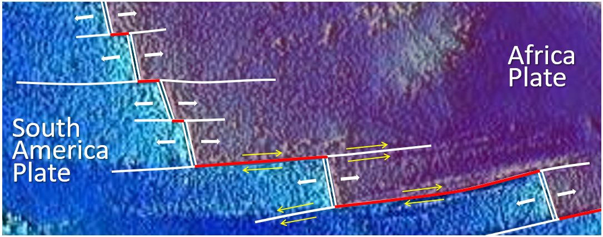

# Chapter 1 — Geology: Soil and Rock

Chapter I sets the geological stage. Before any foundation can be designed, the
engineer must understand **what the ground is made of and how it was formed**.

!!! info "Illustrations in this chapter"
    The photographs in this chapter are taken from the openly licensed textbook
    *Physical Geology – 2nd Edition* by Steven Earle (BCcampus, **CC BY 4.0**), used with
    attribution. See the [geology figure credits](../../assets/figures/geology/CREDITS.txt)
    for the full list. Only CC BY / public-domain figures are used.

## 1.1 Where geotechnics sits

The handbook separates three related disciplines:

- **Geology (địa chất học)** — the science of the Earth: its composition, structure,
  formation, movement, tectonic evolution and change.
- **Engineering geology (địa chất công trình, ĐCCT)** — the branch of geology that
  studies the geological environment **for construction**: it characterises the ground,
  selects the site, and supplies the geological inputs to foundation design.
- **Geotechnique (địa kỹ thuật)** — the applied discipline that binds ĐCCT together
  with **soil mechanics and foundation engineering** (cơ đất & nền móng). Its job is to
  turn geological description into numbers a designer can use.

The handbook's practical point: ĐCCT on its own stays too qualitative, while soil
mechanics on its own assumes too much about uniform ground. Geotechnique is where the
two meet — and its conclusions decide the foundation type, the foundation dimensions,
the ground treatment and the construction method.

## 1.2 Structure of the Earth

The Earth is layered — concentric shells of distinctly different physical properties,
separated by **discontinuity surfaces or zones** (bề mặt hoặc vùng không liên tục).
Geophysics detects these boundaries because the velocity of seismic waves changes
abruptly across them; a local departure from the expected velocity is an **anomaly**
(dị thường).

**Figure.** How a seismic boundary is detected. Waves that travel down into the mantle
are bent upward and reach the station *before* the waves that travelled only through the
crust — the observation that revealed the crust–mantle boundary (the Moho).
*© Steven Earle, CC BY 4.0 — Physical Geology, 2nd ed., Fig. 9.1.5.*

For the engineer the consequences are concrete: rock type, degree of weathering, depth
to sound rock, and the presence of weak or fractured zones.

## 1.3 The three main rock families

### 1.3.1 Igneous rock (đá magma)

Formed by the cooling and crystallisation of molten material. **Intrusive** rocks
(xâm nhập) such as granite cool slowly at depth and are coarse-grained; **extrusive**
rocks (phun trào) such as basalt and andesite cool quickly at the surface and are
fine-grained. In Vietnam, basalt plateaus in the Central Highlands and the Southeast
weather into laterite — a soil, not a rock, by the time the engineer meets it.

**Figure.** A close-up of granite and some of the minerals it contains — H = hornblende,
Q = quartz, F = feldspar. Crystals range from about 0.1 to 3 mm across. The **interlocking
crystal fabric** of an intrusive igneous rock is why it is strong when intact but can
behave as a set of loose blocks once jointed.
*© Steven Earle, CC BY 4.0 — Physical Geology, 2nd ed., Fig. 1.4.2.*

### 1.3.2 Sedimentary rock (đá trầm tích)

Formed by deposition, burial and consolidation. **Clastic** rocks (mảnh vụn) —
sandstone, siltstone, shale — are classified by grain size; **chemical and organic**
rocks include limestone and dolomite. Two features dominate their engineering
behaviour: **bedding planes** (mặt phân lớp), which are planes of weakness, and, in
limestone, **karst** — caves, sinkholes and solution channels that make foundations and
tunnels unpredictable. Vietnam's northern limestone ranges are classic karst terrain.

**Figure.** Pebbles on an ocean beach — the raw material of clastic sediment. The
**grain size, sorting and rounding** visible here are the same properties the engineer
reads off a borehole log to name and classify the deposit.
*© Steven Earle, CC BY 4.0 — Physical Geology, 2nd ed., Fig. 6.1.1.*

**Figure.** Examples of clastic sedimentary rocks. Note how widely texture and
cementation vary — the single biggest control on the strength and deformability of a
sedimentary foundation.
*© Steven Earle, CC BY 4.0 — Physical Geology, 2nd ed., Fig. 6.1.8.*

### 1.3.3 Metamorphic rock (đá biến chất)

Formed from existing rock under heat and pressure: gneiss (gơnai), schist (đá phiến),
marble (đá hoa), quartzite (quaczit), slate (đá phiến sét). Metamorphism produces
**foliation** (cấu tạo phiến) — a strong directional fabric that makes strength and
deformability strongly **anisotropic**: the rock is far weaker across the foliation
than along it.

**Figure.** Slate at a road cut in the Columbia Mountains, B.C., peeling along its
**foliation planes**. This directional fabric — not the rock's intact strength — governs
how the cut stands and how it will fail.
*© Steven Earle, CC BY 4.0 — Physical Geology, 2nd ed., Fig. 5.1.2.*

## 1.4 Weathering and the state of the ground

Weathering is the process that converts **rock into soil** — and the process that most
often decides whether a foundation sits on sound material or on a weakened, structured
mass. The handbook's point is that the *state of weathering* matters more than the rock
name. Four mechanisms do most of the work:

- **Unloading / exfoliation** — removal of overburden lets the rock expand and crack
  *parallel to the ground surface*.
- **Frost wedging** — water in cracks freezes, expands and prises the rock apart; the
  most effective mechanism in a climate like Vietnam's northern highlands.
- **Salt crystallisation** — salts grow in pores and push grains apart, producing
  honeycomb surfaces.
- **Root and biological action** — roots widen every crack they enter.

**Figure.** Exfoliation fractures in granitic rock exposed by a highway cut (Coquihalla
Highway, B.C.). The rock is peeling off in sheets **parallel to the new ground surface**
because the confining pressure was removed.
*© Steven Earle, CC BY 4.0 — Physical Geology, 2nd ed., Fig. 5.1.1.*

**Figure.** Honeycomb weathering of sandstone (Gabriola Island, B.C.). Salt crystallising
in the pores has prised the grains apart, leaving a pitted surface with almost no intact
strength.
*© Steven Earle, CC BY 4.0 — Physical Geology, 2nd ed., Fig. 5.1.5.*

**Figure.** A talus deposit at the foot of a frost-shattered cliff (Keremeos, B.C.). The
weathered debris that collects here is **colluvium** — a loose, poorly sorted,
often metastable material that the engineer must recognise on site.
*© Steven Earle, CC BY 4.0 — Physical Geology, 2nd ed., Fig. 5.1.4.*

## 1.5 Structure: bedding, foliation and faults

Two rock masses with the same intact strength can behave completely differently once
**structure** is taken into account. The controlling features are bedding planes,
foliation, joints and faults — and, critically, their **orientation relative to the load
or the cut**.

**Figure.** A fault (white dashed line) in intrusive rock on Quadra Island, B.C. A pink
dyke has been offset about 10 cm by right-lateral movement. A **fault** is a plane of
already-broken rock: it is a discontinuity in the ground model, not a line on a plan.
*© Steven Earle, CC BY 4.0 — Physical Geology, 2nd ed., Fig. 12.3.4.*

**Figure.** The McConnell Thrust at Mt. Yamnuska, Alberta. Cambrian limestone has been
thrust **over** Cretaceous mudstone — an 800 m-thick sheet pushed some 40 km. Where a
thrust carries strong rock over weak rock, the weak unit controls the design.
*© Steven Earle, CC BY 4.0 — Physical Geology, 2nd ed., Fig. 12.3.9.*

## 1.6 What the engineer takes from this

Rock **type** alone does not determine behaviour. The controlling factors are the
**state of weathering**, the **degree of jointing/fracturing**, and the **orientation
of bedding or foliation** relative to the load. A "strong" granite cut by closely
spaced joints may perform worse than a well-bedded sandstone.

## 1.7 Terminology

| English | Vietnamese (book) |
| --- | --- |
| geology | địa chất học |
| engineering geology | địa chất công trình (ĐCCT) |
| geotechnique | địa kỹ thuật |
| soil mechanics and foundations | cơ đất & nền móng |
| discontinuity | bề mặt / vùng không liên tục |
| anomaly | dị thường |
| igneous rock | đá magma |
| intrusive / extrusive | xâm nhập / phun trào |
| sedimentary rock | đá trầm tích |
| clastic | mảnh vụn |
| metamorphic rock | đá biến chất |
| bedding plane | mặt phân lớp |
| foliation | cấu tạo phiến |
| karst | các-tơ (karst) |
| weathering | phong hoá |
| exfoliation | bong tróc (unloading) |
| frost wedging | nêm băng (nứt do băng) |
| talus / colluvium | tích tụ sườn (taluy) |
| fault | đứt gãy |
| joint | khe nứt |

## 1.8 Key takeaways

- **Geotechnique = ĐCCT + soil mechanics & foundations.** Neither half is sufficient
  alone.
- The Earth is layered; geophysics finds the boundaries by their effect on wave
  velocity.
- Rock behaviour is governed by **weathering, jointing and fabric orientation**, not by
  rock type alone.
- **Weathering is what turns rock into soil** — exfoliation, frost wedging, salt growth
  and roots all break the mass before the engineer ever drills it.
- **Karst limestone** and **foliated metamorphic rock** are the two most unpredictable
  ground types in Vietnam.
