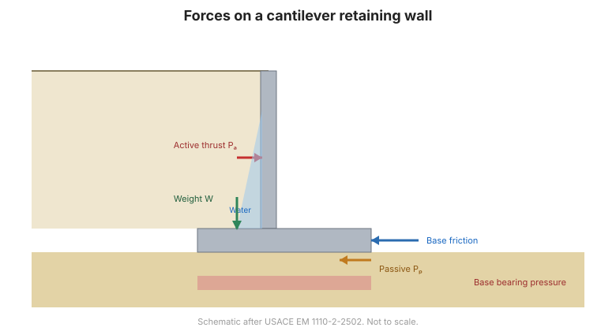

# Chapter 8 — Retaining Wall Analysis

Chapter VIII covers earth pressures and the structures that resist them. It opens with
the classical active and passive pressure theory, then treats **rigid** walls (gravity
and cantilever) and **flexible** walls (sheet piles and diaphragm walls), including
anchored walls and braced excavations.

## 8.1 Active and passive pressure

### 8.1.1 Cohesive soil ($\varphi = 0$, $c \neq 0$)

For a vertical wall with a horizontal backfill surface, ignoring wall–soil friction,
the **active pressure** (áp lực chủ động) is the *minimum* lateral pressure the soil
exerts on the wall — the condition in which the wall has moved away enough for the soil
to mobilise its shear strength along the failure plane:

$$\sigma_a = K_a\,\sigma'_z - 2c\sqrt{K_a}$$

where $\sigma'_z$ is the effective vertical stress, $c$ is the cohesion, and $K_a$ is the
**coefficient of active earth pressure**.

**1. The coefficient $K_a$** is found from:

$$K_a = \tan^2\!\left(45^\circ - \frac{\varphi}{2}\right) = \frac{1 - \sin\varphi}{1 + \sin\varphi}$$

**2. The active thrust $Q_a$** for a wall of height $H$ is:

$$Q_a = \tfrac{1}{2}H\,\sigma_a = \tfrac{1}{2}K_a\,\gamma\,H^2$$

and its point of application is at $\tfrac{1}{3}H$ from the base of the wall.

### 8.1.2 Granular soil

The same framework with $c = 0$, plus the effect of wall friction and sloping backfill.

**Figure.** Earth pressures acting on a retaining wall.

## 8.2 Rigid retaining wall analysis

### 8.2.1 Definition and classification
Gravity, semi-gravity and cantilever walls.

### 8.2.2 Analysis of a rigid wall
Stability against **overturning**, **sliding** and **bearing failure**, plus internal
structural design.

### 8.2.3 Some types of low rigid wall

## 8.3 Flexible retaining wall analysis

### 8.3.1 Definition and classification
Sheet piles and diaphragm (slurry) walls.

### 8.3.2 Analysis of a cantilever (fixed-base) wall
### 8.3.3 Analysis of an anchored wall
### 8.3.4 Analysis of a braced excavation

Braced excavations (hố đào với tường chống xà) — the case most relevant to urban deep
excavation and to the instrumentation in this site's
[Foundation & Excavation](../../applications/foundations.md) page.

### 8.3.5 Base stability and wall deformation of an excavation

## 8.4 Terminology

| English | Vietnamese (book) |
| --- | --- |
| retaining wall | tường chắn |
| active earth pressure | áp lực chủ động |
| passive earth pressure | áp lực bị động |
| earth pressure at rest | áp lực tĩnh (nghỉ) |
| coefficient of active earth pressure | hệ số áp lực chủ động |
| active thrust | lực chủ động |
| rigid wall | tường chắn cứng |
| flexible wall | tường chắn mềm |
| cantilever wall | tường công-xôn |
| sheet pile | tường cừ |
| anchored wall | tường chắn có neo |
| braced excavation | hố đào chống xà |

## 8.5 Key takeaways

- **Active** pressure is the minimum; **passive** is the maximum; **at rest** is between.
- For cohesive soil, $\sigma_a = K_a\sigma'_z - 2c\sqrt{K_a}$ and
  $K_a = \tan^2(45^\circ - \varphi/2)$.
- The active thrust on a wall of height $H$ is $Q_a = \tfrac{1}{2}K_a\gamma H^2$, acting
  at $\tfrac{1}{3}H$ above the base.
- Rigid walls are checked for **overturning, sliding and bearing**.
- Flexible walls (sheet pile, diaphragm) and **braced excavations** are the critical case
  for urban deep excavation monitoring.
