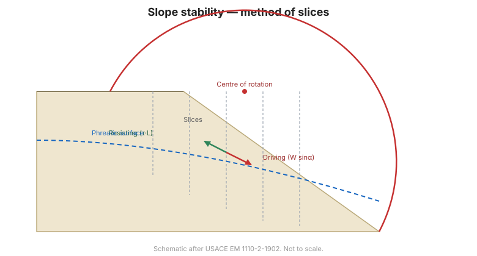
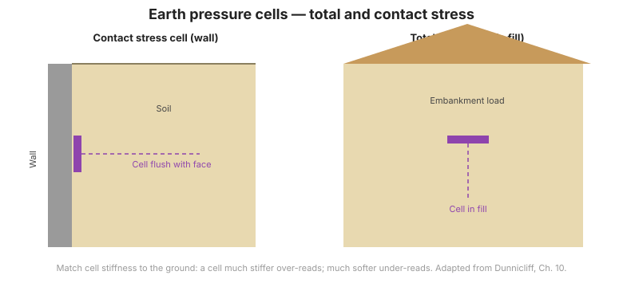

# Chapter 9 — Embankments on Soft Ground

Chapter IX is the closest chapter in the handbook to this site's subject. It treats the
two questions that govern every embankment built on soft clay — **will it be stable, and
how much will it settle** — and then, crucially, **how to monitor it** so that staged
construction can be controlled safely.

## 9.1 General

**Embankment** (đất đắp) means soil chosen for fill, placed and compacted to a design
specification. An embankment can serve two functions: as a **structure** (dam, dyke,
road embankment) and as a **subgrade** (nền đất nền) for a roadway, yard or foundation.

**Soft ground** (nền đất yếu) is ground beneath the fill consisting of soft, compressible
clays and silts, organic soils and peat, with high compressibility and low strength.

The stability and deformation of an embankment on soft ground depend not only on the fill
but, decisively, on the **soft foundation**. The chapter therefore covers:
investigation for the parameters; **slope stability**; **consolidation settlement**;
**monitoring and verification**; fill materials and construction; and flexible-pavement
design.

## 9.2 Slope stability of embankments

### 9.2.1 The combined Bishop–Fellenius slice method

### 9.2.2 Stability method for staged construction

Embankments on soft clay are built in **stages** (đắp theo giai đoạn): a lift is placed,
then the soil is allowed to consolidate and gain strength before the next lift. The
stability check at each stage decides whether the next lift may proceed.

### 9.2.3 Counterweight berms to raise the factor of safety

A **counterweight berm** (bệ phản áp) at the toe raises the factor of safety without
removing the fill.

**Figure.** Circular-arc stability analysis used for staged embankment construction.

## 9.3 Consolidation settlement

### 9.3.1 The nature of consolidation settlement, and its limitations
### 9.3.2 Consolidation settlement by Terzaghi's method
### 9.3.3 Methods of accelerating consolidation

Vertical drains (bấc thấm / PVD), sand drains (giếng cát) and surcharge/preloading are
used to accelerate consolidation so that construction can proceed sooner.

**Figure.** Consolidation: the $e$–$\log\sigma'$ curve and the time–settlement curve.

## 9.4 Monitoring and verification

This is the section that matters most to this site. On an embankment over soft ground,
instrumentation is not optional — it is how staged construction is controlled and how the
design assumptions are verified. The handbook defines five measurements:

### 9.4.1 Settlement monitoring (quan trắc độ lún)

Settlement of the fill and of the soft foundation is measured with **settlement plates**
and **settlement gauges** (bàn đo lún / mốc đo lún) — the basis for confirming the
consolidation rate and deciding when the next lift is safe.

### 9.4.2 Pore-water pressure measurement (đo áp lực nước lỗ rỗng)

**Pore-water pressure** is measured with **piezometers** (canonical term **áp kế**). It
is the direct indicator of consolidation: as excess pore pressure dissipates, effective
stress and strength rise. See
[Dunnicliff Ch. 6](../dunnicliff/chapter-06-piezometers.md) and
[FHWA Ch. 2](../fhwa/chapter-02-groundwater-pressure.md).

**Figure.** Common piezometer types compared.

### 9.4.3 Lateral displacement beneath the embankment (đo chuyển vị ngang)

**Lateral displacement** of the soft ground beneath and beside the fill is measured with
an **inclinometer** in an **inclinometer casing** (canonical term **ống đo nghiêng**).
It is the earliest indicator of incipient instability at the toe. See
[Dunnicliff Ch. 8](../dunnicliff/chapter-08-deformation.md).

**Figure.** Inclinometer casing and probe for measuring lateral displacement.

### 9.4.4 Total vertical stress at the base of the fill (đo ứng suất tổng phương đứng)

**Total earth pressure cells** (canonical term **hộp đo áp lực đất**) placed at the base
of the fill measure the total vertical stress delivered to the foundation — the load input
to the settlement and stability calculations. See
[Dunnicliff Ch. 7](../dunnicliff/chapter-07-stress.md).

**Figure.** Earth pressure cell embedded at the base of the fill.

### 9.4.5 Direct measurement of shear-strength gain (đo mức độ gia cường sức kháng cắt)

The **field vane shear test** (thí nghiệm cắt cánh) repeated in the soft clay directly
measures how much shear strength the soil has gained as it consolidated — the field check
that the staged-construction assumption is being met.

### 9.4.6 General recommendations

A monitoring programme on soft ground should combine: settlement, pore pressure, lateral
displacement and, where the design depends on strength gain, field vane testing — with
**trigger values** that stop construction if exceeded.

## 9.5 Fill materials and construction
### 9.5.1 Construction and treatment methods
### 9.5.2 Fill materials
### 9.5.3 Investigation and testing of fill materials
### 9.5.4 Construction method and compaction control

## 9.6 Flexible pavement design
### 9.6.1 Pavement structure
### 9.6.2 Traffic loading
### 9.6.3 Subgrade strength
### 9.6.4 Design by Road Note 31
### 9.6.5 Design by the AASHTO method
### 9.6.6 Base-course materials

## 9.7 Terminology

| English | Vietnamese (book) |
| --- | --- |
| embankment / fill | đất đắp |
| soft ground | nền đất yếu |
| subgrade | nền đất nền (kết cấu áo đường) |
| staged construction | đắp theo giai đoạn |
| counterweight berm | bệ phản áp |
| consolidation settlement | lún cố kết |
| vertical drain (PVD) | bấc thấm |
| sand drain | giếng cát |
| settlement monitoring | quan trắc độ lún |
| pore-water pressure | áp lực nước lỗ rỗng |
| lateral displacement | chuyển vị ngang |
| inclinometer casing | ống đo nghiêng |
| earth pressure cell | hộp đo áp lực đất |
| field vane shear test | thí nghiệm cắt cánh hiện trường |
| flexible pavement | tầng phủ mềm (áo đường mềm) |

## 9.8 Key takeaways

- On soft ground, behaviour is governed by the **soft foundation**, not the fill.
- Build in **stages**, letting the soil consolidate and gain strength between lifts.
- **Accelerate consolidation** with vertical drains, sand drains and surcharge.
- **Instrumentation controls the construction** — five measurements: settlement, pore
  pressure, lateral displacement, total vertical stress, and field vane strength gain.
- Set **trigger values** and stop construction when they are exceeded.
