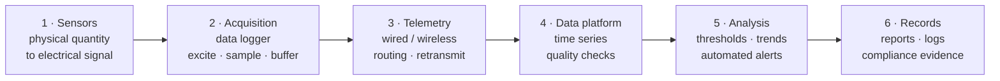

# Chapter 12 — Geoinformatics in Geotechnics

Chapter XII closes the handbook with the role of information technology — *géo-
informatique* — in geotechnical work. Its message is measured: IT has transformed data
handling, but it cannot replace the engineer.

!!! note "On the added technical sections 12.3 and 12.4"
    Beyond the summary of the book, this chapter adds two editorial sections that describe
    in **more technical detail the information technology** behind an automated monitoring
    system and behind an analysis program. The additions are general technical content,
    **not tied to any specific vendor, brand or product**.

## 12.1 The argument

Over recent decades IT has developed strongly and has entered every field, geotechnics
included. But **soil is a very complex material** — many interacting factors, non-uniform,
anisotropic. The problems of geotechnics, in both investigation (testing, data
collection, evaluation and parameter selection) and analysis (soil–structure
interaction), **cannot be solved by a single model or formula**. There are general
analysis programs, but they always need the intervention of a geotechnical specialist.

The handbook's caution: the computer makes data processing fast, convenient and accurate,
and puts many results one menu-click away — but **only knowledge, experience and a sound
grasp of engineering can find the best solution** and choose representative parameters.
Software finishes a good idea quickly; it does not supply the idea.

## 12.2 IT in site investigation

### 12.2.1 The investigation process

An investigation campaign is a **chain of data transformations**: field → sample → test →
index → design parameter. Every link in the chain can be computerised, but an error
introduced at one link cannot be repaired by the links that follow it.

### 12.2.2 Tasks that lend themselves to computing

Four groups:

1. **Capture** — entry of field data, borehole logs and test results.
2. **Management** — the investigation database, linking sample ↔ borehole ↔ stratum ↔
   test.
3. **Processing and presentation** — plotting, correction, interpolation, section
   drawing.
4. **Analysis** — correlation between test types, statistical characterisation, parameter
   selection.

### 12.2.3 Applications of IT

**a) Data entry and standardisation.** Electronic forms replace the paper notebook: every
field has a type, a unit and a valid range, so a unit error (kN/m² ↔ kPa ↔ T/m²) is
blocked at entry rather than discovered after the design is finished.

**b) The investigation database.** The basic data unit is the **borehole**, linked to
**strata**, **samples**, **field tests** and **laboratory tests**. Once the data is
organised relationally, a single source can be exported as: geological sections, summary
tables of properties, distribution plots, and the handover record — without re-entry.

**c) Plotting and analysis of charts.** Computerised plotting frees the engineer from
manual work, but it also creates a new temptation: **to draw a great deal without
checking any of it**. The prettier the chart, the easier it is for the reader to forget
that it is only as good as the data that went into it.

**d) Correlation between test types.** Empirical correlations (for example $N_{SPT}$ ↔
$s_u$ ↔ $q_c$) are a powerful tool, but each correlation is valid only within the **range
of soil and conditions from which it was built**. Software can compute a correlation for
any soil; the engineer must know when that correlation is meaningless.

**e) Digitising old records.** Scanning and re-entering historical investigation records
allows the reuse of archival data — often the most valuable engineering asset a project
inherits, and often the one most easily lost.

## 12.3 Automated data-acquisition technology — the six layers of a monitoring system

*(Added section — technical description, not tied to a specific product.)*

The value of an automated monitoring system **does not lie in the sensors**; it lies in
the ability to measure correctly, transmit enough, detect anomalies early, and preserve
evidence. The system can be described as a chain of six layers, each answering its own
engineering question.

### 12.3.1 Layer 1 — Sensors and signal interfaces

This is the layer that determines **the accuracy actually achievable**; the later layers
can only preserve it or lose it. Four common signal-interface families:

| Interface | Principle | Strengths | Points to note |
| --- | --- | --- | --- |
| **Vibrating wire** | The resonant frequency of a tensioned wire shifts with strain | A **frequency** signal, little loss on long cable runs; stable long-term | Needs an excitation pulse; requires **temperature compensation** |
| **Strain gauge** | Resistance changes with strain | High accuracy, wide range | Noise-sensitive; keep cable short; needs temperature compensation |
| **4–20 mA** | Current proportional to the measured quantity | Industrial standard, good noise immunity, long distance | Needs loop power; single-direction only |
| **Digital / bus** (SDI-12, Modbus, RS-485) | Direct digital transmission, many sensors on one bus | Noise-immune, simple to wire, addressable | Requires address and protocol management |

Two less common families are still worth knowing: **fibre-optic sensing** (Bragg grating /
scattering — fully immune to electromagnetic interference and able to measure
distributed along a line, suited to long structures such as dams and tunnels) and
**MEMS** (small and inexpensive, used for tilt and acceleration, but subject to
**zero-point drift**, so it must be recalibrated periodically).

One requirement is most often overlooked: **every sensor must have a unique identifier and
a calibration certificate**. Without those two things, even correct data cannot be used as
evidence.

### 12.3.2 Layer 2 — Acquisition: the data logger

The logger is where engineering decisions become configuration parameters:

- **Channel count and channel type** — a single unit usually mixes several channel types
  (vibrating wire, strain gauge, 4–20 mA, pulse counting, thermistor).
- **Sampling rate** — must be dense enough not to miss rapid movement. In an emergency
  the rate may need to reach **four readings per hour**; if the system records only once
  a day, it was configured wrongly from the start.
- **Resolution and averaging time** — averaging many samples reduces noise but
  **flattens the peaks**; for an alerting task, the peak is exactly what must be seen.
- **Time synchronisation** — without it, data from several devices cannot be compared.
- **Surge protection**, **back-up battery** and **buffering**. Buffering is a small
  detail with decisive consequences: data is most often lost **precisely at the moment of
  an incident** — when power or the connection fails.

### 12.3.3 Layer 3 — Telemetry

| Method | Distance | Bandwidth | Cost | Notes |
| --- | --- | --- | --- | --- |
| **Wired** (RS-485, fibre) | ~1.2 km per segment | Medium – high | Low – medium | Most stable; hard to install across difficult terrain; needs surge protection |
| **VHF/UHF radio** | 1 – 20 km (terrain-dependent) | Low – medium | Medium | Terrain-dependent; may need a frequency licence |
| **Mesh** | Extends with node count | Low | Medium | Self-heals when a node fails; more complex to configure |
| **Cellular 4G/LTE** | Wherever there is coverage | High | Low (per data plan) | Network-dependent; power-hungry, needs a stable supply |
| **Satellite** | Anywhere | Low | High | Used where there is no ground infrastructure; high latency |

Two minimum technical requirements: a **retransmission mechanism** when a send fails, and
**local buffering** so that data is not lost when the link is interrupted.

### 12.3.4 Layer 4 — The data platform

Monitoring data is a **time series**, and it must be stored as a time series — not as a
spreadsheet. Four mandatory functions:

1. **Synchronised timestamping** of every value.
2. **Automated quality checks**: out-of-range values, implausible jumps, **data gaps**,
   and **zero-point drift** over time.
3. **Storage and export of the raw data** — not only the corrected values. If the original
   series is gone by the time of a periodic audit, the data cannot be re-analysed.
4. **Back-up and an activity log** (who changed what, and when) — both for recovery and as
   evidence.

One design principle should be set from the outset: **data must be exportable to an open
format** (CSV, JSON) and **must not be locked inside a single program**. If only the
software vendor can read the owner's own data, the owner does not truly own it.

### 12.3.5 Layer 5 — Analysis and alerting

- **Thresholds** should be set in three different ways, not just one: by **absolute
  value**, by **rate of change** (mm/day), and **by water level** (because the same reading
  means very different things at low and at high water level).
- **Trend analysis** — regression against time and against load / water level to separate
  normal fluctuation from abnormal change.
- **Stability assessment of the reference network** every cycle. If a reference monument
  moves undetected, **the entire dataset is systematically wrong** — and wrong in a way
  that is very hard to detect.
- **Multi-channel alerting** (SMS, email, on-site siren) with an **escalation matrix**:
  who is notified at which level, and after how long the alert escalates to the next
  level.

### 12.3.6 Layer 6 — Records and evidence

The final layer is the most easily neglected and the one that determines the legal value
of the whole system: periodic reports delivered on time, an **alert log and record of
actions taken**, and a long-term handover archive. A system that measures very well but
cannot produce records in the required format still fails to meet the compliance
requirement.

!!! tip "Related page in this knowledge base"
    The six layers above are set out in more detail, mapped against each group of
    compliance obligations, on the [Automated Data Acquisition System
    (ADAQS)](../../vi/adaqs/index.md) page (in Vietnamese).

## 12.4 IT in geotechnical analysis

### 12.4.1 Characteristics of geotechnical analysis

Geotechnical analysis differs from structural analysis in three respects, and all three
resist "full automation":

- **Parameters are not material constants.** The elastic modulus of soil depends on the
  **strain level**; shear strength depends on the **stress path**. The same soil yields
  several different parameter sets, depending on the problem.
- **The model is a choice, not a result.** Choosing a model (linear, Mohr–Coulomb,
  critical-state, soft-soil with consolidation) is an engineering decision, not a data-
  entry step.
- **Soil–structure interaction is a two-way problem.** The structure changes the
  behaviour of the soil, and the soil changes the internal forces in the structure;
  solving one side and ignoring the other is usually wrong.

### 12.4.2 Observations on the use of IT in analysis

The general-purpose analysis programs used in practice — the handbook's own foreword
names **Geo-Slope** and **Plaxis** as examples — are tools; the **model, the parameters
and the interpretation** remain the engineer's responsibility.

Technically, these programs fall into two families of numerical method: **finite element
(FEM)** and **finite difference (FDM)**, alongside limit-equilibrium methods for slope-
stability problems. Each family has its own strengths — FEM/FDM can simulate
**construction sequence** and deformation, while limit equilibrium gives a **factor of
safety** quickly and stably. Knowing which program answers which question is part of the
engineer's competence, not the software's.

One technological temptation is worth flagging: **false precision**. A result printed to
four decimal places suggests an accuracy that the input parameters — themselves known
only to within ±20–30 % — simply do not have.

### 12.4.3 Framing the geotechnical idea for analysis

The handbook closes here: before running the program, one must **visualise the failure
mechanism**. If you cannot say in words which way the soil mass will move, where the slip
surface lies, and what increases and what decreases as you excavate or load — then the
analysis result is only a number, not a conclusion.

## 12.5 Terminology

| English | Vietnamese (book) |
| --- | --- |
| geoinformatics | công nghệ thông tin ứng dụng địa kỹ thuật (géo-informatique) |
| site-investigation process | tiến trình khảo sát đất nền |
| database | cơ sở dữ liệu |
| data processing | xử lý số liệu |
| analysis program | chương trình phân tích |
| soil–structure interaction | tương tác đất – kết cấu |
| parameter selection | lựa chọn thông số |
| data acquisition | thu thập dữ liệu |
| data logger | đầu ghi dữ liệu |
| signal conditioning | điều hoà tín hiệu |
| telemetry | truyền dẫn dữ liệu từ xa |
| time series | chuỗi thời gian |
| threshold / alert | ngưỡng / cảnh báo |
| finite element method (FEM) | phương pháp phần tử hữu hạn |
| limit equilibrium | cân bằng giới hạn |

## 12.6 Key takeaways

- IT has transformed **data handling** in investigation and analysis.
- Soil is complex, non-uniform and anisotropic; **no single model fits every case**.
- Software is fast but needs **knowledge, experience and engineering judgment**.
- An automated monitoring system is a **chain of six layers**; accuracy is decided by the
  **sensor layer**, and legal value by the **records layer**.
- **Data must be exportable in an open format** — otherwise the owner does not truly own
  its own data.
- **Time synchronisation**, **buffering** and **reference-network stability checks** are
  three small details that are often skipped, yet each can invalidate the whole system.
- The general analysis programs are **tools** — the model and parameters are the
  engineer's responsibility.
- The handbook closes on this note deliberately: **judgment is the constant** across all
  twelve chapters.
