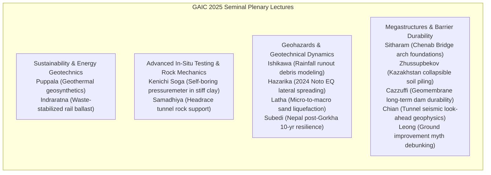
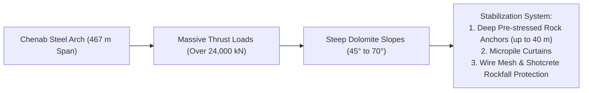

# Chapter 1: Plenary Keynotes & State-of-the-Art Lectures

!!! info "Chapter Context & Source Papers"
    This chapter synthesizes the 14 Plenary Keynotes and State-of-the-Art Lectures presented at the First Geotech Asia International Conference (GAIC 2025), published in *GeoVadis: The Future of Geotechnical Engineering (Volume 3)*, CRC Press / Taylor & Francis (2026), DOI: [10.1201/9781003645955](https://doi.org/10.1201/9781003645955).

---

## 1. Executive Summary & Thematic Scope

The plenary sessions of GAIC 2025 brought together world-leading authorities to address fundamental and applied challenges across modern geotechnics. Key topics spanned:

---

## 2. Sustainable Infrastructure & Energy Geotechnics

### 2.1 Geothermal Solutions and Geosynthetic Systems (Puppala et al.)
Prof. Anand J. Puppala and co-researchers evaluated geothermal energy integration into transport infrastructure using energy geostructures and multi-functional geosynthetics:

*   **Thermo-Hydro-Mechanical (THM) Interactions:** Thermo-active piles and geosynthetic-embedded heat exchangers extract low-enthalpy geothermal heat for pavement de-icing and bridge deck thermal conditioning.
*   **Cyclic Thermal Strains:** Daily and seasonal thermal cycles ($\Delta T = \pm 15^\circ\text{C}$) induce thermally driven axial strains $\varepsilon_{\text{th}} = \alpha_c \Delta T$. The study showed that soil-pile interface friction exhibits minimal shear strength degradation provided effective confining stress $\sigma'_c$ is maintained above preconsolidation stress $\sigma'_p$.

$$\tau_{\text{mob}} = \sigma'_n \tan \delta' + c'_a$$

### 2.2 Advanced Recycled Waste Materials in Rail Geotechnics (Indraratna et al.)
Prof. Buddhima Indraratna, Y. Qi, T. Ngo, and C.K. Arachchige delivered comprehensive field and laboratory evidence on recycling scrap rubber (tire crumb, discarded conveyor belts) combined with coal wash (CW) and steel furnace slag (SFS) for heavy-haul rail subballast:

*   **Optimal Energy Absorbing Mix (CWB):** A matrix comprising Coal Wash, Steel Slag, and Rubber Crumb (at 10% rubber by weight) matches the optimum particle gradation while attenuating dynamic track vibrations by up to 35%.
*   **Ballast Breakage Index ($BBI$):** Introduction of rubber energy-absorbing under-ballast mats (UBMs) reduced ballast crushing and particle breakage by over 40%, dramatically extending maintenance cycles under 30-tonne axle loads.

$$BBI = \frac{A}{A + B}$$

where $A$ is the shift in particle size distribution caused by degradation, and $B$ is the potential breakage area below the $0.075\text{ mm}$ boundary.

---

## 3. High-Precision In-Situ Testing: Self-Boring Pressuremeter (Soga & Liu)

Prof. Kenichi Soga and L. Liu critically examined the disparity between idealized cavity expansion theories and actual field observations in **Self-Boring Pressuremeter (SBPM)** testing within stiff, overconsolidated clays (e.g., London Clay, Gault Clay):

*   **Disturbance and Cuttings Removal:** Idealized cylindrical expansion assumes zero initial disturbance ($r_0 = r_{\text{cavity}}$). In practice, minute over-coring or cutting tool vibration creates an annulus of softened, destructured clay.
*   **Derivation of In-Situ Horizontal Stress ($\sigma_{h0}$):** Lift-off pressure method vs. inflection point analysis:

$$p_L = \sigma_{h0} + u_0$$

*   **Undrained Shear Strength ($s_u$) and Non-Linear Shear Modulus ($G$):** Derivation from the shear stress-strain relationship using Gibson and Anderson's classic formulation:

$$\tau = \frac{1}{2} \varepsilon_c (1 + \varepsilon_c) \frac{dp}{d\varepsilon_c}$$

where $\varepsilon_c = \frac{\Delta V / V_0}{1 + \Delta V / V_0}$ is cavity strain. Finite element simulations confirmed that failing to account for drilling disturbance leads to overestimations of $G_{\text{max}}$ by up to 30% and severe underestimations of in-situ $K_0$.

---

## 4. Multi-Hazard Geotechnics & Seismic Dynamics

### 4.1 Rainfall Infiltration and Debris Flow Runout Dynamics (Ishikawa et al.)
Prof. T. Ishikawa and colleagues presented an integrated numerical framework combining unsaturated seepage (Richard's equation) with depth-averaged shallow water equations for runout propagation:

*   **Transient Pore Pressure Wave:** During intense monsoon storms, wetting front advancement reduces soil suction $\psi = (u_a - u_w)$, causing factor of safety ($F_s$) degradation on steep colluvial slopes.
*   **Soil Runout Mechanics:** Upon initiation, liquefaction-like fluidization transforms slide mass into a rheological Bingham fluid with yield stress $\tau_y$ and plastic viscosity $\mu_p$:

$$\tau = \tau_y + \mu_p \left(\frac{du}{dz}\right)$$

### 4.2 Lateral Spreading in the 2024 Noto Peninsula Earthquake (Hazarika et al.)
Prof. Hemanta Hazarika presented reconnaissance findings from the $M_w 7.5$ earthquake on January 1, 2024 in Japan:

*   **Coastal Liquefaction & Lateral Flow:** Extensive lateral spreading reached ground displacements of $1.5\text{ m}$ to $3.0\text{ m}$ adjacent to quay walls and rivers in Wajima, Nanao, and Suzu.
*   **Foundation Performance:** Shallow mat and continuous footing foundations on unimproved sands suffered non-uniform tilt $> 2.5^\circ$, whereas buildings supported on prestressed spun concrete piles with perimeter sheet pile cutoffs retained operational integrity.

---

## 5. Foundation Innovations for Megastructures

### 5.1 Chenab Rail Bridge: Arch Foundations & Rock Slope Stabilization (Sitharam & Mantrala)
Prof. T.G. Sitharam and S. Mantrala detailed the geotechnical engineering of the **Chenab River Bridge** (Kashmir, India)—the world's highest railway arch bridge ($359\text{ m}$ above the riverbed):

*   **Rock Mass Characterization:** Jointed dolomite rock mass with $GSI = 45 - 65$. Wedge failure kinematics along intersection lines of three orthogonal joint sets necessitated 3D distinct element modeling (3DEC).
*   **Anchorage Design:** Cable anchors stressed to $1200\text{ kN}$ with double corrosion protection bonded into sound rock behind potential kinematically feasible daylight planes.

### 5.2 Megastructure Piling in Problematic Soils of Kazakhstan (Zhussupbekov & Omarov)
Prof. Askar Zhussupbekov documented deep foundation construction in Astana/Nur-Sultan:

*   **Collapsible Loess and Soft Saturated Silt:** Use of bidirectional high-strain dynamic pile testing (Osterberg Cell - O-cell) and static load tests reaching $30,000\text{ kN}$ on large-diameter bored piles ($d = 1.2\text{ m} - 1.5\text{ m}$).
*   **Base Grouting Enhancement:** High-pressure post-grouting at the pile tip boosted end-bearing capacity by 80% to 120%, mitigating settlement in collapsible strata.

---

## 6. Long-Term Durability of Geomembranes in Dams (Cazzuffi & Gioffrè)

Prof. Daniele Cazzuffi and D. Gioffrè delivered keynotes on geomembrane barriers in rockfill and embankment dams:

*   **Material Selection:** Plasticized PVC-P vs. High-Density Polyethylene (HDPE) vs. Ethylene Propylene Diene Monomer (EPDM).
*   **Aging Mechanisms:** Plasticizer extraction, oxidative degradation, and puncture resistance against crushed rock under hydraulic heads exceeding $100\text{ m}$ ($> 1\text{ MPa}$).
*   **Field Inspections:** 40-year exhumation autopsies showed residual elongation at break $> 180\%$, confirming that protected geomembranes covered with geotextile protection layers provide multi-decade impervious lifespans.
