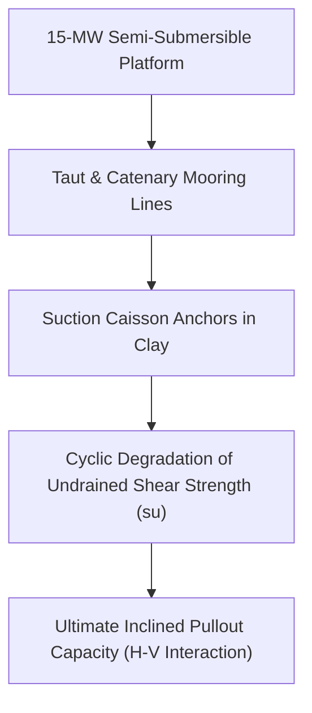

# Chapter 2: AI, Computational Geomechanics & Environmental Engineering

!!! info "Chapter Context & Source Papers"
    This chapter synthesizes technical papers from **Session 1 (AI and Computational Geomechanics)** and **Session 2 (Cold, Coastal and Environmental Geotechnical Engineering)** presented at GAIC 2025 and published in *GeoVadis: The Future of Geotechnical Engineering (Volume 3)*, CRC Press / Taylor & Francis (2026), DOI: [10.1201/9781003645955](https://doi.org/10.1201/9781003645955).

---

## 1. AI and Surrogate Modeling in Geotechnical Engineering

### 1.1 Strip Footing on Spatially Variable Slopes via Surrogate Models (Sharma & Pain)
Priyanka Sharma and Anindya Pain addressed the uncertainty of bearing capacity factors ($N_c$, $N_q$, $N_\gamma$) for strip footings adjacent to cohesive-frictional soil slopes characterized by spatial random fields:

*   **Random Finite Element Method (RFEM):** Cohesion $c$ and friction angle $\phi$ are modeled as log-normal and normal 2D random fields with anisotropic scale of fluctuation $\theta_x, \theta_z$:

$$\rho(\Delta x, \Delta z) = \exp \left( - \sqrt{\left(\frac{2\Delta x}{\theta_x}\right)^2 + \left(\frac{2\Delta z}{\theta_z}\right)^2} \right)$$

*   **Surrogate Machine Learning Model:** Using an Extreme Gradient Boosting (XGBoost) and Gaussian Process Regression (GPR) framework trained on 2,500 Monte Carlo FE simulations, ultimate bearing capacity $q_{ult}$ is evaluated in milliseconds with $R^2 > 0.96$:

$$q_{ult} = c N_c^* + q N_q^* + \frac{1}{2}\gamma B N_\gamma^*$$

where modified factors $N^*$ directly account for slope angle $\beta$, setback distance $d/B$, and spatial coefficient of variation $COV_{c,\phi}$.

### 1.2 Extraterrestrial Regolith Drilling Force Mechanics (Raghav et al.)
V. Raghav and co-authors developed an analytical cutter-rock interaction model for lunar regolith coring mechanisms:

*   **Drilling Mechanics:** Total thrust force $F_T$ and torque $T_Q$ consist of three decoupled components: cutting face resistance, frictional rubbing along cutter wear flat, and chip evacuation clearing forces.
*   **Low-Gravity Influence:** Under lunar gravity ($g = 1.62\text{ m/s}^2$), chip packing ratio and effective confining pressure $\sigma'_3$ decrease, significantly reducing cutter bit wear but increasing the risk of borehole wall sloughing in low-density regolith ($< 1.5\text{ g/cm}^3$).

### 1.3 State of AI in Geotechnical Practice: Frontiers and Pitfalls (Samui)
Prof. P. Samui delivered an objective appraisal of machine learning in geotechnics:

*   **Bottlenecks:** Small training datasets (scarce geotechnical boreholes), data imbalance, spatial autocorrelation neglect, and lack of physical interpretability ("black-box" models).
*   **Physics-Informed Neural Networks (PINNs):** Loss function regularized by governing differential equations (equilibrium $\nabla \cdot \boldsymbol{\sigma} + \mathbf{b} = \mathbf{0}$ and seepage continuity $\nabla \cdot (k \nabla h) = 0$):

$$\mathcal{L}_{total} = \mathcal{L}_{data} + \lambda_{phys} \mathcal{L}_{PDE} + \lambda_{BC} \mathcal{L}_{BC}$$

---

## 2. Rock Mass Uplift Anchor Mechanics (Parab et al.)

G.S. Parab, V.V. Dandage, and A.V. Sharma analyzed high-capacity uplift rock anchors embedded in fractured basalt:

*   **Load Transfer Mechanism:** Field tension tests instrumented with multi-point borehole extensometers (MPBX) demonstrated non-uniform shear stress distribution $\tau(z)$ along the grouted tendon length:

$$\tau(z) = \tau_{\text{peak}} \exp(-\alpha z)$$

*   **Finite Element Verification:** Numerical 3D FEM confirmed that anchor cone breakout failure angles deviate from the theoretical $45^\circ$ inverted cone when sub-horizontal jointing dominates, flattening to $30^\circ - 35^\circ$ and dictating deeper minimum embedment depths $h_e \ge 6\text{ m}$.

---

## 3. Environmental Geotechnics & Barrier Engineering

### 3.1 Bentonite Backfill Unconfined Compressive Strength (Nayak et al.)
B.P. Nayak, S. Kumar, and R. Bag examined engineered clay backfills for deep geological disposal and cut-off walls:

*   **Mix Proportioning:** Sand-bentonite-fly ash mixtures. Hydraulic conductivity $k < 1 \times 10^{-9}\text{ m/s}$ was achieved when bentonite content exceeded 15% by dry weight.
*   **Unconfined Compressive Strength ($UCS$):** Curing time and dry density $\rho_d$ controlled post-swelling strength; excessive fly ash addition caused brittleness and reduced crack self-healing capacity under chemical leaching.

### 3.2 Red Mud Effects on Bentonite Shrinkage Potential (Shaikh et al.)
J. Shaikh and co-investigators stabilized bentonite liners using industrial bauxite residue (red mud):

*   **Shrinkage Limit Modification:** Bentonite suffers high volumetric shrinkage upon desiccation. Addition of 20% to 30% red mud introduced non-swelling ferric oxides and alumina, increasing shrinkage limit from 11.2% to 19.8% and eliminating desiccation crack networks.

### 3.3 Nanomaterial Mitigation of Alkali-Induced Swelling in Red Soil (Kumar et al.)
T. Aravind Kumar, P. Hari Prasada Reddy, and S.K. Vindula investigated high-alkali industrial effluents ($\text{pH} > 12$) impacting red clayey soils:

*   **Swelling Mechanism:** Hydroxide attack dissolves silica tetrahedra, triggering severe swelling and loss of fabric integrity.
*   **Nano-Silica and Nano-Alumina Stabilization:** Incorporating 1.0% nano-additives promoted pozzolanic calcium-silicate-hydrate (C-S-H) gel growth, reducing alkali-induced swelling index from 68% to under 14%.

---

## 4. Bio-Mediated Geotechnics: Low-Cost MICP (Rawat & Satyam)

Vikas Rawat and Neelima Satyam formulated a cost-effective Microbial Induced Calcite Precipitation (MICP) technique substituting expensive commercial nutrient broth with sugarcane molasses:

*   **Bacterial Kinetics:** *Sporosarcina pasteurii* urease activity in diluted sugarcane molasses broth (3% v/v) matched standard nutrient broth within 48 hours ($U \approx 18\text{ mM urea/min}$).
*   **Calcite Precipitation & Strength:**

$$\text{CO(NH}_2)_2 + 2\text{H}_2\text{O} \xrightarrow{\text{Urease}} 2\text{NH}_4^+ + \text{CO}_3^{2-}$$

$$\text{Ca}^{2+} + \text{CO}_3^{2-} \rightarrow \text{CaCO}_3 \downarrow$$

*   **Geotechnical Enhancement:** Sand specimens treated with molasses-MICP exhibited $UCS$ increases from $0\text{ kPa}$ to $1,840\text{ kPa}$ and a 2.5-order-of-magnitude reduction in hydraulic conductivity, slashing treatment costs by 62%.

---

## 5. Marine Geotechnics: Floating Offshore Wind Turbines (James & Haldar)

M. James and S. Haldar simulated 15-MW semi-submersible floating offshore wind turbines (FOWT) moored in deep marine strata:

*   **Coupled Aero-Hydro-Servo-Elastic-Geotechnical Modeling:** Mooring line tension amplitudes under 100-year storm conditions and seismic shaking triggered cyclic pore pressure generation $\Delta u / \sigma'_{v0} > 0.45$.
*   **Suction Caisson Capacity Envelope:** Yield surface under combined horizontal ($H$), vertical ($V$), and moment ($M$) loading:

$$\left(\frac{H}{H_{\text{ult}}}\right)^a + \left(\frac{V}{V_{\text{ult}}}\right)^b \le 1.0$$

The analysis emphasized that dynamic cyclic softening reduces available pullout resistance by up to 22%, requiring caisson aspect ratios $L/D \ge 3.5$.
