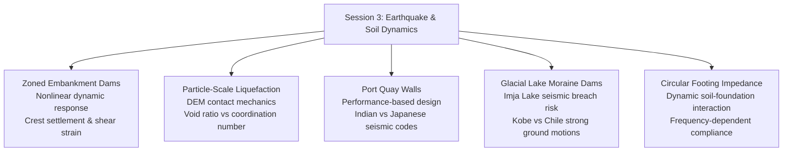
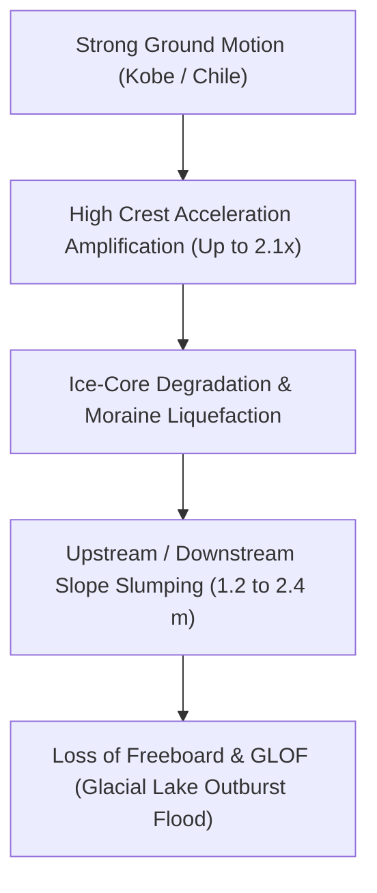

# Chapter 3: Earthquake Engineering & Soil Dynamics

!!! info "Chapter Context & Source Papers"
    This chapter synthesizes technical papers from **Session 3 (Earthquake and Soil Dynamics)** presented at GAIC 2025 and published in *GeoVadis: The Future of Geotechnical Engineering (Volume 3)*, CRC Press / Taylor & Francis (2026), DOI: [10.1201/9781003645955](https://doi.org/10.1201/9781003645955).

---

## 1. Executive Summary & Dynamic Focus

Session 3 addressed non-linear seismic soil response across complex infrastructure systems:

---

## 2. Non-Linear Seismic Response of Zoned Embankment Dams (Kumar & Maheshwari)

A. Kumar and Prof. B.K. Maheshwari evaluated the non-linear earthquake response of high zoned rockfill dams with central impervious clay cores:

*   **Constitutive Formulation:** Equivalent linear vs. fully non-linear hysteretic elastoplastic models with pressure-dependent shear modulus degradation $G/G_{\text{max}}$ and damping ratio $D$:

$$\frac{G}{G_{\text{max}}} = \frac{1}{1 + \left(\frac{\gamma}{\gamma_r}\right)^a}$$

*   **Permanent Deformation Prediction:** Newmark sliding block integration versus coupled dynamic effective-stress finite element analyses. Under peak ground acceleration ($PGA = 0.45\text{ g}$), non-linear soil softening amplified permanent crest settlement by 42% compared to equivalent-linear approximations.
*   **Excess Pore Pressure in Core:** Core saturation levels dictated hydrodynamic stress redistribution; failure to model hydraulic-mechanical coupling underestimates downstream slope outward bulging.

---

## 3. Particle-Based Micromechanics for Liquefaction Susceptibility (Banerjee et al.)

S. Banerjee, R.K. Kandasami, M.U. Rehman, and A. Srivastava introduced a simplified particle-level discrete element method (DEM) framework to characterize liquefaction susceptibility:

*   **Micro-to-Macro Contact Network:** Coordination number $Z_c$ and mechanical contact anisotropy tensor $a_{ij}$:

$$Z_c = \frac{2 N_c}{N_p}$$

$$a_{ij} = \frac{15}{2} \left( \Phi_{ij} - \frac{1}{3}\delta_{ij} \right)$$

where $N_c$ is contact count and $N_p$ is particle count.

*   **Liquefaction Triggering Criterion:** During undrained cyclic shearing, liquefaction onset corresponds to a critical drop in active load-bearing coordination number ($Z_c \rightarrow 3.0$), causing macroscopic shear modulus $G \rightarrow 0$ regardless of initial relative density $D_r$.
*   **Simplified Assessment Index:** A dimensionless grain-scale metric linking uniformity coefficient $C_u$, sphericity $S$, and initial state parameter $\psi$ was proposed, circumventing time-consuming cyclic triaxial testing for initial site screening.

---

## 4. Performance-Based Seismic Design of Port Quay Walls (Pushpa et al.)

K. Pushpa, P. Nanjundaswamy, and S.K. Prasad carried out a rigorous comparative review between Indian Standard (IS 1893 / IS 456) and Japanese Port Design Standards (OCDI - Overseas Coastal Development Institute of Japan):

*   **Design Philosophy Comparison:**
    *   *Indian Standard:* Force-based pseudo-static method using seismic coefficient $k_h = \frac{Z \cdot I \cdot S_a / g}{2 R}$.
    *   *Japanese Code (OCDI):* Two-tier performance-based design:
        *   **Level 1 (Serviceability Earthquake - return period 75 yrs):** Minor residual displacement ($\Delta x < 0.1\text{ m}$), immediate operational recovery.
        *   **Level 2 (Safety Earthquake - return period 475–1000 yrs):** Controlled residual displacement ($\Delta x < 0.3 - 0.5\text{ m}$), no sudden collapse of caisson structure or loss of berth function.
*   **Case Evaluation:** Pseudo-static methods significantly underestimate residual lateral displacement and tilting when backfill liquefaction occurs behind the caisson wall, demonstrating the necessity of effective-stress dynamic response analyses in maritime infrastructure.

---

## 5. Seismic Stability of Glacial Lake Moraine Dams (Ojha, Tiwari, et al.)

Biraj Ojha, Aanchal Tiwari, Sandeep Sapkota, Ram Chandra Tiwari, and P. Dangi Chhetri investigated the seismic vulnerability of the **Imja Glacier Lake moraine dam** in the high Himalayas of Nepal:

*   **Site Context:** Imja Lake ($5,010\text{ m}$ elevation) stores tens of millions of cubic meters of meltwater retained by an unconsolidated terminal moraine dam containing an ice core.
*   **Seismic Excitation:** Dam stability was simulated under historical strong ground motions (1995 Kobe $M_w 6.9$ and 2010 Chile $M_w 8.8$ earthquakes):

*   **Outlet Channel Integrity:** The artificial spillway channel was found prone to blockage from seismic raveling of adjacent moraine ridges, posing a critical cascading risk of overtopping and catastrophically triggering a Glacial Lake Outburst Flood (GLOF).

---

## 6. Dynamic Soil-Foundation Interaction of Circular Footings (Jafarzadeh & Maleki)

Fardin Jafarzadeh and Jafar Maleki investigated the dynamic impedance and vibration response of rigid circular surface footings on sand beds:

*   **Experimental Testing:** Large-scale dynamic test pit instrumented with accelerometers and contact pressure sensors excited under variable frequency vertical and rocking harmonics ($f = 5 - 50\text{ Hz}$).
*   **Impedance Functions:** Complex stiffness $K^* = K_{dyn} + i \omega C$:

$$K_{dyn}(\omega) = k(\omega) K_s$$

$$C(\omega) = c(\omega) \frac{K_s r_0}{V_s}$$

where $K_s = \frac{4 G r_0}{1 - \nu}$ is static vertical stiffness, and $r_0$ is footing radius.
*   **Non-Linear Strain Effects:** At shear strain amplitudes $\gamma > 10^{-4}$, foundation resonance frequencies shifted downward by 25% due to shear modulus degradation in the near-field zone, accompanied by a 35% increase in radiation damping.
