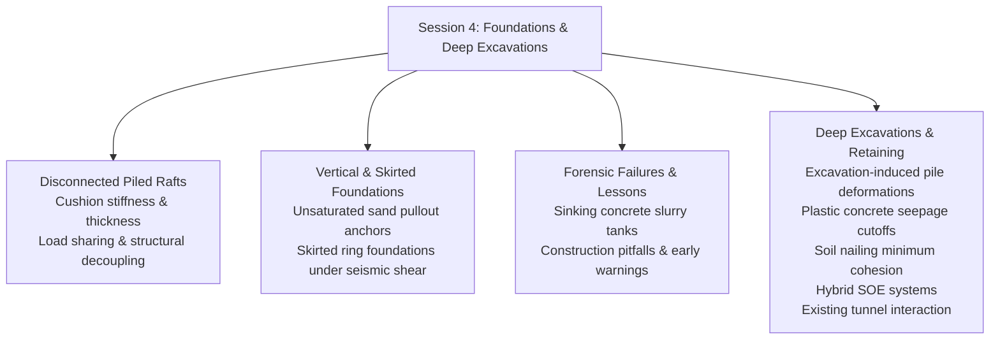

# Chapter 4: Foundations, Deep Excavations & Retaining Systems

!!! info "Chapter Context & Source Papers"
    This chapter synthesizes technical papers from **Session 4 (Foundations and Deep Excavation)** presented at GAIC 2025 and published in *GeoVadis: The Future of Geotechnical Engineering (Volume 3)*, CRC Press / Taylor & Francis (2026), DOI: [10.1201/9781003645955](https://doi.org/10.1201/9781003645955).

---

## 1. Executive Summary & Design Overview

Session 4 examined complex interaction problems in deep foundation systems, high-risk urban excavation, retaining structures, and cutoff barriers:

---

## 2. Advanced Piled Raft Systems: Disconnected Piled Rafts (Raut et al.)

S. Raut, P. Halder, B. Manna, and J.T. Shahu conducted comprehensive numerical investigations into **Disconnected Piled Raft Systems (DPRF)**:

*   **Mechanism of Decoupling:** In DPRF, the raft is structurally separated from the pile heads by a granular cushion layer (sand, gravel, or geogrid-reinforced gravel). This eliminates shear concentrations and high bending moments at pile-head connections:

$$P_{\text{total}} = P_{\text{raft}} + \sum P_{\text{pile}}$$

$$\alpha_{pr} = \frac{\sum P_{\text{pile}}}{P_{\text{total}}}$$

*   **Influence of Cushion Thickness ($t_c/d$) and Stiffness ($E_c$):**
    *   Thin cushion ($t_c/d < 0.5$): High load transfer to piles ($\alpha_{pr} > 0.75$), but stress concentrations persist.
    *   Optimal cushion ($t_c/d = 0.8 - 1.2$): Piles act purely as settlement reducers mobilized at full frictional capacity, while raft contact pressure distributes uniformly over the subsoil.
    *   Excessive cushion ($t_c/d > 2.0$): Piles become inefficient; raft settlements increase by 45%.

---

## 3. Specialized Foundations: Anchors & Skirted Rings

### 3.1 Vertical Anchor Pullout in Unsaturated Sandy Soil (Mushtaq & Sahoo)
M. Mushtaq and J.P. Sahoo investigated the ultimate uplift capacity of plate anchors in unsaturated soils:

*   **Matric Suction Contribution:** Apparent cohesion induced by suction $\psi = (u_a - u_w)$ along the pullout rupture surface:

$$q_{ult} = \gamma' h_e N_\gamma + c_{\text{app}} N_c$$

$$c_{\text{app}} = c' + (u_a - u_w) \tan \phi^b$$

*   **Peak Pullout Resistance:** Plate pullout tests revealed a 2.2-fold increase in uplift capacity at optimum soil-water retention states ($S_r \approx 40\%$) compared to fully dry or saturated sand beds.

### 3.2 Skirted Ring Foundations under Seismic Lateral Loads (Chatterjee et al.)
Kaustav Chatterjee, Puran, Pratik Goel, and Sambit Pani analyzed skirted circular ring foundations for storage tanks and cooling towers:

*   **Confinement Efficiency:** Skirts enclosing the perimeter constrain soil lateral squeeze under seismic overturning moments, enhancing horizontal capacity factors $N_h$ by 35% to 60%.
*   **Layered Strata Interaction:** Weak over strong soil stratigraphy concentrates plastic shear strains along the skirt tip plane, necessitating skirt depth-to-width ratios $D_s/B \ge 0.5$.

---

## 4. Forensic Geotechnical Analysis of Structural Failures

### 4.1 Forensic Analysis of Sinking Concrete Slurry Tanks (Krishnanunni, Bishnoi, Murty)
K.T. Krishnanunni, D. Bishnoi, and D.S. Murty investigated the catastrophic unseated sinking and tilting ($> 300\text{ mm}$) of heavy circular concrete industrial slurry tanks:

*   **Root Cause Failure Mechanism:**
    1.  Inadequate site investigation failed to identify localized soft marine clay lenses at depths of $6\text{ m}$ to $11\text{ m}$ beneath an un-grouted boulder layer.
    2.  Dynamic operational slurry agitation triggered excess pore pressure build-up and undrained bearing capacity failure.
    3.  Differential consolidation settlement induced structural warping and circumferential tank wall tearing.
*   **Remediation Scheme:** High-pressure jet grouting underpin curtains combined with micro-piles drilled through the base slab to bedrock.

### 4.2 Designing Against Failure: Geotechnical Pitfalls (Govind Raj & Annam)
B. Govind Raj and Madan Kumar Annam documented key early-warning indicators and fatal oversights in urban excavations:
*   Over-reliance on uncalibrated default Mohr-Coulomb parameters in software.
*   Ignoring piezometric perched water tables during rainy seasons.
*   Neglecting construction sequencing and over-excavation ahead of strut/tieback preloading.

---

## 5. High-Risk Urban Deep Excavations & Retaining Systems

### 5.1 Excavation-Induced Deformations in Adjacent Piles (Rao & Kandolkar)
R.B. Rao and S.S. Kandolkar modeled the lateral response of existing loaded pile groups located behind deep diaphragm retaining walls:

*   **Proximity Ratio:** Piles located within distance $x \le 1.5 H_e$ (where $H_e$ is excavation depth) suffered induced bending moments exceeding 60% of their structural yield capacity, requiring sacrificial relief trenches or jet grouting barrier curtains between the wall and piles.

### 5.2 Seepage Cutoffs Using Plastic Concrete (Chakraborty et al.)
S. Chakraborty, S.K. Koley, and P.K. Ray detailed design parameters for plastic concrete cut-off diaphragm walls:

*   **Mix Proportioning:** Water, cement, bentonite, and aggregates proportioned to obtain compressive strength $f_c = 1.5 - 3.5\text{ MPa}$ and deformation modulus $E \approx 500 - 1500\text{ MPa}$.
*   **Ductility & Permeability:** Plastic concrete can withstand strains $\varepsilon > 2.5\%$ without brittle tensile cracking, while maintaining hydraulic conductivity $k \le 1 \times 10^{-10}\text{ m/s}$.

### 5.3 Hybrid SOE Systems in Dense Urban Areas (Yasrebi & Zolqadr)
Shahab Yasrebi and Emad Zolqadr evaluated hybrid Support of Excavation (SOE) schemes combining soldier piles, tieback prestressed ground anchors, and top-down strutted diaphragm walls:

*   **Settlement Control:** Hybrid systems limited adjacent building settlements to $< 12\text{ mm}$ adjacent to an $18\text{ m}$ deep subway cut, reducing lateral wall deflections by 40% compared to conventional soil nailing.

### 5.4 Excavation and Surcharge Impacts on Existing Metro Tunnels (Ayothiraman et al.)
R. Ayothiraman, V.K. Singh, and S. Mahajan evaluated existing bored tunnels in sand subjected to adjacent basement excavation and heavy tower surcharge:

*   **Distortion Ratio ($DR$):** Diameter change ratio $\Delta D / D$ reached 0.45% during unbraced bottom-heave unloading stages.
*   **Safety Limits:** Maximum bending moment increments occurred at tunnel springline and crown, dictating staged dewatering and strict limits on adjacent pile driving vibration.
