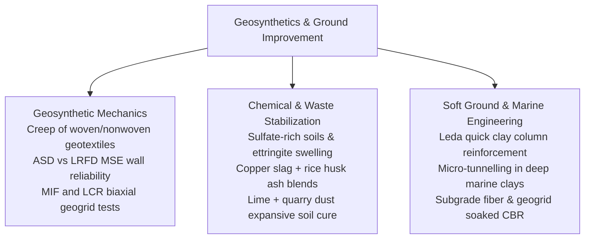

# Chapter 5: Geosynthetics & Ground Improvement

!!! info "Chapter Context & Source Papers"
    This chapter synthesizes technical papers from **Session 5 (Geosynthetic Engineering)** and **Session 6 (Ground Improvement and Stabilisation)** presented at GAIC 2025 and published in *GeoVadis: The Future of Geotechnical Engineering (Volume 3)*, CRC Press / Taylor & Francis (2026), DOI: [10.1201/9781003645955](https://doi.org/10.1201/9781003645955).

---

## 1. Executive Summary & Technological Scope

Sessions 5 and 6 synthesized cutting-edge ground reinforcement, geosynthetic polymers, and chemical/biological stabilization technologies:

---

## 2. Geosynthetic Mechanics & Retaining Wall Reliability

### 2.1 Creep Behavior of Geotextiles (Kolekar, Dasaka, et al.)
J.Y. Kolekar, Prof. S.M. Dasaka, S.B. Kharmale, and Y.A. Kolekar reviewed the creep rupture mechanics of polyester (PET) and polypropylene (PP) geotextiles:

*   **Creep Reduction Factor ($RF_{\text{CR}}$):**

$$T_{\text{al}} = \frac{T_{\text{ult}}}{RF_{\text{CR}} \cdot RF_{\text{ID}} \cdot RF_{\text{D}}}$$

where $RF_{\text{CR}}$ is the creep reduction factor, $RF_{\text{ID}}$ accounts for installation damage, and $RF_{\text{D}}$ represents biological/chemical durability.
*   **Viscoelastic Models:** Burgers four-element model and stepped isothermal method (SIM) predictions showed that PP geotextiles exhibit up to 3.5-times higher creep strain rates than high-tenacity PET fibers at elevated operating temperatures ($T > 35^\circ\text{C}$).

### 2.2 ASD vs. LRFD in Reinforced Soil (MSE) Walls (Mana & Vyas)
D.S.K. Mana and S.D. Vyas evaluated design conservatism between Allowable Stress Design (ASD) and Load and Resistance Factor Design (LRFD):

*   **Limit States:** External stability (sliding, overturning, bearing capacity) and internal stability (reinforcement tensile rupture, pullout resistance).
*   **Reliability Index ($\beta$):** LRFD achieved a more uniform reliability index across varying wall heights ($H = 4 - 12\text{ m}$) by decoupling load factors ($\gamma_{\text{EV}} = 1.35$, $\gamma_{\text{EH}} = 1.50$) from resistance factors ($\phi_t = 0.90$ for strip pullout), achieving 8% to 15% material cost savings in low-risk highway backfills without compromising safety margins.

### 2.3 Biaxial Geogrid Interaction: MIF and LCR (Vyas & Mistry)
Saurabhh Vyas and Shivani Mistry determined Microgrid Interaction Factor ($MIF$) and Lateral Constraint Ratio ($LCR$) using large-scale pullout test apparatus:

*   **Aperture Stability:** Polypropylene extruded geogrids exhibited higher $LCR$ values ($> 0.82$) in angular crushed ballast compared to woven polyester grids ($LCR \approx 0.65$), confirming the superiority of rigid integral junctions in arresting lateral ballast spreading.

---

## 3. Chemical Stabilization & Problematic Soil Treatments

### 3.1 Soluble Sulfate Contamination in Lime-Treated Soil (Jha et al.)
A.K. Jha, Shivanshi, V.B. Singh, and P. Akhtar explored the mechanism of **ettringite heave** in lime-stabilized clays contaminated with soluble sulfates ($\text{SO}_4^{2-} > 2,000\text{ ppm}$):

*   **Mineral Reaction Kinetics:**

$$6\text{Ca}^{2+} + 2\text{Al(OH)}_4^- + 4\text{OH}^- + 3\text{SO}_4^{2-} + 26\text{H}_2\text{O} \rightarrow \text{Ca}_6[\text{Al(OH)}_6]_2(\text{SO}_4)_3 \cdot 26\text{H}_2\text{O} \downarrow \text{ (Ettringite)}$$

*   **Mitigation Strategy:** Addition of ground granulated blast furnace slag (GGBS) and barium chloride effectively immobilized sulfate ions, preventing the formation of expansive needle-like ettringite crystals and maintaining 28-day $UCS > 1.8\text{ MPa}$.

### 3.2 Stabilization of High-Sulfate Soils Using Lime and Quarry Dust (Mukherjee et al.)
A. Mukherjee, S. Suresh, S. Chakraborty, and U. Patil utilized quarry dust (QD) as a pozzolanic binder supplement:

*   **Replacement Ratio:** A combination of 6% hydrated lime and 20% quarry dust reduced plasticity index from $34\%$ to $11\%$ and curbed swell pressure from $210\text{ kPa}$ to under $18\text{ kPa}$.

### 3.3 Industrial Waste Valorization: Copper Slag & Rice Husk Ash (Agnihotri & Sharma)
A.K. Agnihotri and K. Sharma developed sustainable cementitious binders blending industrial copper slag (CS) and agricultural rice husk ash (RHA):

*   **Shear Strength Enhancement:** A 15% CS + 10% RHA + 4% lime blend increased the effective internal friction angle $\phi'$ of soft silty subgrades from $22^\circ$ to $36^\circ$, offering an eco-friendly pavement subbase alternative.

---

## 4. Soft Marine Clay Engineering & Specialized Ground Improvement

### 4.1 Micro-Tunnelling Through Deep Soft Marine Clay (Kulkarni et al.)
Uday Kulkarni, Vinay Pande, Renu Kulkarni, and M.B. Joshi detailed the planning and execution of a coastal sewerage micro-tunnelling project driven through deep soft marine clay ($s_u < 15\text{ kPa}$, sensitivity $S_t > 8$):

*   **Slurry Micro-TBM Control:** Precise face balance pressure control ($\Delta p = \pm 5\text{ kPa}$) prevented hydraulic blowouts through mudflats.
*   **Bentonite Lubrication Injection:** Continuous bentonite-polymer skin lubrication reduced pipe jacking forces by 55%, preventing pipe seizure along a $650\text{ m}$ drive length.

### 4.2 Improvement of Sensitive Leda Clay Stiffness (Guetif)
Z. Guetif evaluated ground stiffness improvement of sensitive Canadian Leda clays via granular column installation:

*   **Stress Concentration Ratio ($n = \sigma_c / \sigma_s$):** Field settlement records verified that compacted stone columns reduced primary consolidation settlement by 60%, with column stiffness ratio reaching $n \approx 4.2$.

### 4.3 Soaked CBR Improvement with Geogrids and Polypropylene Fibers (Rasool et al.)
M.U. Rasool, H. Iqbal, P. Halder, and R. Bhowmik evaluated hybrid reinforcement in high-plasticity road subgrades:

*   **Combined Synergy:** Discrete polypropylene fibers ($0.75\%$ by weight) arrested micro-cracking, while a mid-layer biaxial geogrid boosted soaked California Bearing Ratio ($CBR$) from $2.8\%$ to $14.5\%$, reducing required asphalt pavement structural thickness by 38%.
