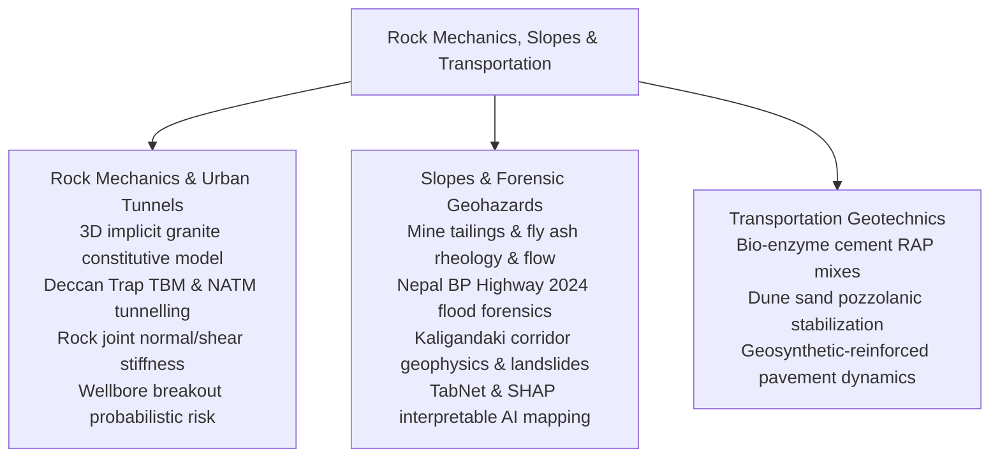
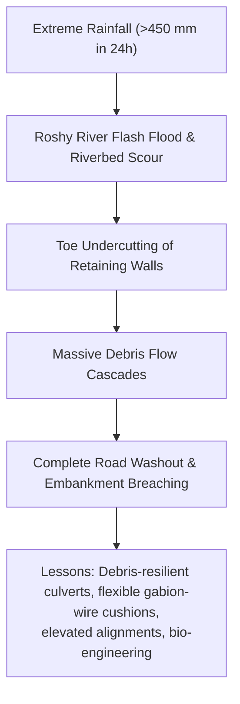

# Chapter 6: Rock Mechanics, Slopes & Transportation Geotechnics

!!! info "Chapter Context & Source Papers"
    This chapter synthesizes technical papers from **Session 7 (Practice, Risk and Education)**, **Session 8 (Rock Mechanics and Tunnelling Engineering)**, **Session 9 (Slope Stability and Landslides)**, and **Session 10 (Transportation Geotechnics)** presented at GAIC 2025 and published in *GeoVadis: The Future of Geotechnical Engineering (Volume 3)*, CRC Press / Taylor & Francis (2026), DOI: [10.1201/9781003645955](https://doi.org/10.1201/9781003645955).

---

## 1. Executive Summary & Infrastructure Scope

This chapter synthesizes major infrastructure breakthroughs across rock engineering, deep tunnelling, extreme slope hazards, and transportation networks:

---

## 2. Advanced Rock Mechanics & Tunnelling Engineering

### 2.1 3D Implicit Constitutive Model for Granite Rocks (Naveen, Kumar, Gokulnath, Juneja)
K.J. Naveen, Ankesh Kumar, C. Gokulnath, and Prof. Ashish Juneja developed a generalized 3D implicit constitutive elastoplastic model capturing non-linear pre-peak hardening and post-peak strain-softening of crystalline granites:

*   **Yield Criterion & Flow Rule:** Incorporating stress-dependent dilatancy angle $\psi(\sigma_3, \varepsilon_p)$ and non-associated plastic potential $g$:

$$f(\boldsymbol{\sigma}, \kappa) = \sqrt{J_{2D}} - \alpha(\kappa) I_1 - k(\kappa) = 0$$

where $I_1$ is the first invariant of stress, $J_{2D}$ is the second deviatoric invariant, and $\kappa$ represents plastic damage progression.
*   **Validation:** Accurately captured brittle-ductile transition curves observed in true triaxial test data under confinement up to $150\text{ MPa}$.

### 2.2 TBM Performance in Basaltic Deccan Trap Rock (Rao, Kulkarni, Kulkarni)
G.V. Rao, Uday Kulkarni, and Renu Kulkarni documented Earth Pressure Balance (EPB) and Hard Rock TBM drives through heterogeneous Deccan Trap basalts (vesicular, amygdaloidal, and compact basalt with compressive strength $UCS = 40 - 160\text{ MPa}$):

*   **Disc Cutter Wear:** Severe abrasive wear occurred in transitions between soft zeolitic/amygdaloidal basalt and hard compact basalt, requiring tungsten carbide button disc cutters and real-time cutterhead torque monitoring.
*   **Penetration Rate ($ROP$):** Semi-empirical field penetration index $FPI = F_N / p$ provided robust advance rate forecasting ($ROP = 1.8 - 2.8\text{ m/h}$).

### 2.3 NATM Tunnelling through Deccan Trap Hazards (Mehta, Kulkarni, Kulkarni)
Ameya Suhas Mehta and co-authors analyzed drill-and-blast New Austrian Tunnelling Method (NATM) excavation through geological fault gouges and columnar joints:

*   **Support System Optimization:** Utilization of self-drilling forepoling umbrellas, lattice girders, and steel-fiber reinforced shotcrete (SFRS) limited tunnel crown convergence to $< 18\text{ mm}$.

### 2.4 Stiffness and Shear Strength of Rock Joints (Kumar & Pandey)
Rajeev Kumar and Vinay Kumar Pandey calibrated non-linear shear dilation and peak shear strength using Barton's Joint Roughness Coefficient ($JRC$) and Joint Wall Compressive Strength ($JCS$):

$$\tau = \sigma_n \tan \left[ JRC \log_{10}\left(\frac{JCS}{\sigma_n}\right) + \phi_b \right]$$

Large-scale direct shear testing on natural basalt joints verified that as normal stress $\sigma_n$ increases above $0.3 JCS$, asperity shearing replaces dilation, reducing effective friction.

---

## 3. Forensic Slope Stability & Landslide Early Warning

### 3.1 Rheology and Liquefaction Flow of Mine Tailings & Fly Ash (Fatema, Bhatia, Palomino)
N. Fatema, S.K. Bhatia, and A.M. Palomino investigated post-failure flow liquefaction of copper tailings and coal fly ash impoundments:

*   **Static Liquefaction:** Saturated silty tailings subject to minor shear perturbations exhibit rapid contractive behavior, collapsing into high-velocity mudflows.
*   **Rheological Profiling:** Rotational rheometer measurements showed shear-thinning pseudoplastic behavior well-characterized by the Herschel-Bulkley model:

$$\tau = \tau_0 + k \dot{\gamma}^n \quad (n < 1.0)$$

Yield stress $\tau_0$ dropped by over 90% when solids content declined by only 6%, explaining multi-kilometer runout distances observed in tailings dam collapses.

### 3.2 Climate-Resilient Road Design: Forensic Analysis of Nepal's BP Highway 2024 Flood (KC Rajan, Subedi, et al.)
KC Rajan, Mandip Subedi, and team conducted forensic back-analyses following the catastrophic September 2024 flood in Nepal, which destroyed sections of the BP Highway:

*   **Design Recommendations:** Embankments require anchored rockfill toe aprons extending below projected scour depth ($d_s > 3.5\text{ m}$) and flexible wire-mesh rockfall barriers along tributary chutes.

### 3.3 Interpretable AI for Landslide Susceptibility: TabNet & SHAP (Congress et al.)
Surya Sarat Chandra Congress, Ambikesh Dwivedi, Raul Velasquez, Prince Kumar, and Ujwalkumar Patil applied TabNet deep learning combined with SHapley Additive exPlanations (SHAP) across Minnesota's river bluffs:

*   **Model Accuracy:** TabNet achieved AUC-ROC of $0.94$, outperforming conventional Random Forest and Support Vector Machines.
*   **SHAP Interpretability:** Feature importance attribution identified slope gradient ($> 28^\circ$), topographic wetness index ($TWI$), and soil hydraulic conductivity as primary global triggers, eliminating black-box uncertainty for planning authorities.

### 3.4 Micro-Pile Stabilization of Valley-Side Slopes in Nepal (Neupane, Ghimire, Sharma)
Udaya Raj Neupane, Saurav Ghimire, and Jenish Sharma documented the remediation of the Jhyaple Khola slope along the Nagdhungha-Naubise highway:

*   **Retaining Network:** Double rows of bored steel micro-piles ($d = 200\text{ mm}$, length $12\text{ m}$) tied into a continuous reinforced concrete cap beam provided high shear dowel resistance, increasing the slope Factor of Safety from $0.92$ to $1.48$.

---

## 4. Modern Transportation Geotechnics

### 4.1 Bio-Enzyme Cement-Treated Reclaimed Asphalt Pavement (RAP) Mixes (Mishra, Pydi, Guzzarlapudi)
Ashish Mishra, Rakesh Pydi, and S.D. Guzzarlapudi enhanced the durability of 100% Reclaimed Asphalt Pavement (RAP) aggregate mixes:

*   **Bio-Enzymatic Action:** Terrazyme bio-enzymes accelerated cationic exchange and neutralized bitumen coating passivity, facilitating cement hydration.
*   **Durability Gains:** Wet-dry durability mass loss decreased from 28% to under 6.5%, meeting AASHTO criteria for heavy-trafficked base courses.

### 4.2 Dune Sand Stabilization using Sustainable Pozzolanic Additives (Shah & Kori)
M.V. Shah and Sandipkumar Kori stabilized aeolian desert dune sands:

*   **Stabilizer Blend:** High-calcium fly ash and ground granulated blast furnace slag activated by hydrated lime.
*   **7-Day & 28-Day Strength:** Unconfined compressive strength exceeded $2.4\text{ MPa}$, rendering loose dune sand stable for rural road construction without requiring aggregate hauling.

### 4.3 Geosynthetic-Reinforced Pavements under Repeated Traffic Loads (Saride, Ram, Jain)
Prof. Sireesh Saride, A.K. Ram, and S. Jain conducted large-scale accelerated cyclic pavement testing:

*   **Permanent Rutting Mitigation:** Triaxial geogrid placed at the subgrade-base interface reduced permanent surface rut depth by up to 52% after 100,000 load cycles ($40\text{ kN}$ dual-wheel assembly).
*   **Traffic Benefit Ratio ($TBR$):**

$$TBR = \frac{N_{\text{reinforced}}}{N_{\text{unreinforced}}} = 2.4 - 3.8$$

demonstrating substantial service-life extensions for heavy highway pavements.
