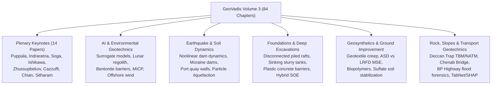

# GeoVadis: The Future of Geotechnical Engineering (Volume 3)

!!! info "Open Access Reference & Attribution"
    This reference manual provides a structured technical digest and engineering synthesis of the open-access volume:  
    **GeoVadis: The Future of Geotechnical Engineering (Volume 3)**  
    *Proceedings of the First Geotech Asia International Conference (GAIC 2025), Goa, India.*  
    **Editors:** Ashish Juneja, Anil Joseph, and Dasaka S. Murty.  
    **Publisher:** CRC Press / Balkema, Taylor & Francis Group, London & Boca Raton, 2026.  
    **License:** Published under [Creative Commons Attribution-NonCommercial-NoDerivatives (CC BY-NC-ND 4.0)](https://creativecommons.org/licenses/by-nc-nd/4.0/).  
    **DOI:** [10.1201/9781003645955](https://doi.org/10.1201/9781003645955) | **eBook ISBN:** 9781003645955 | **Hardback ISBN:** 9781041085546.

---

## Overview and Scope of Volume 3

Following **Volume 1** (Plenary Foundations, Computational Geomechanics, Cold/Coastal Environments, Soil Dynamics, Deep Excavations, Geosynthetics) and **Volume 2** (Ground Modification, Risk & Site Characterization, Rock Tunnelling, Landslides, Transportation Geotechnics), **Volume 3** completes the GAIC 2025 proceedings with **84 peer-reviewed technical papers and plenary lectures**.

Volume 3 synthesizes breakthrough developments across 19 technical domains, featuring 14 seminal Plenary Keynotes and 10 specialized technical sessions:

---

## Publication Details

| Item | Specification |
| --- | --- |
| **Title** | GeoVadis: The Future of Geotechnical Engineering (Volume 3) |
| **Editors** | Ashish Juneja (IIT Bombay), Anil Joseph (Geostruct / IGS), Dasaka S. Murty (IIT Bombay) |
| **Conference** | First Geotech Asia International Conference (GAIC 2025), Goa, India |
| **Publisher** | CRC Press / Balkema, Taylor & Francis Group |
| **Publication Date** | 2026 |
| **DOI** | [10.1201/9781003645955](https://doi.org/10.1201/9781003645955) |
| **eBook ISBN** | 978-1-003-64595-5 |
| **Hardback ISBN** | 978-1-041-08554-6 |
| **Access Mode** | Open Access (OA) under CC BY-NC-ND 4.0 |

---

## Structure of this Reference Manual

Volume 3 is structured into six comprehensive technical chapters capturing all plenary lectures and technical sessions:

| Chapter | Title | Technical Scope & Highlights |
| :--- | :--- | :--- |
| **01** | [Plenary Keynotes & State-of-the-Art Lectures](chapter-01-plenary-lectures.md) | Geothermal geosynthetics (Puppala); Waste-recycled rail subgrade (Indraratna); Self-boring pressuremeter mechanics in stiff clay (Soga); Rainfall debris flow runout (Ishikawa); Megastructure piling in Kazakhstan collapsible soils (Zhussupbekov); Geomembrane dam durability (Cazzuffi); Seismic tunnel look-ahead probing (Chian); Noto Peninsula lateral flow liquefaction (Hazarika); Sand liquefaction micro-mechanics (Latha); Nepal post-Gorkha resilience (Subedi); Chenab Bridge foundation innovation & slope stabilization (Sitharam). |
| **02** | [AI, Computational Geomechanics & Environmental Engineering](chapter-02-ai-computational-environmental.md) | Surrogate machine learning models for strip footings on variable slopes; Extra-terrestrial lunar regolith drilling force mechanics; AI opportunities and bottlenecks in geotechnics; Rock mass uplift anchor testing; Bentonite backfill unconfined compressive strength; Red mud shrinkage control; Nanomaterial mitigation of alkali swelling; Sugarcane molasses MICP biocementation; Floating offshore wind turbine FEM; Modern landfill containment design. |
| **03** | [Earthquake Engineering & Soil Dynamics](chapter-03-earthquake-soil-dynamics.md) | Nonlinear dynamic analysis of zoned rockfill/earthfill dams; Particle-scale simplified liquefaction susceptibility assessment; Performance-based design of port quay walls (Indian vs Japanese codes); Seismic stability and breach mechanics of glacial lake moraine dams (Imja Glacier Lake) under Kobe and Chile earthquakes; Dynamic impedance of circular footings. |
| **04** | [Foundations, Deep Excavations & Retaining Systems](chapter-04-foundations-deep-excavation.md) | Disconnected piled raft foundations (DPRF) with cushion layers; Bridge substructure alternatives in complex geology; Vertical anchor pullout in unsaturated sand; Skirted ring foundations under seismic lateral loads; Forensic back-analysis of sinking concrete slurry tanks; Deep excavation induced deformations in adjacent pile foundations; Plastic concrete cutoff seepage barriers; Soil nailing cohesion thresholds; Hybrid SOE systems; TBM tunnel interaction under excavation unloading and surcharge. |
| **05** | [Geosynthetics & Ground Improvement](chapter-05-geosynthetics-ground-improvement.md) | Creep behavior of woven and nonwoven geotextiles; ASD vs LRFD reliability design of MSE walls; MIF/LCR characterization of biaxial geogrids; Soluble sulfate contaminated lime-treated soils and ettringite swelling mitigation; Soaked CBR of geogrid/fiber subgrades; Infrastructure soil stabilization insights; Quick Leda clay stiffness enhancement; Micro-tunnelling through soft marine clay; Copper slag & rice husk ash cementitious mixes; High-sulfate soil lime-quarry dust stabilization. |
| **06** | [Rock Mechanics, Slopes & Transportation Geotechnics](chapter-06-rock-slopes-transportation.md) | High-capacity rock anchors for pile load testing; Six Sigma precision testing for soils; Guar gum biopolymer road embankments; Dynamic behavior of clay-scrap rubber soils; Integrated geophysics workflows; SPT $(N_1)_{60}$ correlations; Extreme Learning Machine (ELM) GUI for retaining wall risk; Geophysical QA/QC of major fills; Unsaturated agricultural drought mechanics; Siwalik grain size vs $\phi$ interpretation risks; Offshore carbonate soils; 3D implicit granite constitutive model; Surface settlement in urban tunnelling; TBM & NATM excavation in Deccan Trap basalts; Tunnel stability under adjacent excavation; Rock joint stiffness and shear strength; Wellbore probabilistic stability; Mine tailings and fly ash rheology & flow liquefaction; GIS logistic regression landslide mapping; Climate-resilient highway engineering (Nepal BP Highway 2024 flood forensics); Kaligandaki corridor multi-hazard assessment; Micro-pile valley-side slope stabilization; TabNet and SHAP interpretable AI landslide modeling; LEM vs FEM slope comparisons; Bio-enzyme cement RAP mixes; Dune sand pozzolanic stabilization; Geosynthetic-reinforced pavements under cyclic traffic. |

---

## Technical Terminology Standard

All Vietnamese translations follow the canonical 1-to-1 geotechnical terminology:
- **Sister Bar** $\rightarrow$ *Thanh thép đo biến dạng phụ (Sister Bar)*
- **Piezometer** $\rightarrow$ *Áp kế*
- **Strain Gauge** $\rightarrow$ *Cảm biến đo biến dạng*
- **Inclinometer** $\rightarrow$ *Ống đo nghiêng*
- **Load Cell** $\rightarrow$ *Cảm biến đo tải trọng*
- **Earth Pressure Cell** $\rightarrow$ *Hộp đo áp lực đất*
- **Extensometer** $\rightarrow$ *Thiết bị đo biến dạng sâu*
- **Piled Raft Foundation** $\rightarrow$ *Móng bè cọc*
- **Disconnected Piled Raft Foundation** $\rightarrow$ *Móng bè cọc đệm cát (móng bè cọc tách rời)*
- **Soil-Cement Column / Deep Mixing** $\rightarrow$ *Cọc hỗn hợp xi măng - đất*
- **Plastic Concrete Cutoff Wall** $\rightarrow$ *Tường hào bê tông dẻo chống thấm*
- **Diaphragm Wall / Barrette** $\rightarrow$ *Tường vây barrette*
