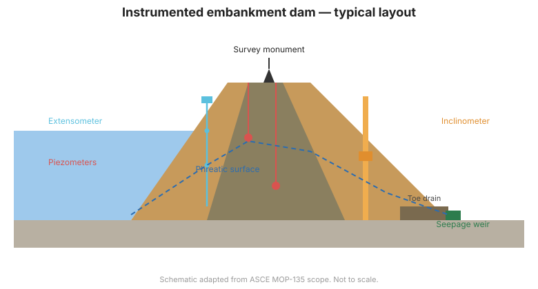

# Chapter 5 — Instrument Families for Dam Monitoring

## 5.1 A menu of measurements

This chapter surveys the instrument families used to monitor dams. Later chapters
go deeper on the most safety-critical ones. For detailed installation procedures,
see the [Dunnicliff](../dunnicliff/index.md) and [FHWA](../fhwa.md) manuals in this
knowledge base.

## 5.2 Measurement categories

| Category | What it measures | Representative instruments |
|----------|-----------------|----------------------------|
| **Water level / reservoir** | Pool elevation, stage | Staff gauges, pressure transducers, float gauges |
| **Pore pressure / uplift** | Water pressure in soil/rock/concrete | Vibrating-wire, pneumatic, standpipe, hydraulic piezometers |
| **Seepage / leakage** | Flow quantity & quality | Weirs, tipping buckets, turbidity sensors, observations |
| **Deformation — surface** | Movement of the dam surface | Survey monuments, GNSS, total station |
| **Deformation — internal** | Movement inside embankment/foundation | Inclinometers, extensometers, settlement systems, SAA |
| **Structural** | Cracks, joint opening, load | Crackmeters, joint meters, load cells, strain gauges |
| **Environmental** | Rainfall, temperature, pore-air | Rain gauges, thermistors, barometers |
| **Concrete / aging** | Distress, alkali, corrosion | Rebar corrosion probes, acoustic emission |

## 5.3 Sensor technologies

Instruments convert a physical quantity into a readable signal. Common
technologies:

- **Vibrating-wire (VW)** — a tensioned wire whose frequency changes with strain;
  robust, drift-free, and the workhorse of modern dam monitoring.
- **Pneumatic** — gas pressure balances the measured pressure; useful where power
  or cables are impractical.
- **Hydraulic** — liquid-column pressure; simple and long-proven.
- **Electrical/resistive & inductance** — potentiometers, LVDTs, and strain gauges.
- **Piezoelectric & MEMS** — accelerometers, tiltmeters, and modern inertial sensors.

## 5.4 Manual vs. automated

- **Manual** instruments are read on site with a portable readout. Low cost, but
  limited frequency and exposure of personnel to hazardous conditions.
- **Automated** instruments feed dataloggers and telemetry, enabling high frequency,
  remote access, and alarms ([Chapter 9](chapter-09-automated.md)).

## 5.5 Accuracy, resolution, and range

Three distinct concepts are often confused:

- **Accuracy** — closeness to the true value (calibration matters).
- **Resolution** — the smallest change the instrument can detect.
- **Range** — the span over which it remains valid.

A dam may need only moderate accuracy but high resolution to detect slow trends.
Specify all three, and a realistic error budget.

## 5.6 Selecting a family

The choice follows the planning step: match the instrument to the indicator,
location, available power, accessibility, expected life, and data system. Redundancy
at the most critical locations is prudent — if the one piezometer that guards a
failure mode fails, the program has a blind spot.

**Figure.** Typical instrument layout on an embankment dam: crest survey, piezometers, extensometer, inclinometer, toe drain, and seepage weir (ASCE MOP-135 scope).

## 5.7 Key takeaways

- Instruments fall into water level, pore pressure, seepage, deformation,
  structural, and environmental families.
- Vibrating-wire sensors are the modern workhorse; pneumatic and hydraulic remain useful.
- Distinguish accuracy, resolution, and range — trend detection often needs resolution most.
- Match the family to the planned indicator and environment; add redundancy at critical points.
