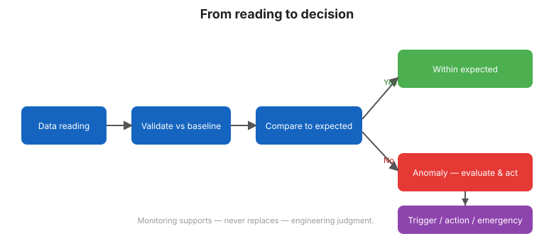

# Chapter 13 — Performance Evaluation and Decision Making

## 13.1 Monitoring exists to support decisions

The purpose of all the preceding work is a defensible answer to one question:
**given what the monitoring shows, what should we do?** This chapter connects
measurement to action.

## 13.2 A structured response to anomalies

When a threshold is exceeded or an evaluation finds a real departure:

1. **Verify** — confirm it is not a sensor or data fault.
2. **Assess** — compare with the failure mode it guards; rate the severity.
3. **Intensify** — increase reading frequency and dispatch inspection
   ([Chapter 3](chapter-03-philosophy.md)).
4. **Decide** — continue normal, investigate, restrict reservoir operation, or
   act to remediate.
5. **Document** — record the decision and its rationale.

## 13.3 Action levels

Many programs define tiered **action levels** tied to thresholds:

| Level | Meaning | Response |
|-------|---------|----------|
| Normal | Within baseline | Routine monitoring |
| Alert | Exceeds baseline band | Review, verify, watch |
| Alarm | Exceeds danger threshold | Intensify, restrict operation, notify |

These levels turn raw numbers into a shared, pre-agreed response — faster and less
emotional during an emergency.

## 13.4 Reservoir operation as a lever

Often the most immediate action is operational: **lower the reservoir** to reduce
loads and seepage while the cause is found. Monitoring data justifies and guides
that decision in real time.

## 13.5 Risk-informed judgment

Decisions weigh the **consequence** of failure against the **credibility** of the
observed trend. A small, well-explained change on a low-consequence feature may
need only monitoring; the same change on a high-consequence failure mode demands
urgent action. There is no universal rule — judgment, informed by the monitoring,
is required.

## 13.6 Closing the loop

A good program learns. Each anomaly, whether benign or serious, updates the
baseline, the thresholds, and the plan. Over the dam's life, the monitoring
program itself improves.

**Figure.** From reading to decision: validate against the baseline, compare to expected behavior, then act (ASCE MOP-135 scope).

## 13.7 Key takeaways

- Monitoring's purpose is a defensible decision: what should we do?
- Respond with verify → assess → intensify → decide → document.
- Pre-agreed action levels make emergencies faster and calmer.
- Reservoir operation is often the first lever; judgment weighs consequence vs. credibility.
