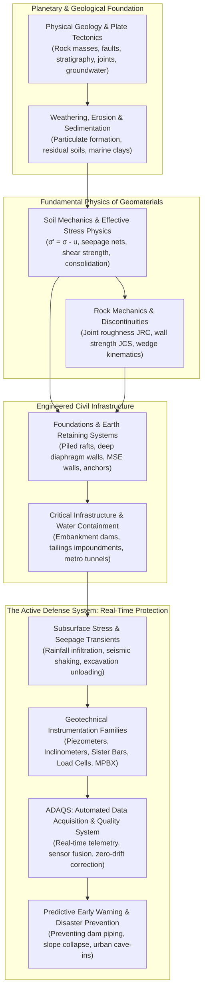
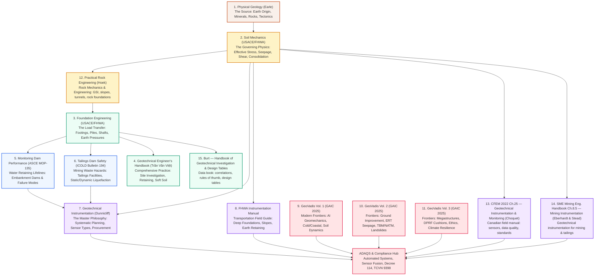
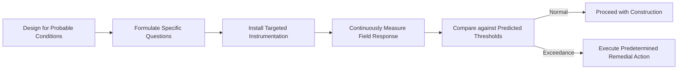
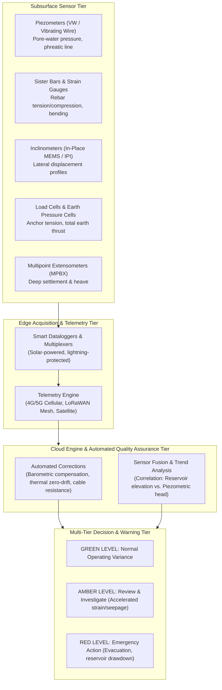
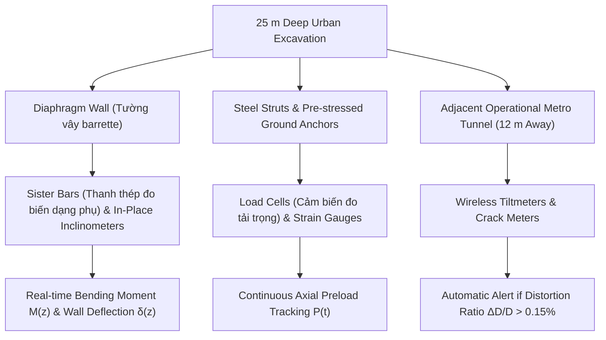
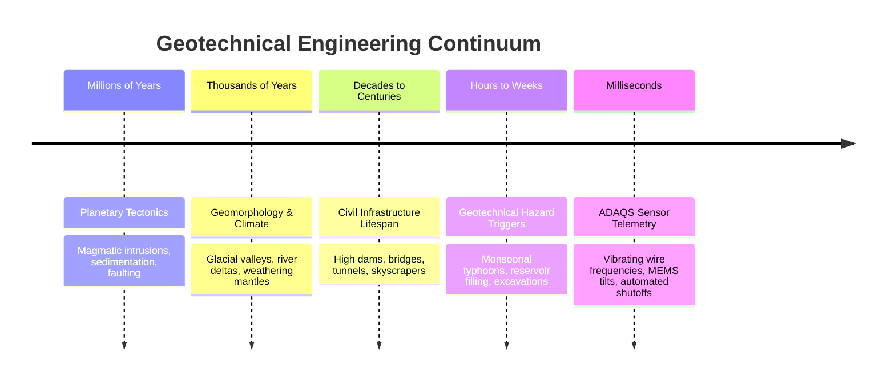

# The Grand Vision: From Earth's Crust to Real-Time Monitoring & Disaster Prevention

!!! info "Executive Synthesis & Foundational Framework"
    This overarching guide synthesizes the entire geotechnical corpus hosted on this platform—spanning **Physical Geology**, **Soil Mechanics**, **Foundation Engineering**, **Rock Engineering (Hoek)**, **Dam & Tailings Safety**, **Advanced Instrumentation (Dunnicliff / FHWA)**, **CFEM 2022** and **SME Mining Instrumentation (Ch. 8.5)**, the **Burt investigation-and-design data tables**, and the latest **GeoVadis Frontiers (Volumes 1–3)**. It articulates the grand engineering vision connecting planetary earth processes to daily sensor telemetry, explaining why geotechnical instrumentation and **ADAQS** are indispensable to preventing catastrophic disasters and ensuring the lifelong resilience of civil infrastructure.

---

## 1. The Grand Vision: Big Picture First

Civil engineering structures do not rest on abstract, idealized mathematical planes—they are rooted in the **Earth's dynamic crust**. 

Every skyscraper, high dam, transit tunnel, offshore energy turbine, and deep excavation interacts directly with geological strata formed over millions of years of tectonic forces, volcanic activity, sedimentation, weathering, and glaciological cycles:

### The Fundamental Dilemma of Geotechnical Engineering
Unlike structural steel or reinforced concrete—whose manufacturing tolerances, yield strengths, and elastic moduli are precisely controlled in industrial factories—**geomaterials are natural, non-homogeneous, opaque, anisotropic, and stress-history-dependent**:

1. **Invisibility:** Engineers cannot open the ground like a machine to inspect every cubic meter. Boreholes sample less than $0.001\%$ of the subterranean volume.
2. **Coupled Non-Linear Physics:** Soil strength is dictated not by total stress, but by the **effective stress principle** ($\sigma' = \sigma - u$). A minute change in pore-water pressure $u$ can drop effective stress $\sigma'$ to zero, transforming solid ground into a fluidized slurry.
3. **Progressive Failure:** Geomaterials fail progressively along localized shear bands or internal erosion pathways that remain entirely invisible from the surface until catastrophic collapse occurs.

Geotechnical instrumentation and automated data acquisition systems (**ADAQS**) provide the **digital nervous system** that bridges this fundamental gap between invisible geological processes and human engineering control.

---

## 2. The Living Continuum: How the Reference Manuals Connect

Each reference manual in this library represents a foundational layer in an integrated pyramid of geotechnical engineering knowledge:

### The Knowledge Progression:
1. **The Origin & Lithology (*Physical Geology*):** Teaches how volcanic basalts, tectonic fault gouges, marine sediments, and glacial till deposits formed their macro-fabrics and groundwater regimes.
2. **The Fundamental Physics (*Soil Mechanics* & *Practical Rock Engineering*):** Translates geological strata into mechanics: grain size distribution, Atterberg limits, permeability $k$, compressibility $C_c$, undrained shear strength $s_u$, and the effective stress tensor. *Practical Rock Engineering* (Hoek) extends this into **rock mechanics** — GSI, discontinuity shear, in-situ stresses, and acceptable-design philosophy for rock slopes, tunnels, and rock foundations.
3. **The Design Synthesis (*Foundation Engineering*, *Geotechnical Engineer's Handbook* & *Burt*):** Calculates how to distribute superstructure loads safely through shallow spread footings, deep bored piles, barrettes, and mechanically stabilized earth (MSE) walls — and *Burt's Handbook of Geotechnical Investigation and Design Tables* supplies the **correlations and design tables** (SPT → strength, CPT → soil type, RQD → rock bearing capacity, PI → modulus) that turn that theory into spreadsheet-ready numbers.
4. **The High-Risk Asset Frontiers (*Dams & Tailings Safety*):** Establishes the fatal failure mechanisms of critical water-retaining and mine-tailings embankments: piping, hydraulic fracturing, foundation sliding, and flow liquefaction.
5. **The Diagnostic Philosophy (*Dunnicliff, FHWA, CFEM 2022* & *SME Mining Instrumentation*):** Introduces the **Observational Method** (Peck, 1969), teaching engineers how to form specific geotechnical questions and select the exact instrument family to answer each question — broadened by the **CFEM 2022 Ch. 25** Canadian instrumentation-and-monitoring field manual and the **SME Mining Engineering Handbook Ch. 8.5** treatment of geotechnical instrumentation for mining and tailings.
6. **The Technological Frontier (*GeoVadis Volumes 1–3*):** Advances the profession into machine learning surrogate models, physics-informed neural networks (PINNs), biopolymer stabilization, bio-cementation (MICP), advanced seismic look-ahead tunnel geophysics, and climate-resilient road alignments.
7. **The Operational Nerve Center (*ADAQS & Statutory Compliance*):** Connects field sensors to automated dataloggers, cloud databases, threshold triggers, and mandatory legal compliance frameworks (such as Vietnam Decree 114/2018/NĐ-CP and TCVN 9398:2012).

---

## 3. Why Instrumentation is the Indispensable Lifeline

### 3.1 The Limits of Mathematical Models
Engineering calculations and numerical simulations (2D/3D FEA, FDM, DEM) are **hypotheses**. They are based on idealized constitutive models (Mohr-Coulomb, Modified Cam-Clay, Hardening Soil) and discrete borehole soundings that represent less than a fraction of a percent of the actual ground mass.

Subsurface surprises are inevitable:
- Unmapped slickensided ancient shear joints in weathered rock.
- Perched, pressurized groundwater lenses sandwiched between impermeable clays.
- Localized soft organic silt lenses beneath massive industrial structures.
- Progressive migration of soil fines through cracked internal dam cores.

### 3.2 The Observational Method: Active Risk Management
Pioneered by Karl Terzaghi and formalized by Ralph B. Peck, the **Observational Method** does not attempt to over-engineer a project with exorbitant, wasteful safety factors to cover every conceivable geological extreme. Instead:
1. Design for the most probable geological conditions.
2. Identify all credible adverse deviations and potential failure modes.
3. Formulate specific engineering questions (e.g., *"Is pore pressure in the core dissipating as predicted during staged filling?"*).
4. Select and install specific instruments to continuously measure the critical parameters.
5. Predetermine specific remedial action plans triggered at quantitative thresholds.

### 3.3 Catastrophes Never Occur Without Subsurface Warning
A dam never bursts without prior internal seepage anomalies. A highway slope never collapses without prior accelerated shear strain. A deep urban excavation never caves in without prior lateral wall deflection and tieback anchor destressing.

These subsurface precursors are invisible to the naked human eye. By the time surface tension cracks appear on a dam crest or street pavement sinks adjacent to a deep basement, **catastrophic failure is often minutes away**. Instrumentation detects the invisible signature weeks or months earlier, converting an impending disaster into a routine maintenance intervention.

---

## 4. The Critical Role of ADAQS: The Automated Digital Nervous System

Historically, geotechnical monitoring relied on manual readouts: technicians walked across dam crests or descended into excavation pits with portable readout boxes once a week or once a month.

### The Fatal Flaws of Manual Monitoring:
*   **Temporal Blind Spots:** Disasters occur during extreme events—torrential typhoons, rapid reservoir filling, or seismic shaking—precisely when manual access to the site is hazardous or impossible.
*   **Human Measurement Errors:** Parallax errors, cable twists, transcription mistakes, and delayed reporting prevent timely action.
*   **Lack of Velocity Analysis:** Structural collapse is rarely triggered by total displacement alone; it is dictated by **rate of acceleration** ($\frac{d^2\delta}{dt^2}$). Manual monthly readings completely miss abrupt velocity spikes.

### The ADAQS Solution: Architecture & Core Functions
The **Automated Data Acquisition & Quality System (ADAQS)** transforms static field instruments into an intelligent, continuous monitoring network:

---

## 5. Life-Safety Domain Applications

### 5.1 Dam Performance & Tailings Dam Safety
Embankment dams and mine tailings storage facilities retain billions of gallons of water and fluidized toxic slimes above downstream communities:

| Critical Failure Mode | Leading Physical Mechanism | Primary Sensor Family | ADAQS Function & Disaster Prevention |
| :--- | :--- | :--- | :--- |
| **Internal Erosion & Piping** | Seepage velocity exceeds critical gradient, eroding fines from core. | **Piezometers (Áp kế)** & V-notch Weirs | Detects anomalous piezometric head rise and turbidity spikes before void collapse occurs. |
| **Slope Instability (Rapid Drawdown)** | High residual pore pressures in upstream shell while reservoir drops. | **Piezometers (Áp kế)** & **Inclinometers (Ống đo nghiêng)** | Triggers drawdown speed limits to keep pore pressure ratio $r_u \le 0.35$. |
| **Static & Dynamic Liquefaction** | Contractive loose tailings collapse into zero-strength fluid under shear. | **Piezometers (Áp kế)** & Seismic Accelerometers | Identifies sudden excess pore pressure ratios $r_u > 0.8$, enabling emergency crest dewatering. |
| **Differential Settlement & Cracking** | Uneven settlement between abutments opens transverse tension cracks. | **Extensometers (Thiết bị đo biến dạng sâu)** | Measures internal longitudinal strains, preventing hydraulic fracturing paths. |

### 5.2 Deep Urban Excavations & Megastructure Foundations
Urban metro systems and commercial basements dig 20 to 35 meters deep immediately adjacent to century-old structures, fragile utilities, and operating rail tunnels:

*   **Sister Bars (Thanh thép đo biến dạng phụ):** Tied directly into reinforcing steel cages to calculate internal bending stresses $M(z) = \frac{E \cdot I \cdot \varepsilon(z)}{y}$, revealing whether the wall is approaching flexural yield.
*   **Piezometers (Áp kế):** Monitor drawdown outside the retaining box to confirm that deep dewatering inside the pit is not draining surrounding aquifers, which would cause devastating regional settlement troughs.

### 5.3 Mining Geotechnics & Tailings Instrumentation
Open-pit and in-pit mining push the same physics into the most extreme geometries — hundred-metre-high walls and tailings embankments built on soft, saturated, sometimes thawing foundations:

*   **SME Mining Engineering Handbook (Ch. 8.5):** Frames geotechnical instrumentation specifically for the mining lifecycle — pit-wall movement, blast vibration, and tailings-facility surveillance — extending the Dunnicliff/FHWA philosophy into the extractive domain.
*   **Practical Rock Engineering (Hoek):** Supplies the rock-slope and large-cavern design backbone (GSI, kinematic analysis, acceptable safety factors) behind stable pit walls.
*   **Worked example — In-Pit Tailings Dykes, Muskeg River Mine (2013):** A published case study showing how instrumentation data (piezometers, inclinometers, settlement gauges) was used to verify staged raises of in-pit tailings dykes against the design's predicted movements — the Observational Method in a mining setting. See the [Mining Geotechnics](../applications/mining/index.md) application pages.

---

## 6. Synthesis: From Geologic Deep Time to Millisecond Telemetry

The geotechnical discipline unites two extreme extremes of time and space:

Without the understanding of **Geology**, engineers cannot anticipate the stratigraphy.  
Without the physics of **Soil Mechanics**, engineers cannot model the stresses.  
Without the rigor of **Foundation Engineering**, structures cannot stand.  
Without **Geotechnical Instrumentation and ADAQS**, engineers operate in the dark, vulnerable to catastrophic failure.

Together, this integrated corpus transforms geotechnical engineering from an uncertain art into a **predictive, observable, and resilient life-safety science**.
