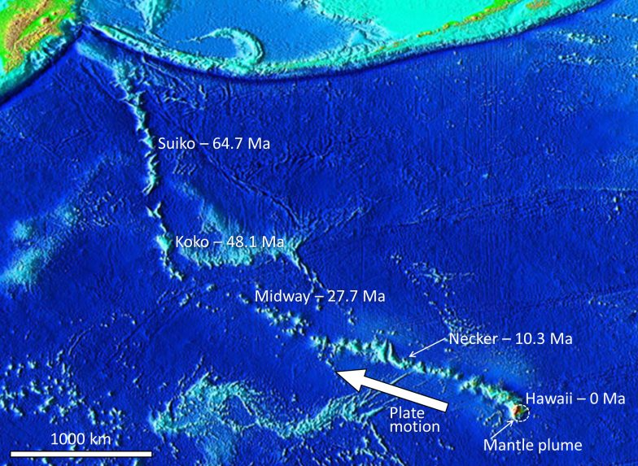

# Chapter 12 — Geological Structures

Rock responds to stress in two ways: it **folds** if it is ductile, or it **fractures** if it
is brittle. Both outcomes create the structural features that decide how a rock mass
behaves.

## 12.1 Stress and strain

- **Compression** — squeezes rock; produces folds and reverse faults.
- **Extension** — stretches rock; produces normal faults and grabens.
- **Shear** — slides rock past rock; produces strike-slip faults.

## 12.2 Folding

Under compression, layered rock bends into **anticlines** (upward) and **synclines**
(downward). Folding changes the **dip** of bedding — and dip is what the engineer measures
to judge slope and foundation stability.

## 12.3 Fracturing and faulting

A **joint** is a fracture with no movement; a **fault** is a fracture with movement.

- **Normal fault** — extension; the hanging wall moves down.
- **Reverse fault** — compression; the hanging wall moves up.
- **Thrust fault** — a low-angle reverse fault; can carry strong rock over weak rock.
- **Strike-slip fault** — lateral movement along the fault's length.

**Figure.** A fault in intrusive rock on Quadra Island, B.C. A pink dyke is offset about 10 cm, right-laterally.
*© Steven Earle, CC BY 4.0 — Physical Geology, 2nd ed., Fig. 12.3.4.*

**Figure.** The McConnell Thrust at Mt. Yamnuska, Alberta: Cambrian limestone thrust over Cretaceous mudstone. Where a thrust puts strong rock on weak rock, the weak unit controls the design.
*© Steven Earle, CC BY 4.0 — Physical Geology, 2nd ed., Fig. 12.3.9.*

**Figure.** Graben and horst structures formed in extension. All the faults are normal faults.
*© Steven Earle, CC BY 4.0 — Physical Geology, 2nd ed., Fig. 12.3.6.*

## 12.4 Measuring geological structures

The two measurements are **strike** (the compass direction of the intersection of a plane
with the horizontal) and **dip** (its angle of inclination). Together they define the
orientation of bedding, foliation or a joint set — the single most useful structural datum
for a design.

## Key points for the geotechnical engineer

- **Structure, not rock type, often controls the design.** A moderately strong rock with
  adversely dipping bedding is worse than a weaker rock without it.
- **Faults are planes of weakness and possible groundwater paths** — and they are
  discontinuities in the ground model.
- **Thrusts can put strong rock over weak rock**; the weak layer then governs settlement and
  stability.
- **Strike and dip must be measured**, not assumed, and must be recorded on every rock-mass
  description.

## Terminology

| English | Vietnamese |
| --- | --- |
| stress / strain | ứng suất / biến dạng |
| fold / anticline / syncline | uốn nếp / nếp lồi / nếp lõm |
| joint | khe nứt |
| fault (normal / reverse / thrust / strike-slip) | đứt gãy (thuận / nghịch / chờm / trượt bằng) |
| graben / horst | địa hào / địa luỹ |
| strike / dip | phương / góc dốc |

---

*Digest of Chapter 12, Physical Geology – 2nd Edition, by Steven Earle (CC BY 4.0).*
