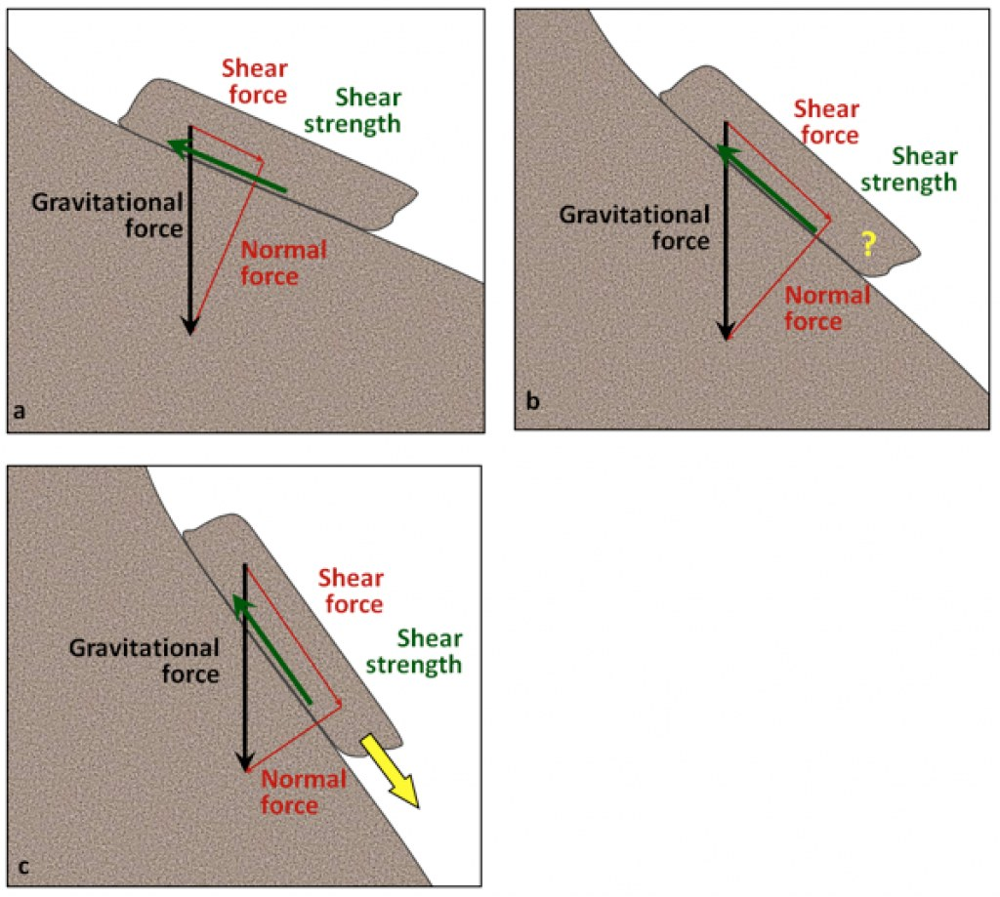
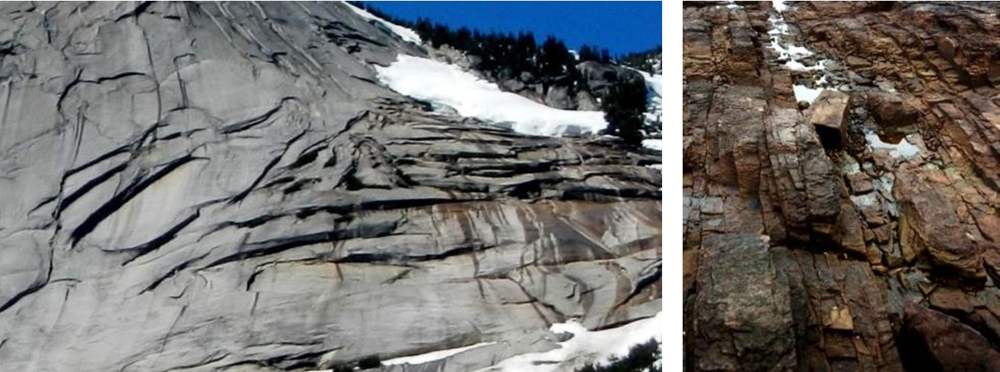
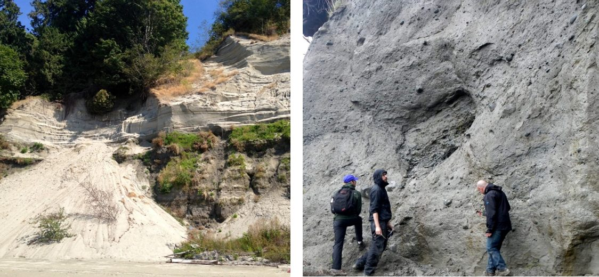
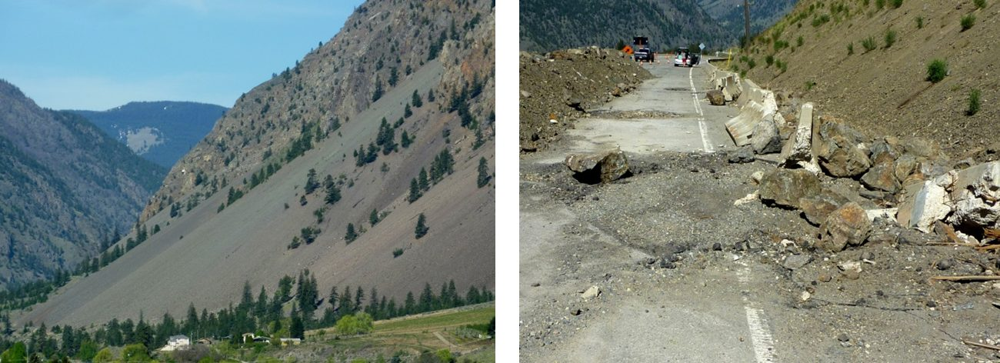
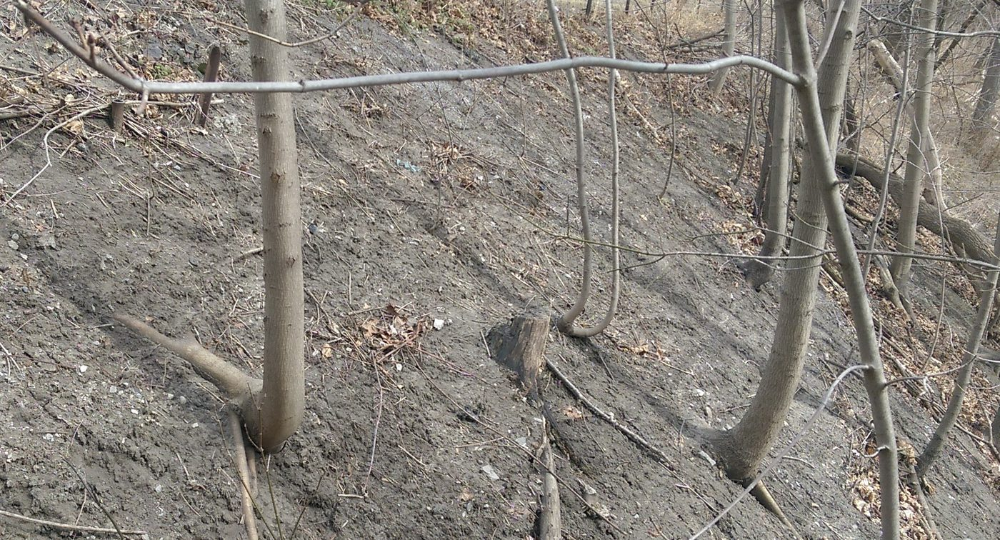
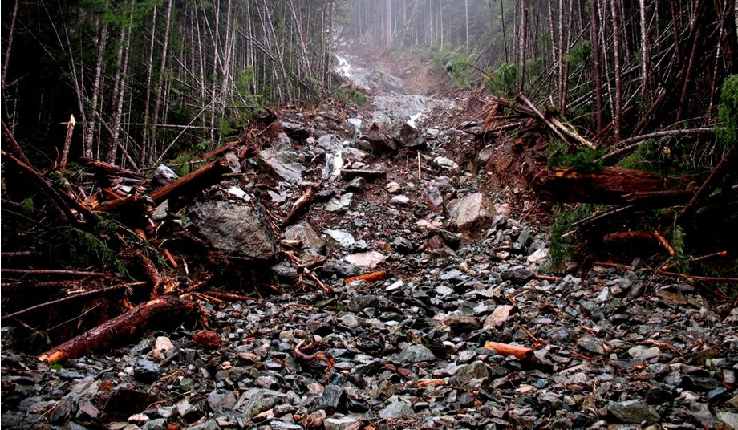
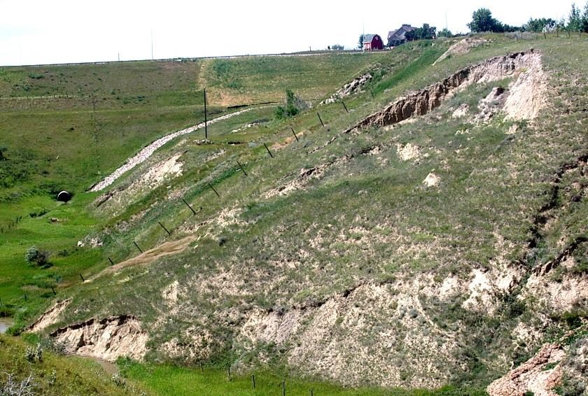
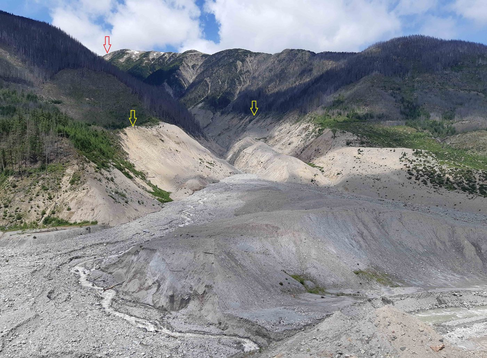
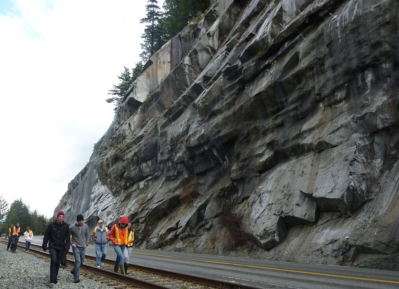

# Chapter 15 — Mass Wasting

Mass wasting is the downslope movement of rock and soil under gravity. It is the
**geological view of slope stability** — and it is useful precisely because it looks at the
whole landscape rather than a single analysed section.

## 15.1 What controls slope stability

Two factors: the **angle of the slope** and the **strength of the material on it**. Gravity
resolves into a **shear force** (down the slope) and a **normal force** (into the slope);
the slope holds while **shear strength** exceeds shear force.

**Figure.** Shear and normal components of gravity on slopes of increasing steepness. (a) shear force much less than shear strength — stable; (b) about equal — marginal; (c) shear force much greater — failure.
*© Steven Earle, CC BY 4.0 — Physical Geology, 2nd ed., Fig. 15.1.1.*

**Figure.** Relative stability of slopes as a function of the orientation of weaknesses (bedding planes) relative to the slope face. Parallel bedding is the most unstable case.
*© Steven Earle, CC BY 4.0 — Physical Geology, 2nd ed., Fig. 15.1.2.*

### Water — the dominant factor

The amount of water in the material is the most important control on its strength. This is
especially true of unconsolidated material:

- **Dry** — held only by grain friction; weak if well sorted or rounded.
- **Moist** — strongest, because surface tension at grain contacts holds the grains together.
- **Saturated** — weakest, because water under pressure pushes the grains apart.

**Figure.** Dry, moist and saturated sand. Moist sand is the strongest; saturated sand the weakest.
*© Steven Earle, CC BY 4.0 — Physical Geology, 2nd ed., Fig. 15.1.4.*

**Figure.** Left: glacial outwash at Point Grey, Vancouver — a strong lower layer beneath a weaker, recently failed sand. Right: glacial till on Quadra Island, B.C., strong enough to stand near-vertically.
*© Steven Earle, CC BY 4.0 — Physical Geology, 2nd ed., Fig. 15.1.3.*

## 15.2 Types of mass wasting

Classified by **material** and **speed**:

- **Rockfall** — free fall of rock from a steep face; produces talus at the toe.
- **Slump** — rotational sliding of a coherent block.
- **Slide** — translational movement along a planar surface.
- **Flow** — debris flow, mudflow, earthflow; material moves as a fluid.
- **Creep** — extremely slow, imperceptible movement, readable in tilted vegetation.

**Figure.** Left: a talus slope near Keremeos, B.C. Right: a rock fall onto a highway west of Keremeos, December 2014.
*© Steven Earle, CC BY 4.0 — Physical Geology, 2nd ed., Fig. 15.2.2.*

**Figure.** Pistol-butt shaped trees on a slope experiencing creep — a natural inclinometer, and one of the cheapest indicators a walk-over survey can read.
*© Steven Earle, CC BY 4.0 — Physical Geology, 2nd ed., Fig. 15.2.7.*

**Figure.** The lower part of a debris flow within a steep stream channel near Buttle Lake, B.C., November 2006.
*© Steven Earle, CC BY 4.0 — Physical Geology, 2nd ed., Fig. 15.2.11.*

**Figure.** A slump along the banks of a small coulee near Lethbridge, Alberta.
*© Steven Earle, CC BY 4.0 — Physical Geology, 2nd ed., Fig. 15.2.9.*

**Figure.** The August 2010 Mount Meager rock avalanche — the extreme end of the slope-failure spectrum.
*'2010 Mt. Meager rock avalanche' by Isaac Earle, CC BY 4.0 — Physical Geology, 2nd ed., Fig. 15.2.5.*

**Figure.** Site of the 2008 rock slide at Porteau Cove, B.C. — a rock slope in a transport corridor.
*© Steven Earle, CC BY 4.0 — Physical Geology, 2nd ed., Fig. 15.2.4.*

## 15.3 Preventing, delaying and monitoring mass wasting

The standard measures are **drainage** (reduce pore pressure), **regrading** (reduce slope
angle), **retaining and reinforcement**, and **monitoring**. Monitoring is the subject of
the rest of this site — inclinometers, piezometers, extensometers and the rest — and its
purpose is exactly to detect the movement described in this chapter early enough to act.

## Key points for the geotechnical engineer

- **Water is the dominant control** on slope strength — drainage is usually the cheapest
  and most effective stabilisation measure.
- **Orientation of weaknesses relative to the slope** decides whether a slope can fail at
  all.
- **Creep is a precursor**, not a benign process — vegetation tilt and structural
  cracking are early warnings.
- **Trigger = rapid loss of shear strength**, most often from water, shaking or
  undercutting.
- **Instrumentation exists to detect movement early** — which is why slope monitoring and
  mass-wasting geology are the same subject seen from two directions.

## Terminology

| English | Vietnamese |
| --- | --- |
| mass wasting | dịch chuyển khối (trượt lở) |
| shear force / shear strength | lực gây trượt / sức kháng cắt |
| rockfall / slump / slide / flow | lăn rơi / trượt xoay / trượt / dòng chảy |
| debris flow | dòng bùn đá |
| creep | trượt từ từ |
| trigger | nguyên nhân kích hoạt |
| talus / colluvium | taluy (tích tụ sườn) |

---

*Digest of Chapter 15, Physical Geology – 2nd Edition, by Steven Earle (CC BY 4.0).*
