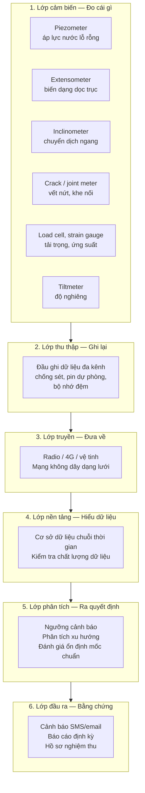

# Hệ thống thu thập dữ liệu tự động (ADAQS)

> **ADAQS — Automatic Data Acquisition System** là lớp nằm giữa cảm biến và người ra quyết định: nó biến tín hiệu điện thành dữ liệu, biến dữ liệu thành thông tin, và biến thông tin thành cảnh báo kịp thời.

Trong quan trắc địa kỹ thuật, giá trị của một hệ thống **không nằm ở cảm biến** — mà nằm ở khả năng **đo đúng, truyền về đủ, phát hiện bất thường sớm và lưu được bằng chứng**.

---

## 1. Vì sao phải tự động hoá?

| Đo thủ công định kỳ | Hệ thống tự động |
| --- | --- |
| Chu kỳ đo thưa (tuần, tháng) | Chu kỳ đo dày (phút, giờ) |
| Không phát hiện được biến động ngắn hạn | Ghi nhận được cả biến động nhanh |
| Phụ thuộc con người, thời tiết, đi lại | Hoạt động liên tục, kể cả ban đêm, mưa lũ |
| Sai số chủ quan khi đọc số | Sai số ổn định, có chứng chỉ hiệu chuẩn |
| Không cảnh báo được theo thời gian thực | Cảnh báo tự động khi vượt ngưỡng |
| Dữ liệu phân tán, dễ thất lạc | Dữ liệu tập trung, có sao lưu |

**Giới hạn kỹ thuật của đo thủ công:** yêu cầu sai số **± 1 mm đến ± 3 mm** đối với công trình quan trọng (theo TCVN 9398) là rất khó đạt và duy trì bằng đo tay định kỳ, đặc biệt khi phải quan trắc **4 lần/giờ** trong tình huống khẩn cấp.

---

## 2. Kiến trúc hệ thống

---

## 3. Sáu lớp — và câu hỏi phải trả lời ở mỗi lớp

=== "Lớp 1 — Cảm biến"

    **Câu hỏi:** Đo đại lượng nào, ở đâu, với độ chính xác bao nhiêu?

    - Xác định theo TCVN 9398 – 9.1.3: lún, chuyển dịch ngang, độ nghiêng, vết nứt
    - Chọn cấp chính xác theo Bảng 6 của TCVN 9398
    - Mỗi cảm biến phải có **mã định danh** và **chứng chỉ hiệu chuẩn**

=== "Lớp 2 — Thu thập"

    **Câu hỏi:** Ghi dữ liệu bao lâu một lần, và khi mất điện thì sao?

    - Chu kỳ lấy mẫu phải đáp ứng tần suất tối đa (khẩn cấp: ≤ 15 phút)
    - Phải có **pin dự phòng** và **bộ nhớ đệm** để không mất dữ liệu khi mất nguồn/truyền
    - Chống sét lan truyền là yêu cầu bắt buộc ở công trường Việt Nam

=== "Lớp 3 — Truyền dữ liệu"

    **Câu hỏi:** Dữ liệu về trung tâm bằng cách nào, và khi mạng lỗi thì sao?

    - Radio, 4G, hoặc vệ tinh tuỳ địa hình và khoảng cách
    - Mạng không dây dạng lưới giúp mở rộng phạm vi mà không cần thêm hạ tầng
    - Cần cơ chế **gửi lại** khi truyền thất bại

=== "Lớp 4 — Nền tảng dữ liệu"

    **Câu hỏi:** Dữ liệu được kiểm tra và lưu ở đâu, trong bao lâu?

    - Lưu dạng **chuỗi thời gian**, gắn dấu thời gian đồng bộ
    - **Kiểm tra chất lượng dữ liệu**: giá trị bất thường, mất tín hiệu, trôi điểm không
    - Sao lưu và xuất được **dữ liệu thô** — phục vụ kiểm định định kỳ 5 năm

=== "Lớp 5 — Phân tích và cảnh báo"

    **Câu hỏi:** Khi nào thì coi là bất thường, và ai được thông báo?

    - **Ngưỡng** theo giá trị tuyệt đối, theo tốc độ thay đổi, và theo cao độ mực nước
    - **Đánh giá ổn định lưới mốc chuẩn** theo mỗi chu kỳ (TCVN 9398 – 9.2.3)
    - Thông báo **đa kênh**: SMS, email, còi báo tại chỗ

=== "Lớp 6 — Đầu ra và hồ sơ"

    **Câu hỏi:** Lấy gì làm bằng chứng đã tuân thủ?

    - Báo cáo định kỳ đúng hạn (trước 15/4 hoặc 15/8 theo Nghị định 114 – Điều 16.3)
    - Nhật ký cảnh báo và biên bản xử lý
    - Hồ sơ bàn giao cho chủ đầu tư lưu giữ (TCVN 9398 – 10.2)

---

## 4. Ba tiêu chí đánh giá một hệ thống ADAQS

| Tiêu chí | Câu hỏi kiểm tra | Dấu hiệu hệ thống yếu |
| --- | --- | --- |
| **Độ tin cậy dữ liệu** | Có bao nhiêu % thời gian hệ thống thực sự có dữ liệu? | Nhiều khoảng trống dữ liệu; không có nhật ký hoạt động |
| **Khả năng phát hiện bất thường** | Có ngưỡng cấu hình được không? Có cảnh báo tự động không? | Chỉ hiển thị số liệu, không phân tích xu hướng |
| **Khả năng lập hồ sơ** | Xuất được dữ liệu thô và báo cáo theo mẫu không? | Dữ liệu khoá trong phần mềm, không xuất được |

---

## 5. Lỗi thường gặp khi triển khai

!!! failure "Những sai lầm tốn kém nhất"
    1. **Chọn cảm biến trước, xác định yêu cầu sau** — dẫn tới không đạt cấp chính xác mà tiêu chuẩn yêu cầu.
    2. **Không hiệu chuẩn định kỳ** — sai số trôi dần, không phát hiện được, hồ sơ kiểm định không hợp lệ.
    3. **Không có bộ nhớ đệm** — mất dữ liệu khi mất điện hoặc mất kết nối, thường đúng vào lúc quan trọng nhất.
    4. **Ngưỡng đặt cố định, không theo mực nước** — không đáp ứng yêu cầu leo thang tần suất của Nghị định 114.
    5. **Không lưu dữ liệu thô** — đến kỳ kiểm định 5 năm thì không còn chuỗi số liệu gốc để phân tích.
    6. **Không kiểm tra ổn định mốc chuẩn** — mốc chuẩn bị dịch chuyển mà không biết, toàn bộ số liệu sai hệ thống.

---

## 6. Liên hệ với yêu cầu tuân thủ

Mỗi lớp của hệ thống ADAQS đều gắn với một nhóm nghĩa vụ cụ thể:

| Lớp | Nghĩa vụ liên quan |
| --- | --- |
| Cảm biến | Nghị định 114 – Điều 5, 14 (lắp đặt thiết bị theo tiêu chuẩn) |
| Thu thập | Nghị định 114 – Điều 15.4 (tần suất quan trắc) |
| Truyền dữ liệu | Nghị định 114 – Điều 15.5, 15.6 (cung cấp dữ liệu, hình thức báo cáo) |
| Nền tảng | TCVN 9398 – 10.2 (lưu trữ, bàn giao hồ sơ) |
| Phân tích | Nghị định 114 – Điều 14 (phát hiện bất thường); TCVN 9398 – 9.2.3 |
| Đầu ra | Nghị định 114 – Điều 16, 18 (báo cáo, kiểm định) |

👉 **Xem đầy đủ:** [Ma trận tuân thủ Nghị định 114 & TCVN 9398](../tuan-thu/nghi-dinh-114-tcvn-9398.md)

---

*Xem thêm: [Thuật ngữ Anh – Việt](../thuat-ngu/index.md) · [Trang chủ tiếng Việt](../index.md)*
