# Địa kỹ thuật Khai khoáng & Kiểm soát Nền đá (Mining Geotechnics & Ground Control)

## Mục tiêu

Bảo đảm tuyệt đối an toàn tính mạng cho công nhân hầm lò và lộ thiên, giữ vững ổn định công trình mỏ và duy trì năng lực sản xuất liên tục thông qua kiểm soát nền đá có hệ thống, đặc trưng hóa khối đá và mạng lưới quan trắc tự động địa kỹ thuật - thủy văn.

---

## 1. Thách thức Vận hành trong Công trình Mỏ

Khác với các công trình dân dụng hạ tầng có hệ số an toàn thiết kế cao ($FS \ge 1,5$) cho niên hạn 100 năm, các khai trường mỏ là môi trường thi công biến động liên tục và chịu áp lực tối ưu hóa chi phí bóc đất đá với rủi ro chuyển tiếp ($FS \approx 1,2 - 1,3$).

Kỹ thuật địa kỹ thuật mỏ bao trùm hai môi trường trọng yếu:

1. **Khai thác Lộ thiên (Open Pit & Moong khai thác)**: Các mái dốc đá nhiều tầng (multi-bench) có chiều sâu vượt quá 500 m đến 1.000 m. Độ ổn định phụ thuộc vào các mặt bất liên tục cấu trúc (khe nứt, đứt gãy), khả năng lưu giữ của cơ tầng, áp lực nước lỗ rỗng bên trong khối sườn tầng và tổn thương nứt nẻ do nổ mìn định hướng.
2. **Khai thác Hầm lò (Underground Mining)**: Các giếng đứng, giếng nghiêng, lò dọc vỉa, lò chợ và buồng khấu hoạt động dưới môi trường ứng suất nguyên sinh khổng lồ ở độ sâu lớn ($\sigma_v = \rho g z$, với ứng suất ngang kiến tạo thường đạt $\sigma_h / \sigma_v > 1,5 - 2,5$). Các tai biến chết người bao gồm hiện tượng nổ đá (rockburst), ép lún thành lò (squeezing ground), sập vòm lò kiểu xén (cutter roof), sập đổ trụ bảo vệ (pillar collapse) và bục vỡ tường chắn chèn vữa đuôi quặng (paste backfill bulkhead).

---

## 2. Khung Kỹ thuật Tích hợp: Từ Kiểm soát Nền đá đến Hệ thống ADAQS

```mermaid
flowchart TD
    subgraph GEOLOGY["1. Địa chất & Đặc trưng hóa Khối đá"]
        G1["Mô tả lõi khoan & Khảo sát khe nứt"]
        G2["Cường độ đá nguyên vẹn (UCS / Nén 3 trục)"]
        G3["Phân loại khối đá (GSI, RMR, Q)"]
    end

    subgraph DESIGN["2. Thiết kế Mỏ & Gia cố Nền lò"]
        D1["Góc dốc sườn moong (Góc tầng & Toàn mỏ)"]
        D2["Kích thước trụ bảo vệ (ALPS / ARMPS)"]
        D3["Kết cấu chống giữ: Neo thép, Neo ma sát, Cáp neo, Bê tông phun"]
    end

    subgraph HAZARDS["3. Tai biến Địa kỹ thuật Mỏ"]
        H1["Trượt phẳng, nêm trượt vách moong & Lật đổ đá"]
        H2["Áp lực nước lỗ rỗng tăng vọt & Thủy lực khe nứt"]
        H3["Tập trung ứng suất & Nổ đá động lực"]
        H4["Hóa lỏng đập bã thải (TSF)"]
    end

    subgraph ADAQS["4. Mạng lưới Quan trắc Tự động ADAQS"]
        M1["Radar quan trắc vi dịch chuyển sườn dốc (SSR)"]
        M2["Áp kế dây rung (VWP) trong lỗ khoan sâu"]
        M3["Thiết bị đo biến dạng sâu nhiều điểm (MPBX)"]
        M4["Mạng lưới vi địa chấn (Geophone & Gia tốc kế)"]
        M5["Hộp đo áp lực đất/đá (BPC) trong trụ bảo vệ"]
    end

    subgraph ACTION["5. Kế hoạch Ứng phó Ngưỡng kích hoạt (TARP)"]
        T1["Xanh: Vận hành khai thác bình thường"]
        T2["Vàng: Hạn chế tiếp cận, tăng tần suất đo, gia cố bổ sung"]
        T3["Đỏ: Di tản khẩn cấp, rút thiết bị, đóng cửa gương lò"]
    end

    GEOLOGY --> DESIGN
    DESIGN --> HAZARDS
    HAZARDS --> ADAQS
    ADAQS --> ACTION
```

---

## 3. Khai thác Lộ thiên: Ổn định Mái dốc Moong Khai thác

### Các Chế độ Phá hoại trong Mỏ Lộ thiên
- **Trượt phẳng và trượt nêm cấp tầng bậc**: Các mặt khe nứt cắt nhau lộ ra ngoài mặt sườn tầng khai thác.
- **Trượt cung tròn quy mô liên tầng / toàn mỏ**: Xảy ra trong khối đá nứt nẻ mạnh, bị biến chất hoặc phong hóa sâu ($GSI < 40$) tuân theo tiêu chuẩn bền phá hoại Hoek-Brown.
- **Trượt lật (Toppling)**: Các hệ khe nứt dốc đứng cắm vào trong sườn dốc tạo thành các cột đá cao bị mất cân bằng và đổ lật ra ngoài moong.
- **Tác động thủy văn và áp lực nước ngầm**: Nước mưa ngấm vào các vết nứt tách đỉnh sườn dốc tạo nên áp lực thủy tĩnh đẩy ngang, đồng thời làm suy giảm nghiêm trọng ứng suất pháp hữu hiệu kháng cắt ($\sigma' = \sigma - u$).

### Chế độ Quan trắc cho Mỏ Lộ thiên
| Hệ thống Quan trắc | Đại lượng Đo đạc | Ứng dụng & Vai trò Kỹ thuật |
|--------------------|------------------|------------------------------|
| **Radar Quan trắc Mái dốc (SSR / InSAR)** | Biến dạng vi mét theo phương tia ngắm (LOS) | Quét liên tục 24/7 toàn bộ vách moong; phát hiện giai đoạn gia tốc dịch chuyển trước khi sạt lở |
| **Trạm Toàn đạc Robot (RTS) + Lăng kính** | Tọa độ không gian 3 chiều $(x, y, z)$ | Theo dõi dịch chuyển mốc đo tại các đỉnh dốc, đường vận tải và cơ tầng |
| **Áp kế Dây rung (VWP)** | Áp lực nước lỗ rỗng sâu ($u$) | Đánh giá hiệu quả hạ mực nước ngầm từ các lỗ khoan tháo khô sau vách moong |
| **Ống đo nghiêng lắp cố định (IPI)** | Chuyển vị ngang theo chiều sâu | Xác định chính xác vị trí mặt trượt ngầm và vận tốc trượt trong tầng đất phủ hoặc đứt gãy |
| **Hệ thống Đo phản xạ miền thời gian (TDR)** | Biến dạng uốn / đứt cáp đồng trục | Phát hiện kịp thời thời điểm xuất hiện dịch cắt trượt dọc theo các lớp kẹp yếu |

---

## 4. Khai thác Hầm lò: Cơ học Đá & Chống giữ Đường lò

### Các Vấn đề Cốt lõi Dưới Hầm sâu
1. **Tập trung Ứng suất**: Việc đào đường lò làm biến đổi trường ứng suất xung quanh; ứng suất tiếp ($\sigma_\theta$) xung quanh biên lò vượt quá cường độ nén đơn trục của đá nguyên vẹn ($\sigma_c$), gây bong tróc, nứt vỡ và sập vòm lò kiểu xén (cutter roof).
2. **Thiết kế Trụ Bảo vệ**: Trong phương pháp buồng - cột hoặc khai thác than lò chợ, các trụ đá/than phải chịu tải trọng dồn từ toàn bộ tầng đá trên nó. Nếu kích thước trụ không chuẩn, trụ bị phá hủy dẻo hoặc nổ giòn, truyền tải đột ngột sang các trụ bên cạnh gây hiệu ứng sụp đổ dây chuyền.
3. **Nổ đá (Rockburst)**: Khi khai thác ở độ sâu lớn ($> 1.000\text{ m}$), năng lượng biến dạng đàn hồi tích lũy cực lớn ($U_e = \sigma^2 / 2E$). Sự trượt của các đứt gãy hoặc biến dạng sụp đổ cục bộ sẽ giải phóng động năng đột ngột như một trận động đất nhân tạo phá hủy toàn bộ đường lò.

### Chế độ Quan trắc Công trình Ngầm & Hầm lò
| Hệ thống Quan trắc | Đại lượng Đo đạc | Ứng dụng & Vai trò Kỹ thuật |
|--------------------|------------------|------------------------------|
| **Thiết bị đo biến dạng sâu nhiều điểm (MPBX)** | Biến dạng tương đối của các lớp đá nóc (1–15 m) | Đo lường độ võng và sự tách tầng của các lớp đá nóc vượt quá tầm với của neo |
| **Mạng lưới Cảm biến Vi địa chấn** | Tọa độ chấn tiêu, độ chấn động ($M_L$), năng lượng bức xạ | Lập bản đồ tái phân bố ứng suất, xác định các vùng tập trung nứt nẻ và cảnh báo sớm nguy cơ nổ đá |
| **Hộp đo áp lực lỗ khoan (BPC / CPC)** | Biến thiên ứng suất bên trong trụ đá/than ($\Delta\sigma$) | Kiểm soát sự truyền tải trọng lên các trụ bảo vệ khi diện tích khấu than mở rộng |
| **Thanh neo gắn cảm biến đo biến dạng (Instrumented Bolt)** | Lực dọc trục và phân bố ứng biến dọc thân neo | Kiểm tra tải trọng làm việc của hệ vì neo, chống hiện tượng đứt neo quá tải |
| **Thiết bị Đo hội tụ Điện tử (Convergence Meter)** | Tốc độ co hẹp nóc - nền và hai bên hông lò | Kiểm chứng mô hình số (FLAC3D, RS2) và đánh giá độ ép lún của đường lò |

---

## 5. An toàn Hồ chứa Bã thải Quặng (TSF)

Đập bã thải đuôi quặng là công trình có nguy cơ rủi ro thảm họa môi trường và nhân mạng lớn nhất trong toàn bộ chuỗi công nghiệp khai thác khoáng sản. Theo tiêu chuẩn **ICOLD Bulletin 194**, hệ thống quan trắc TSF bắt buộc phải có:
- Chuỗi áp kế dây rung (VWP) bố trí đa tầng cắt ngang đỉnh đập, đập khởi đầu và chân đập hạ lưu để giám sát đường bão hòa thấm.
- Tràn đo lưu lượng thấm tự động tích hợp cảm biến độ đục nhằm phát hiện sớm xói ngầm (piping) cuốn trôi hạt mịn.
- Giám sát viễn thám InSAR vệ tinh kết hợp các trạm GNSS liên tục để đo độ lún đỉnh đập và chuyển vị trôi ngang của đập dâng.

---

## 6. Các Sổ tay Tham khảo Chuyên sâu trên Hệ thống

Chuyên mục Địa kỹ thuật Khai khoáng được kết nối chặt chẽ với các bộ sổ tay và giáo trình chuyên sâu trên nền tảng:

- **[Practical Rock Engineering (TS. Evert Hoek)](../../reference-manuals/practical-rock-engineering/index.md)**: Cường độ đá nguyên vẹn, tiêu chuẩn bền Hoek-Brown, Chỉ số Cường độ Địa chất (GSI), thiết kế neo đá, bê tông phun, kiểm soát tổn hại nổ mìn và ổn định buồng ngầm lớn.
- **[An toàn đập thải (ICOLD Bulletin 194)](../../reference-manuals/tailings-dam-safety/index.md)**: Quản lý kỹ thuật an toàn hồ chứa bã thải đuôi quặng mỏ, cơ chế phá hoại hóa lỏng và kế hoạch hành động khẩn cấp.
- **[Địa chất vật lý (Steven Earle)](../../reference-manuals/dia-chat-vat-ly/index.md)**: Địa chất cấu trúc, khoáng vật tạo đá, đứt gãy kiến tạo, nếp uốn, phong hóa và các quá trình dịch chuyển khối.
- **[Giám sát hiệu năng đập (ASCE MOP-135)](../../reference-manuals/monitoring-dam-performance/index.md)**: Phân tích chế độ hỏng, triết lý quan trắc và quản lý chu kỳ sống của thiết bị đo.
- **[Dunnicliff — Thiết bị quan trắc địa kỹ thuật](../../reference-manuals/dunnicliff/index.md)**: Các nguyên lý thiết bị căn bản, mua sắm, hiệu chuẩn cảm biến và 20 bước lập kế hoạch quan trắc.
- **[FHWA — Sổ tay thiết bị quan trắc địa kỹ thuật](../../reference-manuals/fhwa/index.md)**: Móng sâu, mái dốc đá đào và các kết cấu chắn giữ áp lực đất đá.
- **[Tầm nhìn Tổng thể & Khung Kỹ thuật Tích hợp](../../reference-manuals/overarching-vision.md)**: Khung tổng hòa kết nối kiến tạo thạch quyển địa cầu với hệ thống thu thập dữ liệu tự động ADAQS hàng ngày.
