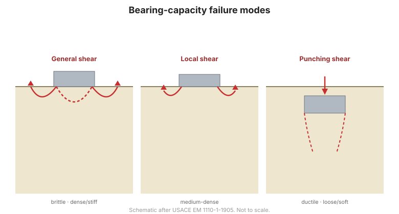
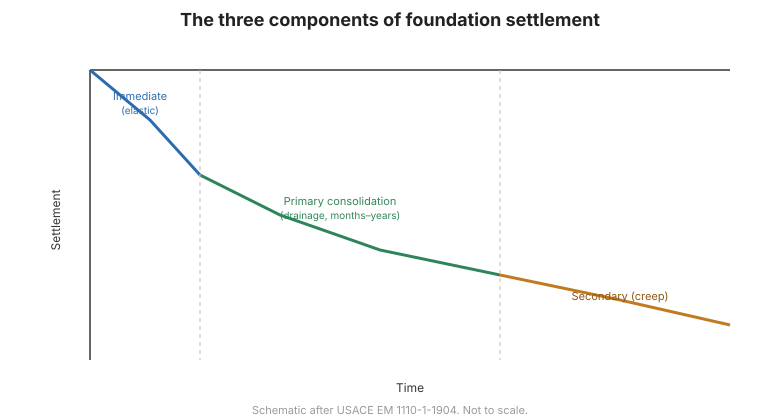

# Chương 5 — Phân tích móng nông

Chương V là chương phân tích đầu tiên. Sách định nghĩa móng nông, rồi trình bày sức
chịu tải theo nhiều phương pháp độc lập và độ lún theo nhiều phương pháp độc lập — hai
phép kiểm tra mà mọi móng nông đều phải đạt.

## 5.1 Những khái niệm cơ bản

### 5.1.1 Định nghĩa móng nông

Sách dùng chính hình học của móng:

- **Chiều rộng móng** $B$, **chiều dài móng** $L$, **chiều sâu chôn móng** $D$ (đo từ
  đáy móng lên mặt đất).
- Móng là **móng nông** khi $\dfrac{D}{B} < 4$.
- **Móng băng** khi $\dfrac{L}{B} > 5$.
- **Móng đơn** khi $\dfrac{L}{B} < 5$.
- Các dạng đặc biệt: móng tròn $B = 2R$; móng vuông $B = L$; móng chữ nhật
  $B < L < 5B$.
- **Móng bè** là móng có kích thước lớn, nâng cả khối nhà hoặc một phần khối nhà.

Sách lưu ý các giới hạn trên chỉ mang tính **tương đối**, không tuyệt đối.

### 5.1.2 Trạng thái móng nông dưới tải trọng

Chuyển vị của móng phụ thuộc mức độ gia tải. **Đường quan hệ tải trọng – chuyển vị**
cho phép phân biệt:

- **Tải trọng giới hạn** $Q_L$ — tải trọng lớn nhất móng chịu được trước khi đất nền
  bị phá hỏng;
- **Tải trọng cho phép** — tải trọng gây chuyển vị chấp nhận được và có hệ số an toàn
  đủ lớn so với $Q_L$.

### 5.1.3 Phân tích trạng thái phá hỏng đất nền dưới móng nông

Cơ chế phá hoại dưới móng nông — trượt tổng thể, trượt cục bộ, xuyên thủng — và cách
mặt phá hoại phát triển.

### 5.1.4 Tải trọng giới hạn trên móng băng nằm ngang, nền đồng nhất

Công thức tải trọng giới hạn tổng quát cho tải trọng thẳng đứng đúng tâm trên móng
băng nằm ngang trong nền đồng nhất, từ đó suy ra các công thức sức chịu tải cổ điển.

**Hình.** Các cơ chế phá hoại sức chịu tải dưới móng nông.

## 5.2 Tính toán sức chịu tải móng nông

Sách cố ý đưa ra **nhiều con đường độc lập** tới cùng một kết quả, để có thể kiểm tra
chéo:

### 5.2.1 Theo cơ đất lý thuyết
Nghiệm sức chịu tải lý thuyết cổ điển.

### 5.2.2 Theo thí nghiệm xuyên tĩnh (CPT)
Tương quan kinh nghiệm giữa sức kháng mũi xuyên $q_c$ và sức chịu tải.

### 5.2.3 Theo thí nghiệm nén ngang Menard (PMT)
Dùng áp lực giới hạn $P_l$ và mô đun nén ngang $E_p$.

### 5.2.4 Theo thí nghiệm xuyên tiêu chuẩn (SPT)
Dùng số búa $N$ — con đường phổ biến nhất trong thực hành Việt Nam.

### 5.2.5 Trên nền đá
Sức chịu tải của móng đặt trên đá.

## 5.3 Tính toán độ lún móng nông

### 5.3.1 Phân bố ứng suất dưới nền móng — Boussinesq
Phân bố ứng suất đàn hồi (Boussinesq) dùng để xác định mức tăng ứng suất đứng theo
chiều sâu.

### 5.3.2 Độ lún cố kết theo phương pháp phân tầng
Chia tầng chịu nén thành các lớp nhỏ và cộng dồn phần đóng góp của chúng.

**Hình.** Các thành phần độ lún dưới móng.

### 5.3.3 Độ lún đàn hồi theo phương pháp tổng quát
### 5.3.4 Độ lún theo thí nghiệm nén ngang Menard
### 5.3.5 Phương pháp nhanh xác định độ lún
### 5.3.6 Độ lún cho phép

## 5.4 Thuật ngữ

| Tiếng Anh | Tiếng Việt (sách dùng) |
| --- | --- |
| shallow foundation | móng nông |
| strip footing | móng băng |
| isolated / pad footing | móng đơn |
| mat / raft | móng bè |
| embedment depth | chiều sâu chôn móng |
| ultimate load | tải trọng giới hạn |
| allowable bearing pressure | áp lực cho phép |
| bearing capacity | sức chịu tải |
| load–settlement curve | đường quan hệ tải trọng – chuyển vị |
| settlement | độ lún |
| layer-summation method | phương pháp phân tầng |
| allowable settlement | độ lún cho phép |

## 5.5 Các điểm then chốt

- Phân biệt nông/sâu bằng **$D/B < 4$**; băng/đơn bằng **$L/B$**.
- Thiết kế có **hai phép kiểm tra độc lập**: sức chịu tải và độ lún.
- Sách đưa **nhiều phương pháp cho mỗi phép** để kiểm tra chéo — lý thuyết, **CPT**,
  **PMT**, **SPT**, nền đá.
- **SPT** là con đường được dùng rộng rãi nhất trong thực hành Việt Nam.
- Dự báo lún dựa trên phân bố ứng suất **Boussinesq** cộng **phương pháp phân tầng**
  (hoặc phương pháp nén ngang).
