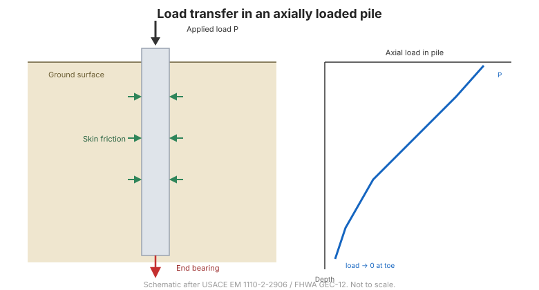

# Chương 6 — Phân tích móng sâu

Chương VI bàn về cọc: cách phân loại cọc, cách một cọc đơn chịu tải, điều gì xảy ra khi
đất chuyển dịch ngược lại thân cọc, cách cọc làm việc dưới tải ngang và trong nhóm, và
cách nhóm cọc lún.

## 6.1 Những khái niệm cơ sở

### 6.1.1 Định nghĩa móng sâu – móng cọc

**Móng sâu** truyền tải xuống các tầng đất sâu hơn, khoẻ hơn. **Cọc** là loại chủ đạo.

### 6.1.2 Phân loại móng cọc

Sách theo quy phạm Pháp **DTU 13-2**, phân nhóm cọc theo cách chế tạo và cách truyền
tải:

| Nhóm | Loại |
| --- | --- |
| 1 | Cọc chế tạo trước — cọc gỗ đóng, cọc thép, bê tông dự ứng lực, cọc ống đóng |
| 2 | Cọc đóng nhồi vật liệu trong ống, thi công tại chỗ |
| 3 | Cọc khoan nhồi — đơn giản, có chống ống, dùng bùn khoan, guồng xoay, vít |
| 4 | Cọc giếng |
| 5 | Cọc ép — bê tông và kim loại |
| 6 | Cọc mini |

**Nhóm 1, 2 và 5** là cọc **đóng/ép**: chúng đẩy và đầm chặt đất quanh cọc nên huy động
**ma sát thành** tốt. Nhưng ở đất rất mềm có cấu trúc, việc đóng cọc có thể làm đất xung
quanh bị phá kết cấu và *giảm* ma sát. **Nhóm 3 và 4** là cọc **thay thế/khoan nhồi**:
hố khoan làm giảm ứng suất ngang, nên ma sát huy động được thấp hơn trên cùng một diện
tích danh nghĩa.

## 6.2 Nguyên lý tính toán móng cọc

### 6.2.1 Cọc chịu tải trọng thẳng đứng
### 6.2.2 Cọc chịu các ngoại lực khác

## 6.3 Trạng thái làm việc của cọc chịu tải thẳng đứng trong môi trường đồng nhất

### 6.3.1 Tính chất phức tạp trong phân tích
### 6.3.2 Khái niệm cơ sở
### 6.3.3 Tổng hợp các kết quả thực nghiệm

## 6.4 Trạng thái huy động sức kháng thực tế của cọc khi chuyển vị

### 6.4.1 Cọc chịu tải thẳng đứng ngàm trong hai lớp
### 6.4.2 Huy động tăng tiến sức kháng khi cọc chuyển vị

## 6.5 Tính toán thực tiễn sức chịu tải một cọc

Dạng tổng quát là tổng của hai thành phần:

$$Q_L = Q_p + Q_f$$

trong đó $Q_p$ là sức kháng mũi và $Q_f$ là ma sát thành.

### 6.5.1 Công thức tổng quát
### 6.5.2 Theo cơ đất lý thuyết
### 6.5.3 Theo thí nghiệm xuyên tiêu chuẩn (SPT)
### 6.5.4 Theo thí nghiệm xuyên tĩnh (CPT)
### 6.5.5 Theo thí nghiệm nén ngang Menard
### 6.5.6 Theo công thức đóng cọc (PDT)
### 6.5.7 Cọc đơn ngàm trong đá

**Hình.** Truyền tải trong cọc: sức kháng mũi cộng ma sát thành.

## 6.6 Ma sát âm – lực xệ ngang

### 6.6.1 Hiện tượng ma sát âm

Khi đất quanh cọc lún **nhiều hơn** cọc, lực kéo đảo chiều: đất trở thành tải trọng kéo
cọc xuống thay vì đỡ cọc. **Ma sát âm** này *cộng thêm* vào tải trọng, phải cộng vào
tải trọng tác dụng chứ không được trừ khỏi sức chịu tải.

### 6.6.2 Phương pháp tính toán ma sát âm
### 6.6.3 Lực xệ ngang của đất yếu vào thân cọc

## 6.7 Móng cọc chịu tác dụng lực ngang

### 6.7.1 Đất rời
### 6.7.2 Đất dính
### 6.7.3 Xác định mô đun phản lực ngang theo nén ngang Menard

## 6.8 Nhóm cọc

### 6.8.1 Hiệu ứng nhóm
### 6.8.2 Phương pháp Terzaghi & Peck với khối móng giả tường
### 6.8.3 Hệ số hiệu dụng nhóm cọc $C_e$
### 6.8.4 Phân bố lực trong nhóm cọc

## 6.9 Độ lún móng cọc

### 6.9.1 Độ lún cọc đơn
### 6.9.2 Độ lún nhóm cọc

## 6.10 Thuật ngữ

| Tiếng Anh | Tiếng Việt (sách dùng) |
| --- | --- |
| deep foundation | móng sâu |
| pile | cọc / móng cọc |
| end bearing | sức kháng mũi cọc |
| skin friction | ma sát thành (hông) cọc |
| driven pile | cọc đóng |
| bored pile | cọc khoan nhồi |
| pressed pile | cọc ép |
| negative skin friction | ma sát âm |
| lateral squeeze | lực xệ ngang |
| pile group / group effect | nhóm cọc / hiệu ứng nhóm |
| group efficiency | hệ số hiệu dụng nhóm cọc |
| lateral reaction modulus | mô đun phản lực ngang |

## 6.11 Các điểm then chốt

- Sức chịu tải cọc là **tổng sức kháng mũi và ma sát thành**: $Q_L = Q_p + Q_f$.
- Cọc **đóng/ép** huy động ma sát tốt hơn cọc **khoan nhồi** trong cùng một loại đất.
- **Ma sát âm** *cộng thêm* tải trọng — không bao giờ trừ vào sức chịu tải.
- Sức kháng ngang cần **mô đun phản lực ngang**, có thể lấy từ thí nghiệm nén ngang
  Menard.
- Cọc làm việc theo **nhóm**; phải kể đến **hiệu ứng nhóm** và **lún nhóm**.
