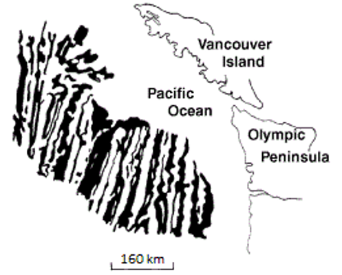
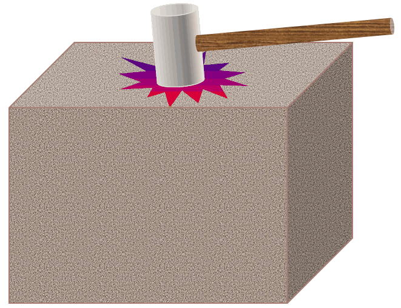
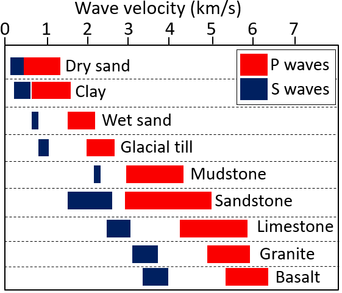
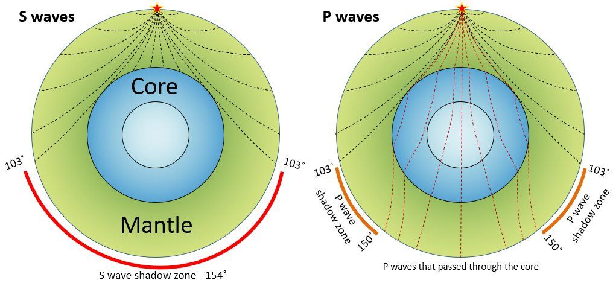
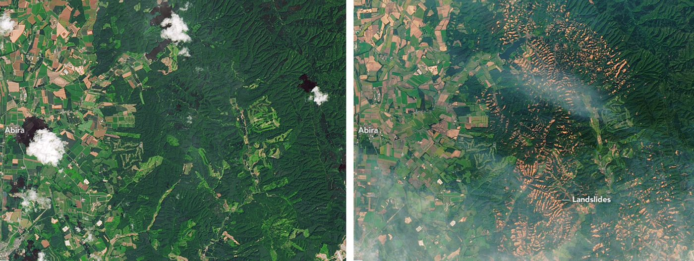
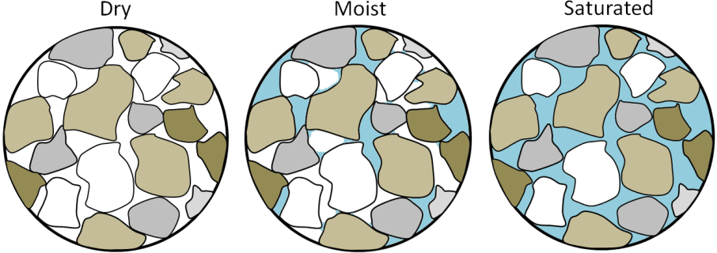

# Chương 11 — Động đất với công trình xây dựng

Chương XI giới thiệu động đất cho người kỹ sư xây dựng: động đất là gì, mô tả chúng ra
sao, phân vùng địa chấn ở Việt Nam thế nào, và chúng đi vào thiết kế cầu và nhà ra sao —
trong đó các vấn đề cơ học đất, trên hết là **hoá lỏng**, được xử lý riêng.

## 11.1 Khái quát về động đất

### 11.1.1 Định nghĩa, khái niệm

Động đất kiến tạo phát sinh như hệ quả của biến dạng trong lớp vỏ Quả Đất. Năng lượng
tích tụ trong quá trình hình thành biến dạng cho đến khi, tại một điểm nào đó, sức kháng
yếu nhất và ứng suất vượt quá giới hạn cân bằng: phá huỷ truyền đi rất nhanh, bức xạ
sóng địa chấn.

Các thuật ngữ chính:

- **Chấn tiêu** — điểm trong lòng Quả Đất nơi bắt đầu phá huỷ.
- **Chấn tâm** — điểm trên mặt đất nằm thẳng đứng trên chấn tiêu.
- **Đứt gãy**, **đứt gãy hoạt động** — mặt gãy dọc theo đó xảy ra dịch chuyển.

**Hình.** Một đứt gãy (đường nét đứt trắng) trong đá xâm nhập ở đảo Quadra, B.C. Một mạch
đá bị dịch chuyển khoảng 10 cm theo chiều phải. Bản thân đứt gãy là mặt đá đã bị phá huỷ,
dọc theo đó phá hoại lan truyền.
*© Steven Earle, CC BY 4.0 — Physical Geology, 2nd ed., Hình 12.3.4.*

### 11.1.2 Khái quát phân bố động đất trên địa cầu
### 11.1.3 Nguyên nhân hình thành động đất

## 11.2 Khái quát một số đặc trưng của động đất

### 11.2.1 Nguồn năng lượng động đất
### 11.2.2 Độ lớn động đất – chấn cấp $M$
### 11.2.3 Cường độ động đất $I$
### 11.2.4 Đặc trưng rung động địa chấn

Hai loại sóng khối mang năng lượng đi khỏi chấn tiêu: **sóng P** (nén — "đẩy–kéo", tới
trước) và **sóng S** (cắt, chậm hơn). Chính sóng S gây phần lớn thiệt hại kết cấu, và —
điểm then chốt với kỹ sư địa kỹ thuật — **sóng S không truyền qua chất lỏng**. Sóng mặt
tới sau cùng và chậm nhất.

**Hình.** Nguyên lý đằng sau mọi phương pháp địa chấn trong khảo sát địa kỹ thuật: một
nhát búa (hoặc nguồn trong hố khoan) phát sóng đàn hồi vào nền đất, thời gian sóng P và S
tới đầu thu cho vận tốc sóng của vật liệu.
*© Steven Earle, CC BY 4.0 — Physical Geology, 2nd ed., Hình 9.1.1.*

**Hình.** Vận tốc điển hình của sóng P (đỏ) và sóng S (xanh) trong trầm tích và trong đá
vỏ. Vận tốc trong **đất yếu** thấp hơn trong đá cả một bậc độ lớn — đó là lý do cùng một
trận động đất làm nền đất yếu rung mạnh hơn hẳn nền đá.
*© Steven Earle, CC BY 4.0, theo Cơ quan Bảo vệ Môi trường Hoa Kỳ (phạm vi công cộng) —
Physical Geology, 2nd ed., Hình 9.1.3.*

**Hình.** Truyền sóng địa chấn qua macti và nhân. Sóng S bị chặn ở ranh giới nhân – macti,
để lại vùng tối sóng S ở phía đối diện Quả Đất — chính nguyên lý vật lý cho phép địa vật
lý phát hiện một **lớp yếu hoặc lỏng** dưới nền công trình.
*© Steven Earle, CC BY 4.0 — Physical Geology, 2nd ed., Hình 9.1.6.*

### 11.2.5 Định luật tắt dần của chấn động
### 11.2.6 Hậu quả của động đất

Ngoài thiệt hại do rung trực tiếp, động đất còn **làm mất ổn định mái dốc** và có thể gây
trượt lở lan rộng — nhất là khi nền đất đã bão hoà nước mưa. Chuỗi sự kiện ở Sapporo năm
2018 là ví dụ điển hình: bão làm bão hoà đất núi lửa, rồi một trận động đất M6.6 gây hàng
nghìn dòng bùn đá.

**Hình.** Trượt lở ở vùng Sapporo, Nhật Bản, sau bão (4/9/2018) và động đất (6/9/2018).
Ảnh Landsat 8 trước (7/2017, trái) và sau (9/2018, phải). Bão hoà rồi rung là cặp nguyên
nhân kép điển hình.
*"Landslides in Hokkaido" của Lauren Dauphin, NASA Earth Observatory (phạm vi công cộng) —
Physical Geology, 2nd ed., Hình 15.1.7.*

## 11.3 Phân vùng địa chấn – bản đồ động đất

### 11.3.1 Khái quát chung
### 11.3.2 Động đất ở Việt Nam

Việt Nam không phải là vùng không có động đất: khu vực Tây Bắc (dọc các đới đứt gãy
sông Hồng và Lai Châu – Điện Biên) và một phần Tây Nguyên đã từng ghi nhận động đất gây
thiệt hại.

### 11.3.3 Khảo sát động đất phục vụ thiết kế kháng chấn

## 11.4 Khái quát về thiết kế chống động đất

### 11.4.1 Các thông số thiết kế
### 11.4.2 Những vấn đề cơ học đất trong thiết kế chống động đất

### 11.4.3 Hiện tượng hoá lỏng đất nền (Liquefaction)

Dưới tải trọng địa chấn có chu kỳ, cát rời bão hoà có thể mất sức kháng và ứng xử như
một chất lỏng. **Hoá lỏng** là mối nguy địa kỹ thuật bậc nhất: nó phá huỷ sức chịu tải,
gây trôi ngang và lún, và đã làm đổ nhiều công trình vốn được xây dựng tốt. Sách trình
bày điều kiện, cách đánh giá và biện pháp giảm thiểu.

**Hình.** Vì sao bão hoà là điều kiện tiên quyết của hoá lỏng: cát bão hoà là trạng thái
**yếu nhất** trong ba trạng thái, vì nước dưới áp lực đẩy các hạt tách nhau. Rung có chu
kỳ xoá bỏ hoàn toàn tiếp xúc hạt–hạt, và đất ứng xử như chất lỏng.
*© Steven Earle, CC BY 4.0 — Physical Geology, 2nd ed., Hình 15.1.4.*

### 11.4.4 Khái quát tác động động đất trong thiết kế cầu
### 11.4.5 Khái quát tác động động đất trong thiết kế nhà

## 11.5 Thuật ngữ

| Tiếng Anh | Tiếng Việt (sách dùng) |
| --- | --- |
| earthquake | động đất |
| focus | chấn tiêu |
| epicenter | chấn tâm |
| fault / active fault | đứt gãy / đứt gãy hoạt động |
| magnitude | độ lớn (chấn cấp) $M$ |
| intensity | cường độ $I$ |
| seismic zoning | phân vùng địa chấn |
| attenuation | tắt dần |
| seismic design | thiết kế kháng chấn (chống động đất) |
| liquefaction | hoá lỏng đất nền |
| lateral spreading | trôi ngang |

## 11.6 Các điểm then chốt

- Biến dạng tích tụ trong vỏ Quả Đất rồi giải phóng thành **phá huỷ và sóng địa chấn**.
- **Độ lớn** là một con số cho cả sự kiện; **cường độ** thay đổi theo vị trí.
- Việt Nam **có** động đất — đặc biệt ở Tây Bắc và Tây Nguyên.
- **Hoá lỏng** cát rời bão hoà là mối nguy địa kỹ thuật đặc trưng, phải được đánh giá ở
  mọi nơi có thể xảy ra.
- Thiết kế kháng chấn cần cả **chuyển động nền** lẫn **ứng xử của đất**.
