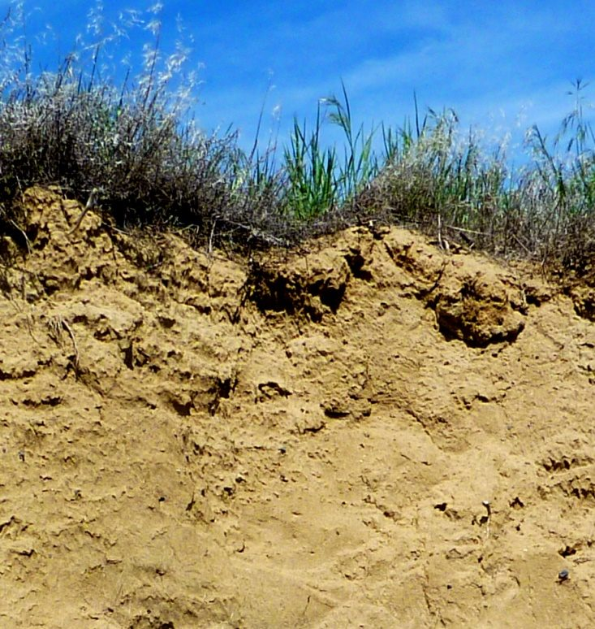

# Chương 5 — Phong hoá và đất

Đây là chương quan trọng nhất với kỹ sư địa kỹ thuật: **phong hoá là quá trình biến đá thành
đất**. Mọi đất tàn dư, mọi phẫu diện phong hoá, và mọi đới "mềm" trong khối đá đều là sản
phẩm của nó.

## 5.1 Phong hoá vật lý

Đá bị phá vỡ cơ học mà không đổi khoáng vật.

- **Bong tróc do giảm tải** — bóc lớp phủ khiến đá nở ra; nó nứt *song song với mặt đất mới*.
- **Nêm băng** — nước trong khe nứt đóng băng, nở khoảng 9 %, và bẩy đá tách ra. Hiệu quả
  nhất ở nơi đóng băng – tan băng luân phiên nhiều.
- **Kết tinh muối** — muối lớn lên trong lỗ rỗng và đẩy các hạt tách nhau (phong hoá tổ ong).
- **Rễ cây và động vật đào** — rễ làm rộng mọi khe nứt nó chui vào.

**Hình.** Khe nứt bong tróc trong granit lộ ra ở mái cắt đường (cao tốc Coquihalla, B.C.). Đá bóc thành tấm song song với mặt mới lộ vì áp lực bó bị mất.
*© Steven Earle, CC BY 4.0 — Physical Geology, 2nd ed., Hình 5.1.1.*

**Hình.** Phong hoá tổ ong trên cát kết (đảo Gabriola, B.C.), do muối kết tinh trong lỗ rỗng.
*© Steven Earle, CC BY 4.0 — Physical Geology, 2nd ed., Hình 5.1.5.*

**Hình.** Tích tụ taluy gồm mảnh vụn do băng giá làm vỡ, dưới chân vách đá (Keremeos, B.C.) — taluy, loại đất rời và thường không bền.
*© Steven Earle, CC BY 4.0 — Physical Geology, 2nd ed., Hình 5.1.4.*

## 5.2 Phong hoá hoá học

Đá bị phân huỷ do phản ứng với nước, oxy và axit. Các phản ứng chính là **thuỷ phân**
(fenspat → khoáng vật sét), **oxy hoá** (khoáng vật sắt → oxit màu gỉ) và **hoà tan**
(cacbonat và khoáng vật bay hơi). Phong hoá hoá học nhanh nhất ở khí hậu nóng ẩm — đó là lý do
**phẫu diện phong hoá sâu là chuyện bình thường ở Việt Nam**.

## 5.3 Sự hình thành đất

Đất là hỗn hợp của hạt khoáng, chất hữu cơ, không khí và nước. Các yếu tố chi phối sự phát
triển của đất là **khí hậu, đá mẹ, độ dốc và thời gian** — đúng bốn yếu tố quyết định một khu
vực có đất tàn dư dày hay chỉ có đá trơ.

**Hình.** Đất phát triển kém trên bụi gió (hoàng thổ) ở vùng khô Washington. Cả phẫu diện dày khoảng 1 m và phần 'đất' thực sự chỉ là 2–3 cm trên cùng.
*© Steven Earle, CC BY 4.0 — Physical Geology, 2nd ed., Hình 5.4.2.*

## 5.4 Các tầng phát sinh đất

Một phẫu diện đất trưởng thành hình thành các tầng rõ rệt — O (hữu cơ), A (hữu cơ – khoáng
trộn), E (bị rửa trôi), B (tích tụ) và C (đá mẹ phong hoá chưa hoàn toàn). Với kỹ sư, ý nghĩa
là **mỗi tầng có sức kháng, tính thấm và tính nén khác nhau**, và mực nước ngầm thường nằm
gần một ranh giới tầng.

## Điểm then chốt cho kỹ sư địa kỹ thuật

- **Phong hoá quyết định phẫu diện nền đất.** Chiều sâu phong hoá, chứ không phải loại đá,
  thường là thứ quyết định chiều sâu móng.
- **Phong hoá vật lý và hoá học tác động cùng nhau** — băng mở khe nứt rồi nước thuỷ phân đá.
- **Sức kháng đất tàn dư giảm dần lên trên** khi phong hoá tăng; ranh giới chuyển sang đá
  nguyên thể là chuyển tiếp dần, không sắc nét.
- **Các-tơ là phong hoá hoá học ở quy mô cảnh quan.**

## Thuật ngữ

| Tiếng Anh | Tiếng Việt |
| --- | --- |
| weathering | phong hoá |
| mechanical / chemical weathering | phong hoá vật lý / hoá học |
| exfoliation (unloading) | bong tróc (giảm tải) |
| frost wedging | nêm băng |
| hydrolysis | thuỷ phân |
| residual soil | đất tàn dư |
| soil horizon | tầng phát sinh đất |
| colluvium / talus | taluy (tích tụ sườn) |

---

*Tổng hợp Chương 5, Physical Geology – 2nd Edition, Steven Earle (CC BY 4.0).*
