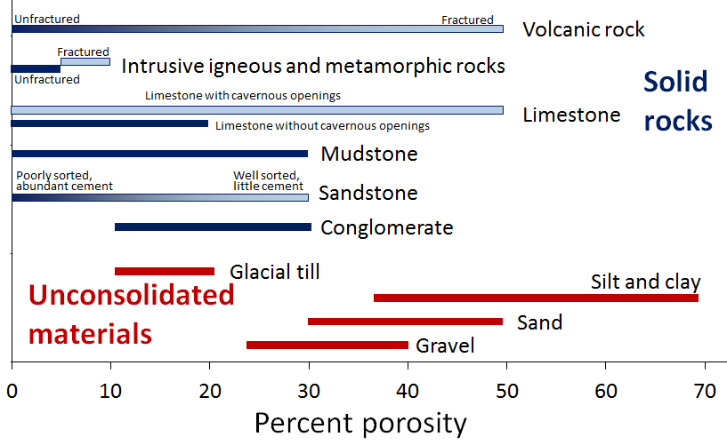
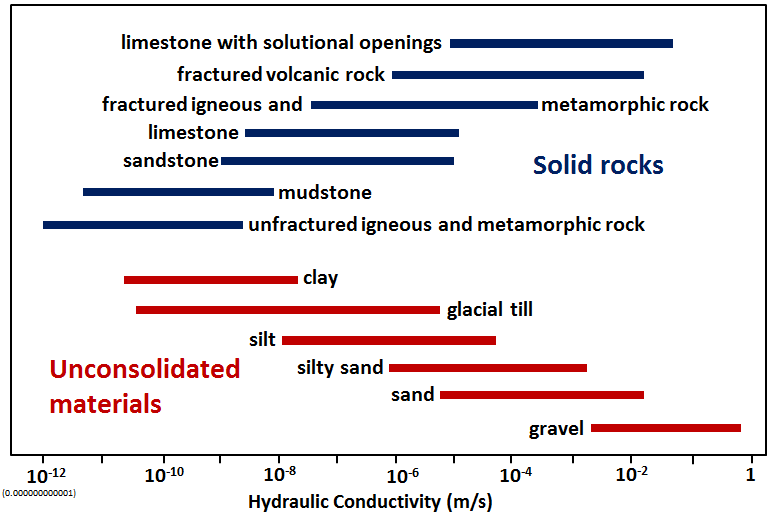
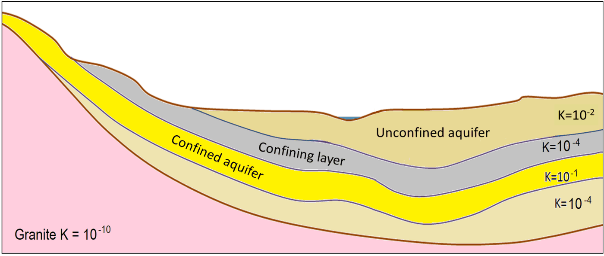

# Chương 14 — Nước dưới đất

Nước dưới đất chứa trong lỗ rỗng của đất và đá. Hai tính chất quyết định mọi thứ: **có bao
nhiêu không gian rỗng** (độ rỗng) và **các khoảng rỗng đó thông nhau tốt đến đâu** (tính thấm).

## 14.1 Độ rỗng

**Độ rỗng** là tỷ lệ phần trăm thể tích vật liệu bị chiếm bởi lỗ rỗng. Vật liệu rời thường
rỗng hơn vật liệu đã cố kết tương ứng, và vật liệu mịn (bụi, sét) *rỗng hơn* vật liệu thô.

**Hình.** Khoảng độ rỗng điển hình của vật liệu rời (đỏ) và đá (xanh). Bụi và sét là loại rỗng nhất — nhưng lại kém thấm nhất.
*© Steven Earle, CC BY 4.0 — Physical Geology, 2nd ed., Hình 14.1.1.*

## 14.2 Tính thấm và hệ số thấm

**Tính thấm** mô tả mức độ thông nhau của lỗ rỗng — và do đó nước chảy qua dễ hay khó. Nó được
định lượng bằng **hệ số thấm $K$**, đơn vị mét trên giây.

**Hình.** Hệ số thấm K (m/s) của vật liệu rời (đỏ) và đá (xanh) — trải trên khoảng mười hai bậc độ lớn. Sét rỗng nhưng gần như không thấm.
*© Steven Earle, CC BY 4.0 — Physical Geology, 2nd ed., Hình 14.1.2.*

Điểm nghịch trực giác nhưng thiết yếu: **sét rỗng nhưng không thấm.** Hầu hết nước trong sét
bị giữ thành *nước liên kết* trên bề mặt hạt khoáng vật và không thể chảy. Đó là lý do lớp sét
là tầng chắn, không phải tầng tiêu nước.

## 14.3 Tầng chứa nước và tầng cách nước

- **Tầng chứa nước** — khối đất đá truyền nước hữu ích.
- **Tầng cách nước** — khối không truyền được.
- **Tầng không áp** — hở ra mặt đất; mực nước ngầm là biên trên của nó.
- **Tầng có áp** — bị lớp kém thấm hơn phủ lên; nước chịu áp lực nên áp kế đọc cao hơn nóc
  tầng chứa nước.

**Hình.** Mặt cắt các tầng chứa nước và tầng cách nước, với độ thấm tương đối biểu thị bằng K (m/s).
*© Steven Earle, CC BY 4.0 — Physical Geology, 2nd ed., Hình 14.1.4.*

## 14.4 Khai thác nước dưới đất và chất lượng nước

Bơm hút làm thay đổi mực nước ngầm và tạo ra **hạ thấp mực nước**, gây lún — nguyên nhân kinh
điển gây hư hại công trình gần giếng và hố đào sâu. Chất lượng nước dưới đất cũng quan trọng:
nước ăn mòn phá thép và tấn công bê tông.

## Điểm then chốt cho kỹ sư địa kỹ thuật

- **Độ rỗng ≠ tính thấm.** Sét là bằng chứng.
- **Hệ số thấm trải trên 12 bậc độ lớn** — con số quan trọng nhất trong mọi tính toán thấm hay
  tiêu nước.
- **Tầng có áp chịu áp lực**; mực nước đo được không phải mực nước ngầm.
- **Bơm hút gây lún** — hạ thấp mực nước là vấn đề địa kỹ thuật, không chỉ là vấn đề cấp nước.
- **Thành phần hoá học nước dưới đất** chi phối ăn mòn và xâm thực bê tông.

## Thuật ngữ

| Tiếng Anh | Tiếng Việt |
| --- | --- |
| porosity | độ rỗng |
| permeability / hydraulic conductivity | tính thấm / hệ số thấm |
| aquifer / aquitard | tầng chứa nước / tầng cách nước |
| unconfined / confined aquifer | tầng không áp / tầng có áp |
| water table | mực nước ngầm |
| drawdown | hạ thấp mực nước |
| bound water | nước liên kết |

---

*Tổng hợp Chương 14, Physical Geology – 2nd Edition, Steven Earle (CC BY 4.0).*
