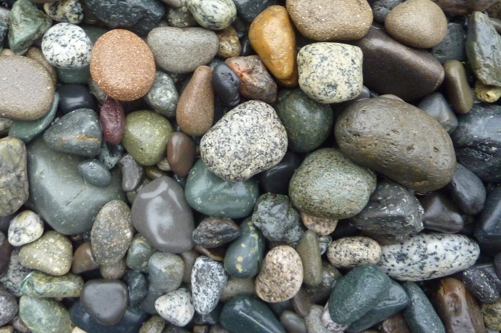

# Địa chất vật lý (ấn bản 2) — Steven Earle

Một **giáo trình mở** về địa chất vật lý, dùng làm nền tảng địa chất cho kho tư liệu địa kỹ
thuật của trang web này. Trong khi các sổ tay tham khảo khác ở đây bắt đầu từ *cơ học đất*
hoặc *thiết bị quan trắc*, cuốn này bắt đầu từ một tầng sâu hơn: Quả Đất cấu tạo từ gì, đá
được hình thành và bị phá vỡ ra sao, và nước dưới đất, động đất cùng mái dốc thực sự ứng xử
thế nào.

!!! info "Bản quyền — CC BY 4.0 (được phép dùng lại)"
    *Physical Geology – 2nd Edition* của **Steven Earle** (cùng Karla Panchuk), BCcampus,
    2019, mang giấy phép **Creative Commons Attribution 4.0 International (CC BY 4.0)**.
    Được phép giữ, dùng lại, sao chép và phóng tác tự do, miễn ghi nguồn.
    Nguồn: <https://opentextbc.ca/physicalgeology2ed/>

    Mục này là **bản tổng hợp kèm chú giải** — tóm tắt các chương có liên quan tới địa kỹ
    thuật và tái bản một số hình minh hoạ. Chỉ những hình thuộc **CC BY hoặc phạm vi công
    cộng** được dùng; các hình CC BY-SA và "bảo lưu mọi quyền" của giáo trình được chủ động
    loại bỏ. Xem [ghi nguồn hình](../../../assets/figures/geology/CREDITS.txt).

## Vì sao cuốn này có mặt ở đây

Sách *Cẩm nang dùng cho kỹ sư địa kỹ thuật* (Chương 1) nêu rõ: **địa chất công trình nếu
tách khỏi địa chất vật lý thì chỉ còn là mô tả**. Mục này cung cấp phần địa chất vật lý đó:
quá trình tạo đá, phong hoá, cấu trúc, nước dưới đất và dịch chuyển khối. Đây cũng là
**nguồn ảnh** hiện dùng để minh hoạ bản tổng hợp cẩm nang — một liên kết hợp pháp chính vì
cuốn sách có giấy phép mở.

**Hình.** Sỏi cuội granit trên bãi biển. Granit là loại đá kỹ sư dễ gặp nhất dưới dạng nền khoẻ, nứt nẻ — và khi phong hoá thì thành đất tàn dư.
*© Steven Earle, CC BY 4.0 — Physical Geology, 2nd ed., Hình 1.4.3.*

## Bản đồ chương

| Chương | Tiêu đề | Vì sao liên quan |
| --- | --- | --- |
| 1 | [Nhập môn địa chất](chapter-01-introduction-to-geology.md) | Phạm vi địa chất và vị trí địa chất công trình |
| 2 | [Khoáng vật](chapter-02-minerals.md) | Đá cấu tạo từ gì; tính chất và nhận dạng khoáng vật |
| 3 | [Đá magma xâm nhập](chapter-03-igneous-rocks.md) | Vòng tuần hoàn đá, magma và thể xâm nhập |
| 5 | [Phong hoá và đất](chapter-05-weathering-and-soil.md) | **Quá trình biến đá thành đất** — cốt lõi của đất tàn dư |
| 6 | [Trầm tích và đá trầm tích](chapter-06-sedimentary-rocks.md) | Trầm tích mảnh vụn, mặt phân lớp, môi trường lắng đọng |
| 7 | [Biến chất và đá biến chất](chapter-07-metamorphic-rocks.md) | Cấu tạo phiến — nguyên nhân dị hướng mạnh nhất |
| 9 | [Nội bộ Quả Đất và địa chấn học](chapter-09-earths-interior.md) | Sóng địa chấn và cơ sở của mọi phép khảo sát địa chấn |
| 11 | [Động đất](chapter-11-earthquakes.md) | Độ lớn, cường độ và hiểm hoạ địa chấn |
| 12 | [Cấu trúc địa chất](chapter-12-geological-structures.md) | Ứng suất, uốn nếp, khe nứt và đứt gãy |
| 14 | [Nước dưới đất](chapter-14-groundwater.md) | Độ rỗng, tính thấm, tầng chứa nước và tầng cách nước |
| 15 | [Dịch chuyển khối](chapter-15-mass-wasting.md) | Ổn định mái dốc nhìn từ phía địa chất |

Các chương còn lại của sách (4 núi lửa, 8 thời gian địa chất, 10 kiến tạo mảng, 13 sông và
lũ, 16 băng hà, 17 bờ biển, 18 đại dương, 19 khí hậu, 20 tài nguyên, 21 tây Canada, 22
nguồn gốc Quả Đất) nằm ngoài phạm vi địa kỹ thuật của trang này và không được tổng hợp.

## GTI Doctor

Trợ lý [GTI Doctor](../../gti-doctor.md) lập chỉ mục kho tư liệu của trang. Hỏi trợ lý về
phong hoá đá, nước dưới đất hay cơ chế trượt mái dốc — trợ lý sẽ trả lời dựa trên các trang
này và trên cẩm nang.
