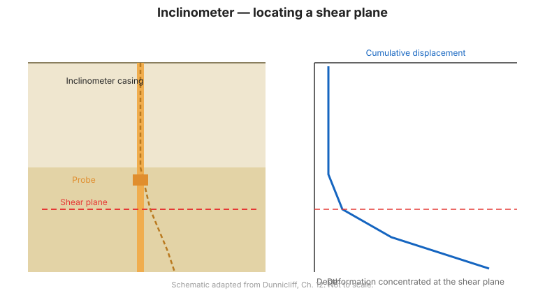
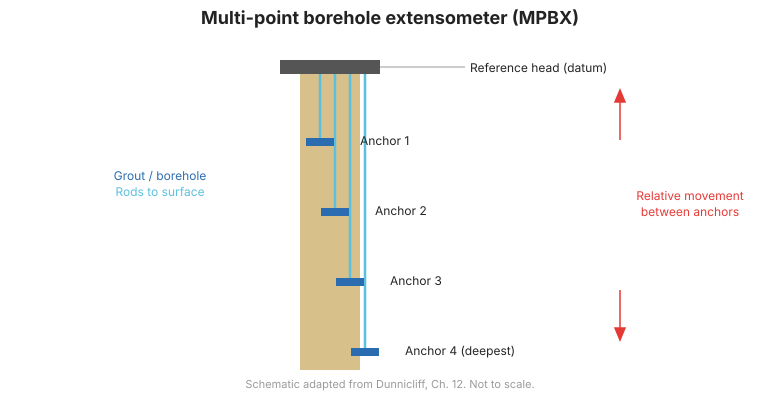

# Chương 8 — Đo biến dạng hình học

## 8.1 Biến dạng là dấu hiệu cảnh báo trực tiếp nhất

Hầu hết các sự cố sập đổ hay mất ổn định địa kỹ thuật đều biểu hiện trước bằng **chuyển vị và biến dạng hình học**. Quan trắc biến dạng cho phép phát hiện sự dịch chuyển cả trên bề mặt lộ thiên và đặc biệt là sâu trong lòng đất — nơi mắt thường hoàn toàn không thể quan sát được.

## 8.2 Đo lún đứng (Vertical Deformation)

- **Bàn đo lún (Settlement Plates)**: Một bản thép hoặc gỗ dán dày $60 \times 60\text{ cm}$ chôn dưới đáy khối đắp, nối với ống đứng bằng thép dẫn lên trên mặt đất đắp. Định kỳ đo cao độ đỉnh ống bằng máy thủy bình độ chính xác cao.
- **Đo lún từ tính (Magnetic Settlement System)**: Ống dẫn hướng PVC có lồng các vòng đĩa nam châm đặt tại ranh giới các lớp địa tầng khác nhau. Dùng đầu dò từ tính có chuông báo hạ xuống ống để đo cao độ từng vòng nam châm, từ đó xác định độ lún riêng biệt của từng tầng địa chất.
- **Hệ thống đo lún chất lỏng (Liquid Settlement Systems)**: Hoạt động theo nguyên lý bình thông nhau; cảm biến áp suất chất lỏng chôn sâu dưới thân đập hoặc nền đường truyền số liệu tự động về trạm đọc trên bờ mà không bị ảnh hưởng bởi quá trình lu lèn thi công.

## 8.3 Đo chuyển vị ngang sâu bằng Inclinometer

Ống đo nghiêng Inclinometer là công cụ chuẩn mực số một để phát hiện vị trí, độ sâu và tốc độ dịch chuyển của mặt trượt trong sườn dốc, đê đập và biến dạng thân tường vây hố đào sâu.

### Cấu tạo và quy trình đo:
- **Ống vách Inclinometer (Casing)**: Ống nhựa kỹ thuật ABS hoặc hợp kim nhôm, có 4 rãnh định hướng bên trong xẻ vuông góc 90° ($A+, A-, B+, B-$).
- **Đầu dò Inclinometer (Torpedo)**: Thân hình trụ bằng thép không gỉ gắn hai bánh xe dẫn hướng ăn khớp vào rãnh ống, bên trong chứa hai cảm biến gia tốc MEMS đo góc nghiêng trục $A$ và $B$.
- **Quy trình đo đảo chiều $0^\circ - 180^\circ$**: Bắt buộc phải đo hai lượt tại mỗi độ sâu (cách nhau 0.5 m):
  - Lượt 1: Bánh xe trên hướng theo rãnh $A+$ (hướng chuyển vị dự kiến).
  - Lượt 2: Kéo đầu dò lên, xoay $180^\circ$ và thả lại theo rãnh $A-$.
  - Độ lệch góc thực tế được tính bằng hiệu số để triệt tiêu hoàn toàn sai số lệch không (zero offset) của cảm biến:

$$\text{Độ lệch} = \frac{(A_{0} - A_{180})}{2} \cdot L \cdot \sin \theta$$

- **Sai số tổng kiểm tra (Checksum)**: Tổng $(A_{0} + A_{180})$ tại mỗi độ sâu phải xấp xỉ hằng số danh định. Nếu checksum thay đổi đột ngột, chứng tỏ rãnh ống bị bẩn hoặc cảm biến bị va đập cơ khí.

### Mảng đo nghiêng tự động (In-Place Inclinometers - IPI / ShapeArray - SAA)
Chuỗi các đoạn cảm biến MEMS đo nghiêng gắn cố định liên hoàn trong ống vách, kết nối liên tục với Datalogger để cung cấp biểu đồ biến dạng ngang theo thời gian thực 24/7 mà không cần nhân công thả cáp thủ công.

## 8.4 Biến dạng kế hố khoan nhiều điểm (MPBX)

- **Extensometer hố khoan nhiều điểm (MPBX)**: Gồm từ 1 đến 8 thanh đo (thanh sợi thủy tinh đàn hồi hoặc thép invar hệ số giãn nở nhiệt thấp) đặt trong cùng một hố khoan.
- Mỗi thanh được neo cố định tại một độ sâu địa tầng xác định bằng vữa chèn hoặc nêm cơ học, phần thân thanh được bọc ống nhựa tự do dẫn lên đầu đo tại miệng hố.
- Cảm biến biến vị (LVDT, chiết áp hoặc dây rung) gắn tại miệng hố đo độ dịch chuyển tương đối của từng điểm neo so với miệng hố khoan, phục vụ theo dõi trồi đáy hố đào hoặc biến dạng vòm hầm.

## 8.5 Đo hội tụ và mở rộng khe nứt

- **Thước đo hội tụ dây băng Invar (Tape Extensometer)**: Đo sự co hẹp hoặc mở rộng khoảng cách giữa các mốc gắn đối diện trên vách và vòm đường hầm với độ chính xác $\pm 0.05\text{ mm}$.
- **Cảm biến đo nứt (Crackmeters)**: Cảm biến dây rung hoặc cơ học gắn bắc cầu qua khe nứt của kết cấu bê tông hoặc vách đá để theo dõi tốc độ phát triển vết nứt theo thời gian.

**Hình.** Inclinometer. Đầu dò (hoặc mảng cố định) trong ống vách đo chuyển vị ngang theo chiều sâu và xác định mặt trượt (Dunnicliff, Ch. 12).

**Hình.** Extensometer hố khoan đa điểm (MPBX). Các neo ở nhiều độ sâu cùng thanh dẫn tới đầu chuẩn cho thấy lún hoặc tách lớp theo chiều sâu (Dunnicliff, Ch. 12).

## 8.6 Các điểm then chốt cần ghi nhớ

- Inclinometer là công cụ hàng đầu để xác định chiều sâu mặt trượt sườn dốc và độ võng tường vây.
- Quy trình đo đảo chiều $0^\circ - 180^\circ$ và kiểm tra checksum là bắt buộc khi đo inclinometer thủ công.
- MPBX đo lún đứng và trồi đáy sâu với độ chính xác cao nhờ các thanh đo không ma sát.
- Mảng tự động IPI và ShapeArray cung cấp dữ liệu biến dạng ngang liên tục cho các dự án rủi ro cao.
