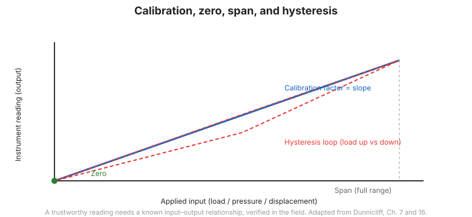

# Chương 11 — Hiệu chuẩn và bảo trì thiết bị

## 11.1 Hiệu chuẩn: Thiết lập hệ quy chiếu chuẩn mực

Một số đọc từ cảm biến (tần số Hz, điện áp mV, hay điện trở $\Omega$) sẽ hoàn toàn vô nghĩa nếu không có một hàm chuyển đổi chuẩn xác giữa tín hiệu đầu ra và đại lượng vật lý thực tế (kPa, mm, kN). **Hiệu chuẩn (Calibration)** là quá trình thiết lập và duy trì mối quan hệ chuyển đổi toán học này trong suốt vòng đời của thiết bị.

## 11.2 Hiệu chuẩn nhà máy và kiểm tra tại hiện trường

- **Hiệu chuẩn nhà máy (Factory Calibration)**: Được thực hiện trong phòng thí nghiệm chuẩn của nhà sản xuất trên các bàn thử nghiệm có kiểm soát nhiệt độ và áp suất, có truy xuất nguồn gốc tiêu chuẩn đo lường quốc gia (NIST / ISO). Cung cấp bảng số liệu đa điểm và phương trình hồi quy tuyến tính hoặc đa thức bậc hai.
- **Kiểm tra hiệu chuẩn tại hiện trường (Field Calibration Verification)**:
  - *Áp kế (Piezometer)*: Nhúng ngập cảm biến vào ống nước cao có vạch chia centimet hoặc đưa vào bình nén khí mini cầm tay để kiểm tra độ nhạy và số đọc zero trước khi thả xuống hố khoan.
  - *Đầu dò Inclinometer*: Đặt đầu dò lên khung kiểm chuẩn góc nghiêng chuẩn (calibration test frame) để kiểm tra số đọc 0° và góc nghiêng chuẩn $\pm 30^\circ$.
  - *Cảm biến tải / biến dạng*: Kiểm tra điện trở cuộn dây bằng ôm kế và kiểm tra điện trở cách điện bằng Megohmmeter (phải đạt $> 100\text{ M}\Omega$ ở điện áp 500V).

## 11.3 Thiết bị đọc hiện trường (Readout Units)

Thiết bị đọc cầm tay phải được kiểm định định kỳ hàng năm. Cần dự phòng ít nhất một máy đọc phụ tại công trường để đối chiếu chéo khi nghi ngờ máy đọc chính bị lệch hoặc hết pin.

## 11.4 Kế hoạch bảo trì phòng ngừa định kỳ

- **Chống ẩm**: Thay thế các gói hạt hút ẩm (silica gel) bên trong các hộp đấu nối cáp (junction boxes) và tủ chứa Datalogger ngay khi hạt chuyển từ màu xanh/cam sang màu hồng/trắng.
- **Làm sạch đầu tiếp xúc**: Lau sạch bụi bẩn, cát và bôi mỡ silicon bảo vệ trên các đầu giắc cắm kim loại chống nước.
- **Bảo vệ chống sét**: Kiểm tra hệ thống cọc tiếp địa chống sét lan truyền (điện trở tiếp địa phải đạt $< 5\,\Omega$); thay thế các ống phóng điện khí (gas discharge tubes) hoặc bộ chống sét MOV nếu đã bị đánh thủng sau các cơn dông bão.
- **Hệ thống năng lượng mặt trời**: Lau sạch bụi bẩn trên bề mặt tấm pin mặt trời và kiểm tra dung lượng bình ắc quy gel sâu (deep-cycle gel battery).

## 11.5 Hướng dẫn trong điều kiện thời tiết khắc nghiệt

- **Mùa đông / Vùng lạnh**: Thiết bị chứa chất lỏng thủy lực phải pha dung dịch chống đông (ethylene glycol hoặc cồn); bảo vệ cáp không bị giòn nứt do nhiệt độ âm.
- **Mùa mưa lũ / Vùng nhiệt đới**: Đảm bảo các tủ điện và hộp nối cáp được nâng cao hơn mực nước ngập lịch sử tối thiểu 1 m; gia cố chống chuột và côn trùng cắn phá cáp tín hiệu.

**Hình.** Hiệu chuẩn. Quan hệ đầu vào-đầu ra (độ dốc = hệ số hiệu chuẩn), với điểm không, dải đo và hiện tượng trễ (Dunnicliff, Ch. 7 và 16).

## 11.6 Các điểm then chốt cần ghi nhớ

- Hiệu chuẩn là nền tảng để chuyển đổi tín hiệu cảm biến thành giá trị kỹ thuật thực tế.
- Bắt buộc kiểm tra nghiệm thu số đọc ban đầu tại hiện trường trước khi lắp đặt.
- Kiểm tra điện trở cách điện ($> 100\text{ M}\Omega$) để đảm bảo cáp không bị rò rỉ nước ngầm.
- Bảo trì phòng ngừa định kỳ (hút ẩm, chống sét, nguồn pin) quyết định tuổi thọ của hệ thống.
