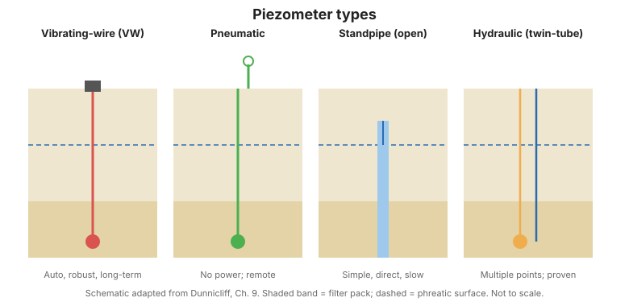
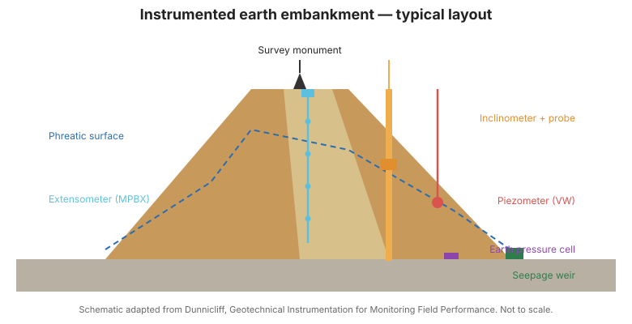

# Chương 2 — Tổng quan thiết bị đo áp lực nước ngầm

## 2.1 Piezometer là gì

Trong tài liệu này, **piezometer** là thiết bị được bịt kín trong đất sao cho nó chỉ
phản ứng với áp lực nước ngầm quanh chính nó, không phản ứng với áp lực ở cao độ
khác. Piezometer đo **áp lực nước lỗ rỗng trong đất** và **áp lực nước khe nứt trong
đá**. (Thuật ngữ *tế bào áp lực lỗ rỗng* đôi khi được dùng thay thế.) **Giếng quan
sát** là thiết bị khác: nó không có lớp bịt dưới bề mặt, do đó tạo ra một kết nối
thẳng đứng giữa các tầng.

Ứng dụng piezometer chia thành hai nhóm lớn:

1. **Mô tả dạng dòng chảy** — ví dụ quan trắc dòng chảy dưới bề mặt trong thí nghiệm
   bơm hút quy mô lớn để xác định tính thấm tại chỗ, hoặc theo dõi thấm lâu dài
   trong mái dốc.
2. **Cung cấp chỉ số sức chống cắt** — áp lực lỗ rỗng cho phép ước tính ứng suất hữu
   hiệu ($\sigma' = \sigma - u$), từ đó đánh giá sức chống cắt. Ví dụ: sức chống cắt
   dọc mặt trượt tiềm năng sau mái dốc cắt, và kiểm soát áp lực lỗ rỗng khi đắp theo
   giai đoạn trên nền sét yếu.

Khác biệt giữa piezometer cho đất và cho đá không nằm ở thiết bị mà ở **cách lắp
đặt**: trong đất, một cột cát ngắn (thường ~750 mm) được đặt quanh piezometer; trong
đá, cột cát dài hơn nhiều để đảm bảo cắt qua một khe nứt.

## 2.2 Giếng quan sát

Giếng quan sát là một đoạn ống đục lỗ nối với ống dẫn, đặt trong hố khoan chứa cát
hoặc sỏi. Lớp bịt mặt ngoài ngăn nước chảy tràn vào hố, và một lỗ thông hơi trên nắp
để nước lưu thông tự do. Mực nước được xác định bằng đầu dò.

**Phạm vi ứng dụng phù hợp rất hạn chế.** Do giếng quan sát tạo ra **kết nối thẳng
đứng giữa các tầng**, nó chỉ hợp lệ trong nền thấm liên tục, nơi áp lực nước ngầm
tăng đều theo độ sâu — điều kiện hiếm khi có thể giả định. Trong thực tế, giếng quan
sát thường được lắp trong giai đoạn khảo sát "để xác định áp lực nước ngầm ban đầu",
nhưng số đọc thường gây hiểu nhầm. **Giếng quan sát hiếm khi nên dùng** cho quan
trắc hiệu năng.

## 2.3 Piezometer ống đứng hở

**Piezometer ống đứng hở (Casagrande)** gồm một đầu lọc nối với ống dẫn, với khoảng
vành xuyến phía trên đầu lọc được bịt kín để chỉ tầng mục tiêu được kết nối. Thiết
bị này đáng tin cậy, có lịch sử hoạt động tốt lâu dài, và tính toàn vẹn của lớp bịt
có thể kiểm tra sau lắp đặt bằng thí nghiệm thấm cột nước giảm dần. Nó có thể chuyển
thành thiết bị đọc từ xa bằng cách đưa một cảm biến áp lực vào trong ống.

Hạn chế lớn nhất là **độ trễ thủy lực dài** (Mục 2.7). Các hạn chế khác: có thể bị
hư do thiết bị thi công hoặc do đất xung quanh bị nén theo phương thẳng đứng; có thể
bị đóng băng nếu mực nước dâng quá đường băng giá; kéo dài ống đứng xuyên qua nền
đắp làm gián đoạn việc đắp và gây đầm nén kém; và đầu lọc xốp có thể bị tắc do dòng
nước vào ra lặp lại.

## 2.4 Piezometer khí nén

**Piezometer khí nén** dùng một màng mềm cân bằng bởi áp lực khí cấp và hồi qua hai
ống. Ưu điểm: độ trễ ngắn, phần hiệu chuẩn của hệ vẫn tiếp cận được tại bộ đọc, ít
gây trở ngại thi công, và không gặp vấn đề đóng băng. Hạn chế: số đọc phụ thuộc phần
nào vào người vận hành, và độ chính xác giảm khi đọc trong điều kiện khí đang chảy.

## 2.5 Piezometer dây rung

**Piezometer dây rung (VW)** đo sự thay đổi tần số cộng hưởng của một dây căng khi
màng kim loại uốn dưới áp lực nước. Ưu điểm: dễ đọc, độ trễ ngắn, ít trở ngại thi
công, ảnh hưởng dây dẫn nhỏ, không gặp vấn đề đóng băng, và kết nối sẵn sàng với
**bộ ghi dữ liệu (datalogger)** để quan trắc tự động. Hạn chế chính là **cần đánh giá
nhu cầu bảo vệ chống sét**.

## 2.6 Piezometer nhiều điểm

**Piezometer nhiều điểm** đặt nhiều cảm biến trong một hố khoan để có số đo áp lực
theo độ sâu chi tiết, với số điểm đo không giới hạn và phần hiệu chuẩn tiếp cận được
tại mặt đất. Đổi lại là **quy trình lắp đặt phức tạp**, và thường chỉ đọc thủ công
định kỳ.

**Hình.** So sánh các loại piezometer phổ biến: dây rung, khí nén, ống đứng hở và thủy lực hai ống (theo FHWA-HI-98-034, Ch. 2).

## 2.7 Độ trễ thủy lực

**Độ trễ thủy lực** là thời gian để nước đi qua đầu lọc và cân bằng áp lực với nền
đất xung quanh. Nó được quyết định bởi **độ linh động thay đổi thể tích** của thiết
bị so với tính thấm của nền:

- **Ống đứng** phải nhận một thể tích nước lớn để nâng cột nước — nên trong sét ít
  thấm, độ trễ có thể **vài tuần đến vài tháng**.
- **Thiết bị màng** (khí nén hoặc dây rung) thay đổi thể tích rất nhỏ, nên độ trễ chỉ
  **vài giây đến vài phút**.

Đây là lý do nền ít thấm đòi hỏi thiết bị màng cứng, và vì sao ống đứng chỉ phù hợp
với đất thấm tương đối tốt.

## 2.8 Thiết bị khuyến nghị và các vấn đề khác

- **Lựa chọn:** dùng bảng ưu điểm và hạn chế để khớp thiết bị với nền đất và tốc độ
  đáp ứng yêu cầu.
- **Loại đầu lọc:** phải chọn đầu lọc xốp sao cho không bị tắc và không tự thêm độ
  trễ.
- **Nút bentonite dạng hạt phía trên piezometer**, rồi **vữa xi măng phía trên nút
  đó**, để cô lập vùng đo.
- **Búa/đầu dò dò mực nước:** dùng để xác định mực nước trong ống đứng và giếng quan
  sát.

!!! warning "Piezometer màng đọc cột nước, không đọc cao độ"
    Số đọc của piezometer màng biểu thị **cột nước phía trên piezometer**; cao độ của
    piezometer phải được đo hoặc ước lượng nếu cần **cao độ cột nước**. Mọi
    piezometer màng (trừ loại thông khí quyển) đều nhạy với thay đổi **áp suất khí
    quyển**.

**Hình.** Mặt cắt điển hình một hố khoan lắp đặt, thể hiện vùng lọc, lớp bịt và vữa lấp cô lập piezometer (theo FHWA-HI-98-034, Ch. 2).

## 2.9 Các điểm then chốt cần ghi nhớ

- Piezometer phải được **bịt kín** để chỉ phản ứng với vùng của chính nó.
- **Giếng quan sát tạo kết nối thẳng đứng** và hiếm khi nên dùng để quan trắc.
- **Độ trễ thời gian** là yếu tố quyết định: ống đứng chậm, thiết bị màng nhanh.
- Piezometer dây rung là lựa chọn mặc định cho quan trắc tự động lâu dài — nhưng phải
  tính **bảo vệ chống sét**.
- Luôn ghi **cao độ** piezometer, và để ý ảnh hưởng **khí quyển**.
