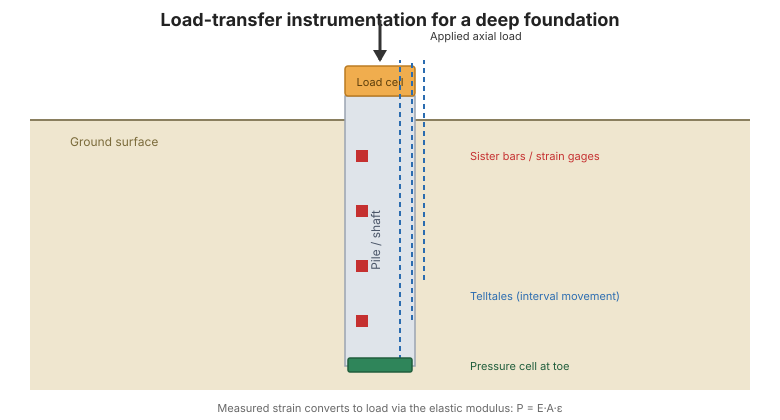

# Chương 8 — Quan trắc móng sâu

## 8.1 Giới thiệu

Móng sâu — **cọc đóng** và **cọc khoan nhồi** — truyền tải từ công trình xuống nền ở
độ sâu. Quan trắc trong **thí nghiệm tải** và trong thi công trả lời câu hỏi trung
tâm: *tải phân bố thế nào giữa ma sát thành bên và sức kháng mũi, và móng ứng xử ra
sao dưới tải?*

## 8.2 Cọc đóng

**Vai trò chung.** Quan trắc trong thí nghiệm tải dọc trục tĩnh đo ứng xử **truyền
tải** của cọc: tải truyền từ cọc vào đất dọc theo chiều dài và tại mũi như thế nào.

**Các câu hỏi địa kỹ thuật chính:**

- Tải dọc trục phân bố thế nào giữa thành bên và mũi?
- Ma sát thành bên và sức kháng mũi huy động được ở tải làm việc là bao nhiêu?
- Cọc có ứng xử đàn hồi không, và tải đo được có khớp với tải tác dụng không?

**Thiết bị phù hợp** (Bảng 8-1) thường gồm: **tenzo** hoặc **thanh chị em** (ứng biến
dọc trục → tải), **telltale / nhiều telltale** (chuyển vị), **load cell** ở đầu và mũi
cọc, và **extensometer** (lún nội bộ).

## 8.3 Cọc khoan nhồi

**Vai trò chung.** Như cọc đóng, quan trắc phân giải truyền tải và xác định phản ứng
tải–lún. Cọc khoan nhồi cho phép lắp thiết bị vào bê tông tươi hoặc lồng cốt thép.

**Các câu hỏi địa kỹ thuật chính:**

- Phản ứng tải–lún của cọc khoan là gì?
- Tải chia sẻ thế nào giữa sức kháng bên và sức kháng mũi?
- Đáy cọc có sạch và ứng xử như giả định không?

**Thiết bị phù hợp** (Bảng 8-2) thường gồm: **thanh chị em** (ứng biến → tải trong
lồng thép), **tế bào áp lực đất tiếp xúc** ở đáy, **nhiều telltale** (chuyển vị giữa
các đoạn) và **load cell**.

**Hình.** Quan trắc truyền tải cho thí nghiệm tải móng sâu: tenzo / thanh chị em dọc thân cọc, telltale cho chuyển vị giữa các đoạn, cùng load cell và tế bào áp lực ở mũi (theo FHWA-HI-98-034, Ch. 8).

## 8.4 Diễn giải dữ liệu truyền tải

Chuyển ứng biến đo được thành tải dùng **mô đun đàn hồi** của cấu kiện
($P = E A \varepsilon$). Một phép kiểm hữu ích là đồ thị **nhân–quả**: tải đo được ở
một cao độ phải khớp với tải tác dụng trừ đi tải thành bên phía trên. Khi có **dữ liệu
truyền tải đầy đủ**, có thể tách trực tiếp phân bố ma sát thành bên và sức kháng mũi;
khi không có, chỉ suy ra được phản ứng tổng. Ví dụ tính toán nằm trong **Phụ lục D**
(xem [Chương 14](chapter-14-references-appendices.md)).

## 8.5 Các điểm then chốt cần ghi nhớ

- Lắp thiết bị cho thí nghiệm tải móng sâu để phân giải **thành bên so với mũi**.
- **Thanh chị em** và **tenzo** chuyển ứng biến thành tải qua **mô đun đàn hồi**.
- **Telltale** và **extensometer** cho profile chuyển vị.
- Dùng **phép kiểm nhân–quả** để xác nhận dữ liệu hợp lý về mặt vật lý.
- Ví dụ truyền tải đã giải nằm trong **Phụ lục D**.
