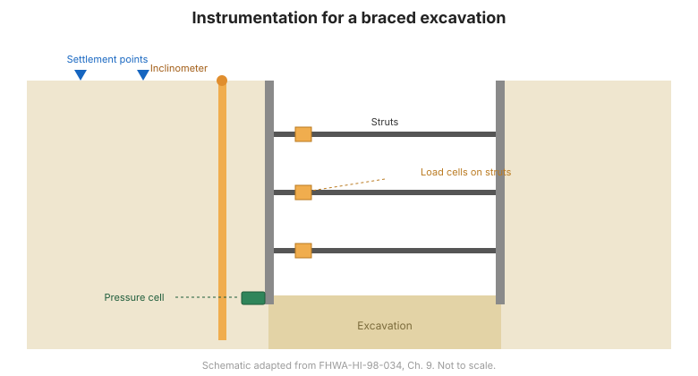

# Chương 9 — Quan trắc kết cấu chắn đất

## 9.1 Giới thiệu

Kết cấu chắn đất giữ lại đất hoặc đá và truyền tải sinh ra xuống nền hoặc vào cốt
gia cường bên trong. Quan trắc xác nhận kết cấu ứng xử đúng thiết kế — chuyển vị nhỏ,
tải như dự đoán, và nền phía sau tường ổn định. Chương này bàn về hố đào chống đỡ,
tường vữa, tường đất có cốt (MSE) và tường neo đất.

## 9.2 Hố đào chống đỡ bên trong

**Vai trò chung.** Quan trắc theo dõi chuyển vị tường, chuyển vị nền, tải thanh chống
và áp lực lỗ rỗng quanh hố đào, để điều chỉnh hệ chống và bảo vệ công trình lân cận.

**Các câu hỏi địa kỹ thuật chính:**

- Tường và nền xung quanh chuyển vị bao nhiêu?
- Các thanh chống đang chịu tải bao nhiêu?
- Đáy có bị bùng nền hay áp lực lỗ rỗng đang tăng không?

**Thiết bị phù hợp** (Bảng 9-1) thường gồm: **inclinometer** (chuyển vị tường và
nền), **load cell** (tải thanh chống), **piezometer** (áp lực lỗ rỗng), **điểm lún**
và **trắc đạc**.

## 9.3 Hố đào chống đỡ bên ngoài

**Vai trò chung.** Với hệ neo hoặc thanh giằng, quan trắc đo tải neo và chuyển vị nền.

**Thiết bị phù hợp** (Bảng 9-2) thường gồm: **load cell** (tải neo), **inclinometer**,
**piezometer** và **điểm trắc đạc**.

## 9.4 Tường vữa

**Vai trò chung.** Quan trắc xác nhận tính ổn định của hào trong thi công và hiệu năng
của tường hoàn thiện.

**Thiết bị phù hợp** (Bảng 9-3) thường gồm: **đo hội tụ** (ổn định hào),
**inclinometer** (chuyển vị tường), cùng thiết bị **ứng suất/ứng biến** và **áp lực**.

## 9.5 Tường đất có cốt (MSE)

**Vai trò chung.** Quan trắc đo ứng suất và ứng biến trong cốt gia cường cùng chuyển
vị của mặt tường và đất được giữ.

**Các câu hỏi địa kỹ thuật chính:**

- Cốt gia cường huy động lực kéo bao nhiêu?
- Mặt tường và đất được giữ chuyển vị bao nhiêu?
- Ứng suất tác dụng ở chân tường là bao nhiêu?

**Thiết bị phù hợp** (Bảng 9-4) thường gồm: **cảm biến đo biến dạng (strain gauge)** hoặc **cảm biến đo tải trọng (load cell)** trên cốt gia cường,
**thiết bị đo nghiêng (inclinometer)** và **trắc đạc** cho chuyển vị, và **hộp đo áp lực đất** ở chân tường.

## 9.6 Tường neo đất

**Vai trò chung.** Quan trắc đo tải trọng neo, chuyển vị mặt tường và biến dạng nền.

**Thiết bị phù hợp** (Bảng 9-5) thường gồm: **cảm biến đo tải trọng (load cell)** trên neo, **thiết bị đo nghiêng (inclinometer)**
và **điểm trắc đạc**.

**Hình.** Quan trắc cho kết cấu chắn đất: inclinometer sau tường, load cell trên thanh chống/neo, hộp đo áp lực ở chân tường và điểm lún trên nền lân cận (theo FHWA-HI-98-034, Ch. 9).

## 9.7 Bài tập — tường MSE

Sổ tay có một **bài tập** về tường đất có cốt (MSE), bao gồm quan trắc ổn định toàn
diện và xác định độ lớn cùng phân bố ứng suất trong tường. Kết quả ví dụ nằm trong
**Phụ lục E** (xem [Chương 14](chapter-14-references-appendices.md)).

## 9.8 Các điểm then chốt cần ghi nhớ

- Khớp thiết bị với đường truyền tải: **thanh chống/neo → load cell**; **tường/nền →
  inclinometer và trắc đạc**; **nền → piezometer**.
- Với **tường MSE**, lắp thiết bị cho **cốt gia cường** để thấy lực kéo huy động.
- Bảo vệ công trình lân cận bằng cách quan trắc **chuyển vị nền ngoài hố đào**.
- Ví dụ tường MSE đã giải nằm trong **Phụ lục E**.
