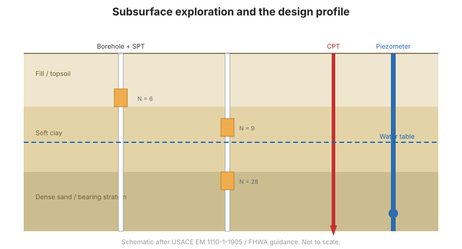

# Chương 2 — Khảo sát dưới bề mặt & Mô tả khu đất

## 2.1 Vì sao phải khảo sát

Mọi thiết kế móng chỉ tốt bằng mô hình nền đất đằng sau nó. **Khảo sát dưới bề mặt**
xác lập địa tầng, điều kiện nước ngầm và các đặc trưng kỹ thuật cần thiết để chọn loại
móng và tính sức chịu tải cùng lún. Khảo sát thiếu là nguyên nhân gốc phổ biến nhất
của các sự cố móng.

## 2.2 Chương trình khảo sát

Chương trình được lập quanh **công trình và các câu hỏi** mà nó đặt ra:

- **Mục đích** — tải trọng nào, biến dạng cho phép nào, phương pháp thi công nào?
- **Bố trí** — hố khoan và các phép thử bố trí phủ diện tích công trình và mọi thay
  đổi của nền; dày hơn nơi điều kiện biến đổi.
- **Độ sâu** — đủ sâu để xuyên qua mọi tầng đóng góp đáng kể vào lún, hoặc tới tầng
  chịu lực tốt.
- **Phương pháp** — kết hợp **hố khoan lấy mẫu** và **thí nghiệm tại chỗ**.

## 2.3 Lấy mẫu và thí nghiệm tại chỗ

- **Hố khoan** lấy mẫu nguyên dạng và phá hoại để thí nghiệm trong phòng.
- **Thí nghiệm xuyên tiêu chuẩn (SPT)** cho số búa $N$ — chỉ số mật độ và cường độ được
  dùng rộng rãi, và là cơ sở của nhiều tương quan kinh nghiệm.
- **Thí nghiệm xuyên côn (CPT)** cho sức kháng mũi và ma sát thành liên tục, rất tốt để
  mô tả đất yếu và ước lượng cường độ cùng thông số cố kết.
- **Cắt cánh (vane)**, **pressuremeter** và **dilatometer** cho các thông số đặc thù tại
  chỗ.

## 2.4 Nước ngầm

Nước ngầm chi phối ứng suất hữu hiệu, do đó chi phối cường độ và lún. Cần xác lập:

- **độ sâu mực nước ngầm** và biên độ theo mùa;
- **áp lực nước lỗ rỗng** và mọi điều kiện áp lực thủy tĩnh dư;
- **tính thấm** của mỗi tầng, phục vụ thấm và cố kết.

Áp lực nước lỗ rỗng được đo bằng **piezometer** (xem tài liệu
[Dunnicliff](../dunnicliff/index.md) và [FHWA](../fhwa/index.md)).

## 2.5 Từ dữ liệu đến mặt cắt thiết kế

Khảo sát tạo ra một **mặt cắt thiết kế**: mô hình đơn giản hóa, thiên về an toàn, gồm
các tầng, đặc trưng của chúng và chế độ nước ngầm, biểu diễn thành thông số cho các
phân tích ở các chương sau. Mặt cắt nên:

- **bao biên độ bất định** — dùng giá trị thiên an toàn nơi dữ liệu thưa;
- **nhận diện đất có vấn đề** — sét yếu, cát rời, đất trương nở hoặc sụt lún, hữu cơ,
  đất đắp;
- **cảnh báo tính biến đổi** — nơi đặc trưng thay đổi đột ngột trên khu đất.

**Hình.** Khảo sát dưới bề mặt: hố khoan lấy mẫu và thí nghiệm tại chỗ, cùng piezometer, tạo nên mặt cắt thiết kế (theo USACE EM 1110-1-1905 / hướng dẫn FHWA).

## 2.6 Các điểm then chốt cần ghi nhớ

- **Khảo sát trước khi thiết kế** — mô hình nền chi phối mọi quyết định.
- Kết hợp **hố khoan** với **thí nghiệm tại chỗ** (SPT, CPT) và **đo nước ngầm**.
- Độ sâu và khoảng cách theo **công trình và các câu hỏi** của nó.
- Rút gọn dữ liệu thành một **mặt cắt thiết kế** thiên an toàn, nêu rõ ràng.
- Để ý **đất có vấn đề** và **tính biến đổi**.
