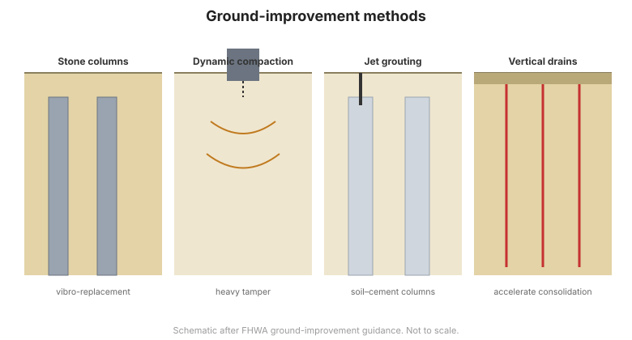

# Chương 14 — Gia cố nền & Quan trắc móng

## 14.1 Vì sao gia cố nền

Khi nền không thể đỡ móng dự kiến một cách kinh tế, có thể **cải tạo nền tại chỗ** thay vì
lách qua bằng móng sâu. Gia cố nền tăng cường độ, giảm tính nén, kiểm soát nước ngầm hoặc
giảm nhẹ hóa lỏng. Đây thường là giải pháp kinh tế nhất cho đất yếu, rời hoặc nén.

## 14.2 Phương pháp đầm chặt

- **Đầm rung và thay thế rung (cột đá)** — đầu rung đầm chặt cát rời và tạo cột đá đầm chặt
  trong sét yếu.
- **Đầm chặt động (dynamic compaction)** — quả nặng thả theo lưới đầm chặt đất lấp hạt rời và
  đất rời.
- **Thay thế động sâu** — cột đá hoặc đá dăm tạo bằng cách thả.
- **Phụt vữa đầm chặt (compaction grouting)** — vữa cứng bơm vào để đầm chặt và nâng.

## 14.3 Gia cường và bao gồm (inclusion)

- **Cột đá (stone columns)** — tăng sức chịu tải và giảm lún; cũng hoạt động như giếng thoát
  nước.
- **Neo đất (soil nailing)** — thép neo đặt vào mái dốc hoặc mặt hố đào để gia cường (FHWA
  GEC-7).
- **Đất có cốt (MSE)** — cốt địa kỹ thuật hoặc kim loại trong đất lấp
  ([Chương 11](chapter-11-retaining-walls.md)).
- **Micropile** — cọc khoan phụt đường kính nhỏ cho nơi chật hẹp hoặc gia cố móng.

## 14.4 Phụt vữa và thoát nước

- **Phụt vữa thấm (permeation grouting)** — lấp lỗ rỗng trong đất hạt rời để giảm thấm và
  tăng cường độ.
- **Phụt vữa tia (jet grouting)** — vữa áp lực cao tạo cột đất–xi măng.
- **Thoát nước** — giếng thoát đứng, bấc thấm (wick drain) và giếng ngang tăng tốc cố kết và
  hạ áp lực nước lỗ rỗng.

**Hình.** Các phương pháp gia cố nền phổ biến: thay thế rung / cột đá, đầm chặt động, phụt vữa tia và bấc thấm thoát nước đứng (theo hướng dẫn gia cố nền của FHWA).

## 14.5 Quan trắc cho móng

Vì gia cố nền và móng sâu tốn kém và khó kiểm chứng, **quan trắc** là thiết yếu để xác nhận
hiệu năng:

- **Bàn lún và extensometer** — đo lún và phân bố của nó.
- **Piezometer** — theo dõi áp lực nước lỗ rỗng trong cố kết và chất tải.
- **Inclinometer** — phát hiện dịch chuyển ngang trong mái dốc và sau hố đào.
- **Load cell và tenzo** — đo tải trong cọc, neo và thanh chống.
- **Điểm lún và trương nở** — kiểm chứng gia cố nền và công trình lân cận.

Các thiết bị này, cùng cách dùng chúng, được trình bày sâu trong tài liệu
[Dunnicliff](../dunnicliff/index.md) và [FHWA](../fhwa/index.md).

## 14.6 Các điểm then chốt cần ghi nhớ

- **Gia cố nền** thường rẻ hơn móng sâu cho nền yếu.
- **Đầm chặt** (rung, động) xử lý đất rời và nén.
- **Bao gồm và gia cường** (cột đá, neo đất, MSE, micropile) thêm cường độ và độ cứng.
- **Phụt vữa và thoát nước** kiểm soát tính thấm và áp lực nước lỗ rỗng.
- **Quan trắc** mọi giải pháp gia cố và móng — kiểm chứng là thiết yếu vì nền đất bị che
  khuất.
