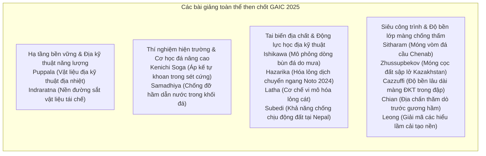
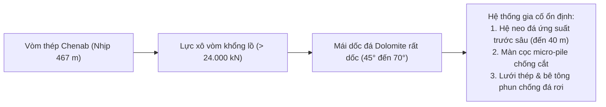

# Chương 1: Báo cáo Toàn thể & Bài giảng Đầu ngành

!!! info "Bối cảnh chuyên đề & Tài liệu nguồn"
    Chương này tổng hợp 14 bài báo cáo toàn thể và bài giảng đầu ngành được trình bày tại Hội nghị Quốc tế Địa kỹ thuật Châu Á lần thứ nhất (GAIC 2025), xuất bản trong kỷ yếu *GeoVadis: The Future of Geotechnical Engineering (Volume 3)*, CRC Press / Taylor & Francis (2026), DOI: [10.1201/9781003645955](https://doi.org/10.1201/9781003645955).

---

## 1. Tóm tắt Tổng quan & Khung Chuyên đề

Phiên toàn thể GAIC 2025 quy tụ các chuyên gia hàng đầu thế giới để giải quyết những thách thức căn bản lẫn thực tiễn trong kỹ thuật địa kỹ thuật hiện đại:

---

## 2. Hạ tầng Bền vững & Địa kỹ thuật Năng lượng

### 2.1 Giải pháp Địa nhiệt & Hệ thống Vật liệu Địa kỹ thuật (Puppala và cộng sự)
GS. Anand J. Puppala và các cộng sự đã đánh giá khả năng tích hợp năng lượng địa nhiệt vào kết cấu hạ tầng giao thông thông qua cọc năng lượng nhiệt và vật liệu địa kỹ thuật đa chức năng:

*   **Tương tác Nhiệt - Thủy lực - Cơ học (THM):** Cọc kích hoạt nhiệt và các ống trao đổi nhiệt gắn trong vật liệu địa kỹ thuật khai thác nguồn địa nhiệt nông để chống đóng băng mặt đường và điều hòa nhiệt độ bản mặt cầu.
*   **Biến dạng Nhiệt Chu kỳ:** Chu kỳ biến dạng nhiệt ngày đêm và theo mùa ($\Delta T = \pm 15^\circ\text{C}$) gây ra biến dạng dọc trục do nhiệt $\varepsilon_{\text{th}} = \alpha_c \Delta T$. Nghiên cứu chỉ ra rằng ma sát tiếp xúc giữa cọc và đất nền không bị suy giảm đáng kể miễn là ứng suất pháp hữu hiệu $\sigma'_c$ duy trì vượt trên ứng suất tiền cố kết $\sigma'_p$:

$$\tau_{\text{mob}} = \sigma'_n \tan \delta' + c'_a$$

### 2.2 Vật liệu Phế thải Tái chế trong Nền đường sắt (Indraratna và cộng sự)
GS. Buddhima Indraratna, Y. Qi, T. Ngo, và C.K. Arachchige đã cung cấp các chứng cứ hiện trường và phòng thí nghiệm về việc tái chế cao su phế thải (vụn lốp xe, băng tải bỏ đi) kết hợp với đá thải rửa than (CW) và xỉ lò thép (SFS) làm lớp đệm dưới đá ba-lát (subballast):

*   **Hỗn hợp Hấp thụ Năng lượng Tối ưu (CWB):** Cấp phối chứa xỉ thép, đá rửa than và vụn cao su (10% khối lượng) giảm thiểu đến 35% biên độ dao động động lực của đoàn tàu.
*   **Chỉ số Vỡ vụn Đá ba-lát ($BBI$):** Lớp thảm cao su hấp thụ năng lượng dưới lớp đá ba-lát (UBM) đã giảm hơn 40% hiện tượng nghiền nát hạt ba-lát dưới tải trọng trục $30\text{ tấn}$, kéo dài đáng kể chu kỳ bảo dưỡng đường ray:

$$BBI = \frac{A}{A + B}$$

trong đó $A$ là diện tích biến đổi của đường cong cấp phối hạt do vỡ vụn, và $B$ là diện tích tiềm năng phá vỡ dưới giới hạn $0.075\text{ mm}$.

---

## 3. Thí nghiệm Hiện trường Độ chính xác cao: Áp kế Tự khoan (Soga & Liu)

GS. Kenichi Soga và L. Liu đã phân tích chuyên sâu sự khác biệt giữa lý thuyết giãn nở lỗ rỗng lý tưởng và quan sát thực tế khi thí nghiệm bằng **Áp kế Tự khoan (Self-Boring Pressuremeter - SBPM)** trong các tầng sét cứng quá cố kết:

*   **Nhiễu loạn và Loại bỏ Mùn khoan:** Giả định lý tưởng xem lỗ khoan ban đầu hoàn toàn nguyên vẹn ($r_0 = r_{\text{cavity}}$). Trên thực tế, dao động của đầu cắt tạo ra một vành đất sét bị xáo động và suy giảm độ cứng.
*   **Xác định Ứng suất Ngang Hiện trường ($\sigma_{h0}$):** So sánh phương pháp áp lực tách rời màng ($p_L$) và phương pháp điểm uốn:

$$p_L = \sigma_{h0} + u_0$$

*   **Sức kháng Cắt Không thoát nước ($s_u$) và Mô đun Cắt Phi tuyến ($G$):** Tính toán từ đường cong quan hệ ứng suất - biến dạng trượt theo công thức kinh điển của Gibson và Anderson:

$$\tau = \frac{1}{2} \varepsilon_c (1 + \varepsilon_c) \frac{dp}{d\varepsilon_c}$$

trong đó $\varepsilon_c = \frac{\Delta V / V_0}{1 + \Delta V / V_0}$ là biến dạng lỗ rỗng. Mô phỏng phần tử hữu hạn xác nhận rằng nếu bỏ qua xáo động khi khoan thì mô đun cắt cực đại $G_{\text{max}}$ sẽ bị đánh giá cao hơn tới 30%, đồng thời hệ số áp lực đất tĩnh $K_0$ bị đánh giá thấp nghiêm trọng.

---

## 4. Tai biến Địa kỹ thuật & Động lực học Địa chấn

### 4.1 Thấm do Mưa và Động lực học Dòng chảy Bùn đá (Ishikawa và cộng sự)
GS. T. Ishikawa và nhóm nghiên cứu đã phát triển khung tính toán tích hợp giữa bài toán thấm không bão hòa (phương trình Richard) và phương trình sóng nước nông trung bình theo chiều sâu để mô phỏng sự dịch chuyển dòng chảy bùn đá:

*   **Sóng Áp lực Nước Lỗ rỗng Tạm thời:** Mưa bão kéo dài làm vùng thấm ướt tiến sâu, suy giảm lực hút dính ma mao dẫn $\psi = (u_a - u_w)$, dẫn tới suy giảm hệ số an toàn ($F_s$) trên các sườn dốc đá sỏi sườn tích.
*   **Cơ học Dòng chảy Đất đá:** Khi trượt xảy ra, sự hóa lỏng dòng chảy biến khối trượt thành chất lưu phi Newton dạng Bingham với ứng suất chảy $\tau_y$ và độ nhớt dẻo $\mu_p$:

$$\tau = \tau_y + \mu_p \left(\frac{du}{dz}\right)$$

### 4.2 Hóa lỏng Dịch chuyển Ngang trong Động đất Bán đảo Noto 2024 (Hazarika và cộng sự)
GS. Hemanta Hazarika trình bày các khảo sát thực tế sau trận động đất $M_w 7.5$ ngày 01/01/2024 tại Nhật Bản:

*   **Hóa lỏng Ven biển & Trôi trượt Ngang:** Biến dạng trôi trượt ngang (lateral spreading) đạt biên độ $1.5\text{ m}$ đến $3.0\text{ m}$ sát tường bến cảng và bờ sông tại Wajima và Suzu.
*   **Ứng xử Móng Công trình:** Các móng nông và móng băng không được xử lý cải tạo nền bị nghiêng lệch $> 2.5^\circ$, trong khi các công trình đặt trên cọc bê tông ly tâm ứng suất trước có bố trí hàng cừ khống chế biên vẫn duy trì khả năng khai thác an toàn.

---

## 5. Đột phá Kỹ thuật Móng cho Siêu Công trình

### 5.1 Cầu Đường sắt Chenab: Móng Vòm & Ổn định Mái dốc Đá (Sitharam & Mantrala)
GS. T.G. Sitharam và S. Mantrala trình bày chi tiết giải pháp địa kỹ thuật thi công **Cầu vòm Chenab** (Kashmir, Ấn Độ) — cầu đường sắt dạng vòm cao nhất thế giới ($359\text{ m}$ trên lòng sông):

*   **Mô tả Khối Đá:** Khối đá dolomite nứt nẻ có chỉ số $GSI = 45 - 65$. Nguy cơ trượt nêm tại giao tuyến của ba hệ khe nứt đòi hỏi mô phỏng phần tử rời 3 chiều (3DEC).
*   **Thiết kế Neo Cáp:** Bố trí các bó cáp ứng suất trước lực kéo $1200\text{ kN}$ được bảo vệ chống ăn mòn kép, ngàm sâu vào vùng đá nguyên khối nằm phía sau các mặt trượt tiềm năng.

### 5.2 Móng Cọc Siêu Công trình trên Đất Có Vấn đề tại Kazakhstan (Zhussupbekov & Omarov)
GS. Askar Zhussupbekov tổng kết kinh nghiệm thi công móng sâu tại Astana/Nur-Sultan:

*   **Đất Loess Lún sập và Bùn sét Bão hòa:** Ứng dụng thí nghiệm nén tĩnh cọc hai chiều bằng hộp tải trọng Osterberg (O-cell) đạt lực nén trên $30.000\text{ kN}$ cho cọc khoan nhồi đường kính lớn ($d = 1.2\text{ m} - 1.5\text{ m}$).
*   **Bơm vữa Đáy Cọc Áp lực cao:** Công nghệ phụt vữa gia cường đáy cọc (base post-grouting) giúp gia tăng sức kháng mũi từ 80% đến 120%, triệt tiêu lún dư trong nền đất lún sập.

---

## 6. Độ bền Lâu dài của Màng Địa kỹ thuật trong Đập (Cazzuffi & Gioffrè)

GS. Daniele Cazzuffi và D. Gioffrè đã công bố các báo cáo tổng quan về màng chống thấm địa kỹ thuật (geomembrane) trong đập đất đá:

*   **Lựa chọn Vật liệu:** So sánh màng PVC-P hóa dẻo, Polyethylene mật độ cao (HDPE), và cao su EPDM.
*   **Cơ chế Lão hóa:** Hiện tượng thất thoát chất hóa dẻo, oxy hóa và khả năng kháng đâm thủng dưới áp lực cột nước cao vượt quá $100\text{ m}$ ($> 1\text{ MPa}$).
*   **Khảo sát Khai quật Hiện trường:** Mẫu màng sau 40 năm khai thác thực tế trong đập vẫn duy trì độ giãn dài khi đứt $> 180\%$, khẳng định màng địa kỹ thuật được bảo vệ bằng lớp vải địa kỹ thuật đệm có tuổi thọ chống thấm tin cậy qua nhiều thập kỷ.
