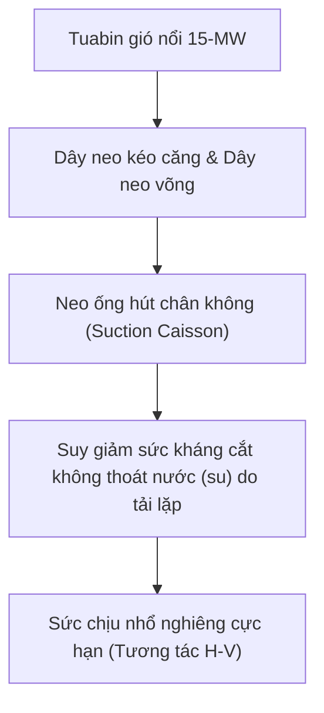

# Chương 2: AI, Cơ học Địa kỹ thuật Tính toán & Môi trường

!!! info "Bối cảnh chuyên đề & Tài liệu nguồn"
    Chương này tổng hợp các bài báo khoa học thuộc **Phiên 1 (Trí tuệ Nhân tạo & Cơ học Địa kỹ thuật Tính toán)** và **Phiên 2 (Địa kỹ thuật Vùng lạnh, Ven biển & Môi trường)** được trình bày tại GAIC 2025 và xuất bản trong *GeoVadis: The Future of Geotechnical Engineering (Volume 3)*, CRC Press / Taylor & Francis (2026), DOI: [10.1201/9781003645955](https://doi.org/10.1201/9781003645955).

---

## 1. Trí tuệ Nhân tạo (AI) & Mô hình Thay thế trong Địa kỹ thuật

### 1.1 Sức chịu Tải Móng Băng trên Mái dốc Biến thiên Không gian (Sharma & Pain)
Priyanka Sharma và Anindya Pain đã nghiên cứu sự không chắc chắn của các hệ số sức chịu tải ($N_c$, $N_q$, $N_\gamma$) cho móng băng đặt kề mái dốc đất dính - ma sát có trường ngẫu nhiên biến thiên theo không gian:

*   **Phương pháp Phần tử Hữu hạn Ngẫu nhiên (RFEM):** Lực dính $c$ và góc ma sát trong $\phi$ được mô hình hóa bằng trường ngẫu nhiên 2D chuẩn và log-chuẩn với thang dao động dị hướng $\theta_x, \theta_z$:

$$\rho(\Delta x, \Delta z) = \exp \left( - \sqrt{\left(\frac{2\Delta x}{\theta_x}\right)^2 + \left(\frac{2\Delta z}{\theta_z}\right)^2} \right)$$

*   **Mô hình Học máy Thay thế (Surrogate Model):** Ứng dụng thuật toán XGBoost và Hồi quy Quá trình Gaussian (GPR) huấn luyện trên 2.500 mô phỏng Monte Carlo FE, cho phép dự báo sức chịu tải cực hạn $q_{ult}$ chỉ trong vài mili-giây với hệ số xác định $R^2 > 0.96$:

$$q_{ult} = c N_c^* + q N_q^* + \frac{1}{2}\gamma B N_\gamma^*$$

trong đó các hệ số hiệu chỉnh $N^*$ trực tiếp xét đến độ dốc mái talu $\beta$, khoảng cách mép móng $d/B$ và hệ số biến thiên $COV_{c,\phi}$.

### 1.2 Cơ học Lực Khoan Đất Tầng Mặt Mặt Trăng (Raghav và cộng sự)
V. Raghav và các đồng tác giả đã thiết lập mô hình giải tích tương tác răng cắt - đất đá cho cơ cấu lấy mẫu tầng mặt Mặt Trăng:

*   **Cơ học Quá trình Khoan:** Tổng lực đẩy dọc trục $F_T$ và mô-men xoắn $T_Q$ được tách thành ba thành phần: lực kháng tại mặt cắt, lực ma sát dọc theo mặt mòn của răng cắt và lực cản vận chuyển phoi khoan ra khỏi lỗ.
*   **Ảnh hưởng Trọng lực Thấp:** Dưới gia tốc trọng trường Mặt Trăng ($g = 1.62\text{ m/s}^2$), ứng suất nén hiệu dụng $\sigma'_3$ suy giảm mạnh, giúp giảm hao mòn mũi cắt nhưng lại tăng nguy cơ sập lở thành lỗ khoan trong tầng đất mặt mật độ rời ($< 1.5\text{ g/cm}^3$).

### 1.3 Tiến trình & Rào cản của AI trong Thực hành Địa kỹ thuật (Samui)
GS. P. Samui đã đưa ra đánh giá khách quan về việc áp dụng máy học trong địa kỹ thuật:

*   **Các Điểm nghẽn Cốt lõi:** Tập dữ liệu huấn luyện nhỏ (số lượng lỗ khoan hạn chế), mất cân bằng dữ liệu, bỏ qua tương quan không gian và thiếu khả năng diễn giải vật lý (mô hình "hộp đen").
*   **Mạng Nơ-ron Thông tin Vật lý (PINNs):** Hàm mất mát được ràng buộc bởi các phương trình vi phân chi phối (cân bằng cơ học $\nabla \cdot \boldsymbol{\sigma} + \mathbf{b} = \mathbf{0}$ và dòng thấm liên tục $\nabla \cdot (k \nabla h) = 0$):

$$\mathcal{L}_{total} = \mathcal{L}_{data} + \lambda_{phys} \mathcal{L}_{PDE} + \lambda_{BC} \mathcal{L}_{BC}$$

---

## 2. Cơ học Neo Đá Chịu Lực Nhổ (Parab và cộng sự)

G.S. Parab, V.V. Dandage, và A.V. Sharma đã phân tích ứng xử của neo đá chịu nhổ tải trọng lớn neo trong đá basalt nứt nẻ:

*   **Cơ chế Truyền Tải trọng:** Thí nghiệm kéo nhổ hiện trường gắn thiết bị đo biến dạng sâu nhiều điểm (MPBX) dọc chiều dài bầu vữa cho thấy ứng suất cắt $\tau(z)$ phân bố phi tuyến giảm dần theo độ sâu:

$$\tau(z) = \tau_{\text{peak}} \exp(-\alpha z)$$

*   **Kiểm chứng Phần tử Hữu hạn:** Mô phỏng FEM 3D khẳng định góc nón phá hoại chịu nhổ thực tế lệch khỏi góc lý thuyết $45^\circ$ khi khối đá có các khe nứt gần nằm ngang chiếm ưu thế, góc nón dẹt xuống $30^\circ - 35^\circ$, đòi hỏi chiều sâu ngàm neo tối thiểu $h_e \ge 6\text{ m}$.

---

## 3. Kỹ thuật Địa kỹ thuật Môi trường & Màng Chắn Chống thấm

### 3.1 Cường độ Nén Đơn UCS của Vật liệu Đắp Gốc Bentonite (Nayak và cộng sự)
B.P. Nayak, S. Kumar, và R. Bag nghiên cứu vật liệu đắp đất sét kỹ thuật dùng cho tường hào chống thấm và kho chứa chất thải độc hại:

*   **Tỷ lệ Phối trộn:** Hỗn hợp cát - bentonite - tro bay. Hệ số thấm đạt mức $k < 1 \times 10^{-9}\text{ m/s}$ khi hàm lượng bentonite vượt quá 15% theo khối lượng khô.
*   **Cường độ Nén Đơn ($UCS$):** Thời gian bảo dưỡng và dung trọng khô $\rho_d$ quyết định cường độ sau trương nở; việc thêm quá nhiều tro bay làm tăng độ giòn và giảm khả năng tự liền sẹo nứt nẻ khi bị dung dịch hóa chất thẩm thấu.

### 3.2 Tác động của Bùn Đỏ Bauxite đến Độ Co ngót của Bentonite (Shaikh và cộng sự)
J. Shaikh và nhóm nghiên cứu đã xử lý lớp đệm bentonite bằng bùn đỏ bauxite thải công nghiệp:

*   **Điều chỉnh Giới hạn Co ngót:** Bentonite thông thường bị co ngót thể tích rất lớn khi khô kiệt. Việc bổ sung 20% đến 30% bùn đỏ cung cấp các hạt oxit sắt và alumin không trương nở, nâng giới hạn co ngót từ 11,2% lên 19,8% và loại bỏ hoàn toàn mạng lưới nứt nẻ do co ngót.

### 3.3 Ứng dụng Vật liệu Nano Giảm Trương nở do Kiềm trong Đất Đỏ (Kumar và cộng sự)
T. Aravind Kumar, P. Hari Prasada Reddy, và S.K. Vindula nghiên cứu hiện tượng nước thải công nghiệp kiềm cao ($\text{pH} > 12$) xâm thực nền đất đỏ:

*   **Cơ chế Trương nở:** Ion $\text{OH}^-$ hòa tan tứ diện silica trong khoáng vật sét, làm vỡ cấu trúc và trương nở mạnh.
*   **Gia cố bằng Nano-Silica & Nano-Alumina:** Phối trộn 1,0% phụ gia hạt nano thúc đẩy phản ứng pozzolan hình thành gel C-S-H, giảm chỉ số trương nở tự do do kiềm từ 68% xuống dưới 14%.

---

## 4. Địa kỹ thuật Xử lý Sinh học: MICP Chi phí thấp (Rawat & Satyam)

Vikas Rawat và Neelima Satyam đã phát triển kỹ thuật Kết tủa Canxit do Vi sinh vật kích hoạt (MICP) sử dụng rỉ mật mía thay thế môi trường dinh dưỡng đắt tiền:

*   **Động học Vi khuẩn:** Hoạt tính urease của vi khuẩn *Sporosarcina pasteurii* trong môi trường rỉ mật mía pha loãng (3% v/v) tương đương môi trường chuẩn phòng thí nghiệm sau 48 giờ ($U \approx 18\text{ mM ure/phút}$).
*   **Phản ứng Kết tủa Canxit & Tăng cường Độ:**

$$\text{CO(NH}_2)_2 + 2\text{H}_2\text{O} \xrightarrow{\text{Urease}} 2\text{NH}_4^+ + \text{CO}_3^{2-}$$

$$\text{Ca}^{2+} + \text{CO}_3^{2-} \rightarrow \text{CaCO}_3 \downarrow$$

*   **Chỉ tiêu Địa kỹ thuật:** Cát xử lý bằng MICP gốc mật mía có cường độ nén đơn $UCS$ tăng từ $0\text{ kPa}$ lên $1.840\text{ kPa}$ và giảm hệ số thấm $2,5$ bậc độ lớn, đồng thời tiết kiệm 62% chi phí xử lý.

---

## 5. Móng Công trình Biển: Trụ Điện Gió Nổi Ngoài Khơi (James & Haldar)

M. James và S. Haldar mô phỏng kết cấu móng cho tuabin điện gió nổi bán chìm 15-MW (FOWT) trong nền đất sét biển sâu:

*   **Mô phỏng Động lực học Tích hợp Khí - Thủy động - Đất nền:** Biên độ lực căng dây neo dưới bão 100 năm và động đất gây tích lũy áp lực nước lỗ rỗng thặng dư $\Delta u / \sigma'_{v0} > 0.45$.
*   **Mặt Giới hạn Khả năng Chịu tải:** Phân tích cho thấy hiện tượng mềm hóa chu kỳ làm giảm sức chịu nhổ tới 22%, đòi hỏi tỷ số hình học ống hút chân không phải đạt $L/D \ge 3.5$.
