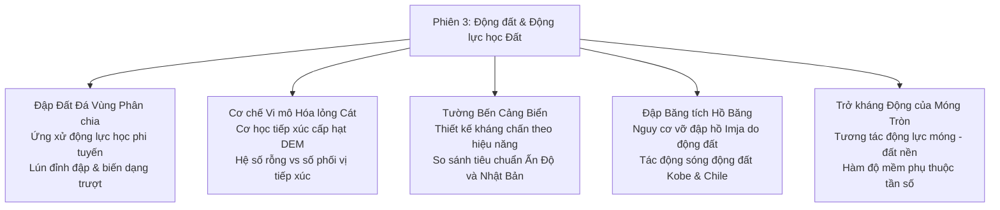
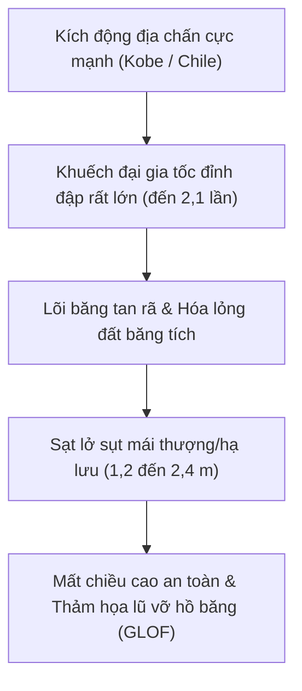

# Chương 3: Kỹ thuật Địa chấn & Động lực học Đất

!!! info "Bối cảnh chuyên đề & Tài liệu nguồn"
    Chương này tổng hợp các bài báo khoa học thuộc **Phiên 3 (Kỹ thuật Động đất & Động lực học Đất)** được trình bày tại GAIC 2025 và xuất bản trong *GeoVadis: The Future of Geotechnical Engineering (Volume 3)*, CRC Press / Taylor & Francis (2026), DOI: [10.1201/9781003645955](https://doi.org/10.1201/9781003645955).

---

## 1. Tóm tắt Tổng quan & Trọng tâm Động lực học

Phiên 3 tập trung vào phân tích ứng xử phi tuyến của đất nền dưới tác động động đất phức tạp:

---

## 2. Phân tích Động lực học Phi tuyến Đập Đất Đá (Kumar & Maheshwari)

A. Kumar và GS. B.K. Maheshwari đã đánh giá ứng xử động đất phi tuyến của đập đá đổ có lõi sét chống thấm trung tâm:

*   **Mô hình Quan hệ Ứng suất - Biến dạng:** So sánh mô hình tuyến tính tương đương và mô hình đàn dẻo trễ hoàn toàn phi tuyến có xét đến suy giảm mô đun cắt $G/G_{\text{max}}$ và tăng tỷ số cản $D$ theo biên độ biến dạng:

$$\frac{G}{G_{\text{max}}} = \frac{1}{1 + \left(\frac{\gamma}{\gamma_r}\right)^a}$$

*   **Dự báo Biến dạng Dư Vĩnh cửu:** Dưới gia tốc đỉnh nền ($PGA = 0.45\text{ g}$), hiện tượng mềm hóa đất nền phi tuyến làm độ lún dư đỉnh đập tăng thêm 42% so với phương pháp tuyến tính tương đương.
*   **Áp lực Nước Lỗ rỗng Thặng dư trong Lõi:** Độ bão hòa của lõi đất sét chi phối sự phân bố lại ứng suất thủy động lực; việc bỏ qua liên kết cơ - thủy lực sẽ đánh giá thấp biến dạng phình ra phía hạ lưu của thân đập.

---

## 3. Cơ chế Tiếp xúc Cấp hạt Đánh giá Nguy cơ Hóa lỏng (Banerjee và cộng sự)

S. Banerjee, R.K. Kandasami, M.U. Rehman, và A. Srivastava giới thiệu khung tính toán hạt rời (DEM) để đánh giá khả năng hóa lỏng cát từ cấp hạt vi mô:

*   **Mạng lưới Tiếp xúc Vi mô và Dị hướng Cơ học:** Số phối vị $Z_c$ và ten-xơ dị hướng tiếp xúc cơ học $a_{ij}$:

$$Z_c = \frac{2 N_c}{N_p}$$

$$a_{ij} = \frac{15}{2} \left( \Phi_{ij} - \frac{1}{3}\delta_{ij} \right)$$

trong đó $N_c$ là tổng số điểm tiếp xúc và $N_p$ là tổng số hạt.

*   **Tiêu chí Kích hoạt Hóa lỏng:** Khi chịu cắt chu kỳ không thoát nước, thời điểm hóa lỏng xảy ra ứng với sự sụp đổ đột ngột của mạng lưới truyền lực tiếp xúc ($Z_c \rightarrow 3.0$), làm mô đun cắt vĩ mô $G \rightarrow 0$ bất kể mật độ ban đầu $D_r$.
*   **Chỉ số Đánh giá Giản lược:** Đề xuất một thông số không thứ nguyên liên kết giữa hệ số đồng đều $C_u$, độ cầu $S$ và thông số trạng thái $\psi$, cho phép sàng lọc sơ bộ nguy cơ hóa lỏng mà không cần thực hiện thí nghiệm ba trục chu kỳ tốn kém.

---

## 4. Thiết kế Kháng chấn Theo Hiệu năng cho Tường Bến Cảng (Pushpa và cộng sự)

K. Pushpa, P. Nanjundaswamy, và S.K. Prasad đã tiến hành so sánh hệ thống tiêu chuẩn Ấn Độ (IS 1893) và tiêu chuẩn Cảng biển Nhật Bản (OCDI):

*   **So sánh Triết lý Thiết kế:**
    *   *Tiêu chuẩn Ấn Độ:* Dựa trên lực giả tĩnh với hệ số động đất $k_h = \frac{Z \cdot I \cdot S_a / g}{2 R}$.
    *   *Tiêu chuẩn Nhật Bản (OCDI):* Thiết kế kháng chấn 2 cấp theo hiệu năng:
        *   **Cấp 1 (Động đất Khai thác bình thường - chu kỳ lặp 75 năm):** Chuyển vị dư nhỏ ($\Delta x < 0.1\text{ m}$), cầu cảng hoạt động bình thường ngay sau chấn động.
        *   **Cấp 2 (Động đất Cực đại - chu kỳ lặp 475–1000 năm):** Chuyển vị dư cho phép có kiểm soát ($\Delta x < 0.3 - 0.5\text{ m}$), bảo đảm kết cấu thùng chìm (caisson) không bị đổ sập đột ngột.
*   **Đánh giá Thực tế:** Phương pháp giả tĩnh đánh giá thấp đáng kể góc nghiêng và độ trượt ngang khi xảy ra hóa lỏng lớp đất đắp sau tường thùng chìm, khẳng định tính bắt buộc của phân tích động lực học theo ứng suất hữu hiệu cho các công trình bến cảng.

---

## 5. Ổn định Địa chấn của Đập Băng tích Hồ Băng (Ojha, Tiwari và cộng sự)

Biraj Ojha, Aanchal Tiwari, Sandeep Sapkota, Ram Chandra Tiwari, và P. Dangi Chhetri khảo sát mức độ rủi ro địa chấn của **đập băng tích Hồ Imja** trên dãy Himalaya thuộc Nepal:

*   **Bối cảnh:** Hồ Imja nằm ở cao độ $5.010\text{ m}$, chứa hàng chục triệu mét khối nước băng tan được ngăn giữ bởi đập băng tích hỗn độn chứa lõi băng bên trong.
*   **Tác động Động đất Mạnh:** Mô phỏng ổn định thân đập dưới dữ liệu kích động của các trận động đất lịch sử Kobe ($M_w 6.9$) và Chile ($M_w 8.8$):

*   **Rủi ro Kênh Xả Lũ:** Rung chấn làm sạt lở các vách đá sỏi hai bên làm tắc nghẽn kênh xả tràn nhân tạo, tiềm ẩn nguy cơ tràn đỉnh gây vỡ hồ băng thảm khốc xuống hạ du.

---

## 6. Tương tác Động lực Đất - Móng của Móng Nông Hình Tròn (Jafarzadeh & Maleki)

Fardin Jafarzadeh và Jafar Maleki nghiên cứu hàm trở kháng động và dao động cưỡng bức của móng tròn cứng đặt trên nền cát:

*   **Thí nghiệm Hiện trường:** Mô hình móng kích thước lớn được kích thích dao động điều hòa theo phương thẳng đứng và lắc ngang ở các dải tần số $f = 5 - 50\text{ Hz}$.
*   **Hàm Trở kháng Phức:** $K^* = K_{dyn} + i \omega C$:

$$K_{dyn}(\omega) = k(\omega) K_s$$

$$C(\omega) = c(\omega) \frac{K_s r_0}{V_s}$$

trong đó $K_s = \frac{4 G r_0}{1 - \nu}$ là độ cứng tĩnh thẳng đứng, và $r_0$ là bán kính móng.
*   **Ảnh hưởng của Biến dạng Phi tuyến:** Ở dải biên độ biến dạng trượt $\gamma > 10^{-4}$, tần số cộng hưởng của móng bị dịch chuyển giảm 25% do suy giảm mô đun cắt trong vùng cận móng, đi kèm với sự gia tăng 35% của hệ số cản bức xạ sóng.
