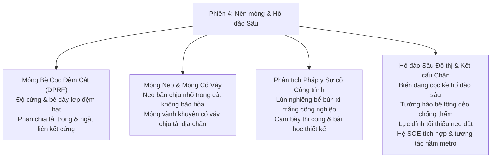

# Chương 4: Nền móng, Hố đào Sâu & Kết cấu Chắn giữ

!!! info "Bối cảnh chuyên đề & Tài liệu nguồn"
    Chương này tổng hợp các bài báo khoa học thuộc **Phiên 4 (Nền móng và Hố đào Sâu)** được trình bày tại GAIC 2025 và xuất bản trong *GeoVadis: The Future of Geotechnical Engineering (Volume 3)*, CRC Press / Taylor & Francis (2026), DOI: [10.1201/9781003645955](https://doi.org/10.1201/9781003645955).

---

## 1. Tóm tắt Tổng quan & Phạm vi Thiết kế

Phiên 4 phân tích các bài toán tương tác phức tạp của móng sâu, hố đào sâu đô thị rủi ro cao, tường chắn đất và tường hào chống thấm:

---

## 2. Hệ Móng Bè Cọc Tách rời: Móng Bè Cọc Đệm Cát (Raut và cộng sự)

S. Raut, P. Halder, B. Manna, và J.T. Shahu đã nghiên cứu mô phỏng số chi tiết về ứng xử phụ thuộc lớp đệm của **Móng bè cọc đệm cát (Disconnected Piled Raft Foundation - DPRF)**:

*   **Cơ chế Ngắt Liên kết Kết cấu:** Trong hệ DPRF, bản bè móng được tách rời hoàn toàn khỏi đỉnh cọc bằng một lớp đệm hạt rời (cát thô, sỏi cuội hoặc cấp phối gia cố lưới địa kỹ thuật). Giải pháp này triệt tiêu hoàn toàn sự tập trung ứng suất cắt và mô-men uốn tại mối nối đỉnh cọc - đáy bè:

$$P_{\text{total}} = P_{\text{raft}} + \sum P_{\text{pile}}$$

$$\alpha_{pr} = \frac{\sum P_{\text{pile}}}{P_{\text{total}}}$$

*   **Ảnh hưởng của Chiều dày Đệm ($t_c/d$) và Độ cứng Đệm ($E_c$):**
    *   Lớp đệm mỏng ($t_c/d < 0.5$): Tải trọng truyền xuống cọc lớn ($\alpha_{pr} > 0.75$), nhưng sự tập trung ứng suất cục bộ vẫn còn.
    *   Lớp đệm tối ưu ($t_c/d = 0.8 - 1.2$): Cọc đóng vai trò thuần túy như những bộ phận giảm lún (settlement reducers) được huy động hết ma sát bên, trong khi áp lực tiếp xúc đáy bè phân bố đều xuống đất nền.
    *   Lớp đệm quá dày ($t_c/d > 2.0$): Hiệu quả giảm lún của cọc bị suy giảm; độ lún bản bè tăng 45%.

---

## 3. Móng Chuyên dụng: Neo Bản & Móng Vòng Có Váy

### 3.1 Sức Chịu Nhổ Neo Bản trong Cát Không Bão hòa (Mushtaq & Sahoo)
M. Mushtaq và J.P. Sahoo khảo sát sức chịu nhổ cực hạn của neo bản thẳng đứng trong cát không bão hòa:

*   **Đóng góp của Lực hút dính Mao dẫn:** Lực dính biểu kiến phát sinh do lực hút dính mao dẫn $\psi = (u_a - u_w)$ dọc mặt phá hoại:

$$q_{ult} = \gamma' h_e N_\gamma + c_{\text{app}} N_c$$

$$c_{\text{app}} = c' + (u_a - u_w) \tan \phi^b$$

*   **Sức Chịu Nhổ Cực đại:** Kết quả thí nghiệm kéo nhổ chỉ ra sức kháng nhổ tăng 2,2 lần tại trạng thái giữ nước tối ưu ($S_r \approx 40\%$) so với trạng thái cát khô kiệt hoặc ngập nước bão hòa.

### 3.2 Móng Vành khuyên Có Váy Chịu Tải Trọng Động đất (Chatterjee và cộng sự)
Kaustav Chatterjee, Puran, Pratik Goel, và Sambit Pani phân tích móng vành khuyên có váy biên chịu tải trọng ngang chấn động:

*   **Hiệu ứng Ngăn Cản Đất Chồi ra:** Váy thép/bê tông bao quanh chu vi móng ngăn chặn sự trồi trượt ngang của đất dưới mô-men lật động đất, nâng cao hệ số sức chịu tải ngang $N_h$ từ 35% đến 60%.
*   **Địa tầng Phân lớp:** Địa tầng lớp mềm nằm trên lớp cứng làm tập trung biến dạng trượt dẻo tại chân váy móng, đòi hỏi chiều sâu váy móng $D_s/B \ge 0.5$.

---

## 4. Phân tích Pháp y Địa kỹ thuật Sự cố Công trình

### 4.1 Pháp y Sự cố Lún Nghiêng Bể Bùn Bê tông Cỡ Lớn (Krishnanunni, Bishnoi, Murty)
K.T. Krishnanunni, D. Bishnoi, và D.S. Murty phân tích sự cố lún nghiêng nghiêm trọng ($> 300\text{ mm}$) của các bể chứa bùn bê tông công nghiệp đường kính lớn:

*   **Nguyên nhân Gốc rễ:**
    1.  Khảo sát địa chất bỏ sót thấu kính bùn sét mềm ở độ sâu $6\text{ m} - 11\text{ m}$ bên dưới tầng đá tảng không được bơm vữa.
    2.  Sự khuấy trộn bùn động học trong quá trình vận hành gây tích tụ áp lực nước lỗ rỗng thặng dư và làm suy giảm sức chịu tải không thoát nước của nền sét.
    3.  Lún cố kết chênh lệch gây xé rách liên kết giữa thành bể và bản đáy.
*   **Biện pháp Xử lý:** Thi công cọc hỗn hợp xi măng - đất (jet grouting) tạo màn gia cố bao quanh kết hợp cọc micro-pile xuyên qua đáy bể ngàm vào tầng đá cứng.

### 4.2 Thiết kế Phòng tránh Thất bại Địa kỹ thuật (Govind Raj & Annam)
B. Govind Raj và Madan Kumar Annam đúc kết các cảnh báo sớm và sai lầm phổ biến khi thi công hố đào sâu:
*   Phụ thuộc vào các thông số mặc định của phần mềm mà không hiệu chuẩn với thí nghiệm thực tế.
*   Bỏ qua mực nước ngầm áp lực giả trong các mùa mưa lũ.
*   Đào đất vượt chiều sâu quy định trước khi căng kéo ứng suất trước cho hệ dầm giằng hoặc neo đất.

---

## 5. Hố Đào Sâu Đô thị & Kết Cấu Giữ Thành Hố Móng

### 5.1 Biến Dạng của Cọc Lân Cận do Đào Hố Móng Sâu (Rao & Kandolkar)
R.B. Rao và S.S. Kandolkar phân tích phản ứng của nhóm cọc chịu tải kề sát hố đào sâu được che chắn bằng tường vây barrette:

*   **Phạm vi Vùng Nguy hiểm:** Các cọc nằm trong phạm vi khoảng cách $x \le 1.5 H_e$ ($H_e$ là chiều sâu đào) bị phát sinh mô-men uốn vượt quá 60% khả năng chịu lực tính toán của tiết diện cọc, đòi hỏi phải bố trí rãnh giảm chấn hoặc cọc hỗn hợp xi măng - đất ngăn cách.

### 5.2 Tường Hào Bê tông Dẻo Chống Thấm (Chakraborty và cộng sự)
S. Chakraborty, S.K. Koley, và P.K. Ray trình bày các yêu cầu thiết kế tường hào bê tông dẻo ngăn thấm nước ngầm:

*   **Thành phần Cấp phối:** Nước, xi măng, bentonite và cốt liệu hạt được tính toán để đạt cường độ chịu nén $f_c = 1.5 - 3.5\text{ MPa}$ và mô đun biến dạng $E \approx 500 - 1500\text{ MPa}$.
*   **Độ dẻo & Khả năng Chống thấm:** Bê tông dẻo chịu được biến dạng lớn $\varepsilon > 2.5\%$ mà không bị nứt gãy cơ học, đồng thời duy trì hệ số thấm cực nhỏ $k \le 1 \times 10^{-10}\text{ m/s}$.

### 5.3 Hệ Chống đỡ Hố đào Tích hợp (SOE) trong Đô thị (Yasrebi & Zolqadr)
Shahab Yasrebi và Emad Zolqadr đánh giá hệ chống đỡ hố đào tích hợp (hybrid SOE) kết hợp cọc chống bằng thép, neo đất ứng suất trước và tường vây thi công top-down:

*   **Kiểm soát Lún Công trình Lân cận:** Hệ kết hợp hạn chế lún của các tòa nhà lân cận hố đào sâu $18\text{ m}$ xuống dưới $12\text{ mm}$, giảm chuyển vị ngang tường chắn 40% so với phương pháp đinh đất truyền thống.

### 5.4 Ảnh Hưởng của Hố Đào Sâu đến Hầm Metro Hiện Hữu (Ayothiraman và cộng sự)
R. Ayothiraman, V.K. Singh, và S. Mahajan phân tích biến dạng của đường hầm metro vỏ bê tông lắp ghép trong cát khi hố đào bên cạnh giải phóng tải trọng và chịu tải trọng tháp nhà cao tầng kề bên:

*   **Tỷ số Méo Vỏ Hầm ($\Delta D / D$):** Biến dạng méo đường kính vỏ hầm đạt 0,45% trong giai đoạn dỡ tải đáy hố móng.
*   **Biện pháp Khống chế:** Cần tiến hành hạ mực nước ngầm theo từng phân đoạn và kiểm soát rung chấn thi công cọc nhồi sát vách hầm để bảo vệ an toàn cho vỏ hầm.
