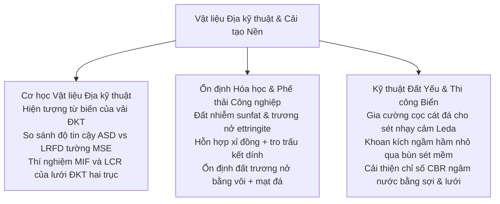

# Chương 5: Vật liệu Tổng hợp & Cải tạo Nền đất

!!! info "Bối cảnh chuyên đề & Tài liệu nguồn"
    Chương này tổng hợp các bài báo khoa học thuộc **Phiên 5 (Kỹ thuật Vật liệu Địa kỹ thuật)** và **Phiên 6 (Cải tạo Nền & Ổn định Hóa học)** được trình bày tại GAIC 2025 và xuất bản trong *GeoVadis: The Future of Geotechnical Engineering (Volume 3)*, CRC Press / Taylor & Francis (2026), DOI: [10.1201/9781003645955](https://doi.org/10.1201/9781003645955).

---

## 1. Tóm tắt Tổng quan & Khung Công nghệ

Phiên 5 và 6 phân tích các giải pháp tiên tiến về vật liệu polymer địa kỹ thuật, độ tin cậy kết cấu chắn đất, và các phương pháp cải tạo nền đất yếu bằng phụ gia sinh - hóa:

---

## 2. Cơ học Vật liệu Địa kỹ thuật & Độ Tin cậy Tường Chắn Đất

### 2.1 Hiện tượng Từ biến của Vải Địa kỹ thuật (Kolekar, Dasaka và cộng sự)
J.Y. Kolekar, GS. S.M. Dasaka, S.B. Kharmale, và Y.A. Kolekar phân tích hiện tượng phá hoại do từ biến dài hạn của vải địa kỹ thuật polyester (PET) và polypropylene (PP):

*   **Hệ số Giảm Cường độ do Từ biến ($RF_{\text{CR}}$):**

$$T_{\text{al}} = \frac{T_{\text{ult}}}{RF_{\text{CR}} \cdot RF_{\text{ID}} \cdot RF_{\text{D}}}$$

trong đó $RF_{\text{CR}}$ là hệ số suy giảm do từ biến, $RF_{\text{ID}}$ là hệ số hư hỏng do quá trình thi công đầm nén, và $RF_{\text{D}}$ là hệ số suy giảm do độ bền hóa sinh lâu dài.
*   **Mô hình Nhớt Đàn tính:** Dự báo theo phương pháp đẳng nhiệt bước nhảy (SIM) cho thấy vải địa kỹ thuật sợi PP có tốc độ biến dạng từ biến cao hơn tới 3,5 lần so với sợi PET cường độ cao ở nhiệt độ môi trường cao ($T > 35^\circ\text{C}$).

### 2.2 So sánh Thiết kế Tường MSE theo ASD và LRFD (Mana & Vyas)
D.S.K. Mana và S.D. Vyas đánh giá mức độ an toàn và kinh tế giữa phương pháp Ứng suất Cho phép (ASD) và phương pháp Hệ số Tải trọng và Sức kháng (LRFD):

*   **Các Trạng thái Giới hạn:** Ổn định ngoài (trượt, lật, sức chịu tải) và ổn định trong (đứt cốt gia cường, tuột neo cốt).
*   **Chỉ số Độ Tin cậy ($\beta$):** Phương pháp LRFD đạt được chỉ số độ tin cậy đồng đều hơn trên các dải chiều cao tường chắn ($H = 4 - 12\text{ m}$) nhờ tách biệt các hệ số tải trọng ($\gamma_{\text{EV}} = 1.35$, $\gamma_{\text{EH}} = 1.50$) và hệ số sức kháng ($\phi_t = 0.90$), tiết kiệm từ 8% đến 15% khối lượng vật liệu so với phương pháp ASD mà vẫn đảm bảo độ an toàn.

### 2.3 Hệ số Tương tác Lưới Địa kỹ thuật: MIF và LCR (Vyas & Mistry)
Saurabhh Vyas và Shivani Mistry xác định Hệ số Tương tác Lưới vi mô ($MIF$) và Tỷ số Hạn chế Ngang ($LCR$) bằng thiết bị kéo nhổ hộp lớn:

*   **Độ Ổn định Mắt Lưới:** Lưới địa kỹ thuật hai trục dập nguyên tấm (extruded PP) cho giá trị $LCR$ cao ($> 0.82$) trong lớp đá dăm ba-lát cạnh sắc, tốt hơn so với lưới dệt polyester ($LCR \approx 0.65$), khẳng định vai trò giữ chặt hạt đá chống biến dạng ngang của mắt lưới cứng.

---

## 3. Ổn định Hóa học & Xử lý Đất Có Vấn đề

### 3.1 Đất Nhiễm Sunfat Gia cố bằng Vôi (Jha và cộng sự)
A.K. Jha, Shivanshi, V.B. Singh, và P. Akhtar phân tích hiện tượng **trương nở phá hoại do khoáng ettringite** trong đất sét gia cố bằng vôi bị nhiễm muối sunfat hòa tan ($\text{SO}_4^{2-} > 2.000\text{ ppm}$):

*   **Phản ứng Hóa học Hình thành Ettringite:**

$$6\text{Ca}^{2+} + 2\text{Al(OH)}_4^- + 4\text{OH}^- + 3\text{SO}_4^{2-} + 26\text{H}_2\text{O} \rightarrow \text{Ca}_6[\text{Al(OH)}_6]_2(\text{SO}_4)_3 \cdot 26\text{H}_2\text{O} \downarrow \text{ (Ettringite)}$$

*   **Giải pháp Khống chế:** Bổ sung xỉ lò cao nghiền mịn (GGBS) kết hợp bari clorua giúp cố định ion sunfat, ngăn chặn tinh thể ettringite hình kim phát triển, bảo toàn cường độ nén $UCS > 1.8\text{ MPa}$ sau 28 ngày.

### 3.2 Ổn định Đất Nhiễm Sunfat Bằng Vôi và Mạt Đá Mỏ (Mukherjee và cộng sự)
A. Mukherjee, S. Suresh, S. Chakraborty, và U. Patil sử dụng bột mạt đá mỏ (quarry dust - QD) làm phụ gia pozzolanic:

*   **Tỷ lệ Thay thế:** Phối trộn 6% vôi tôi và 20% mạt đá mỏ giúp giảm chỉ số dẻo từ $34\%$ xuống $11\%$, đồng thời kéo áp lực trương nở từ $210\text{ kPa}$ xuống dưới $18\text{ kPa}$.

### 3.3 Hỗn hợp Xi măng Tận dụng Xỉ Đồng & Tro Trấu (Agnihotri & Sharma)
A.K. Agnihotri và K. Sharma chế tạo chất kết dính bền vững từ xỉ đồng công nghiệp (CS) và tro trấu nông nghiệp (RHA):

*   **Tăng Cường Độ Kháng Cắt:** Hỗn hợp 15% CS + 10% RHA + 4% vôi giúp tăng góc ma sát trong hữu hiệu $\phi'$ của nền đất bụi yếu từ $22^\circ$ lên $36^\circ$, mở ra giải pháp vật liệu đắp thân thiện môi trường cho móng đường giao thông.

---

## 4. Công nghệ Xử lý Nền Đất Yếu Đặc thù

### 4.1 Khoan Kích Ngầm Hầm Nhỏ Qua Bùn Sét Mềm Ven Biển (Kulkarni và cộng sự)
Uday Kulkarni, Vinay Pande, Renu Kulkarni, và M.B. Joshi trình bày kinh nghiệm khoan kích ngầm ống thoát nước thải qua bùn sét biển cực mềm ($s_u < 15\text{ kPa}$, độ nhạy $S_t > 8$):

*   **Kiểm soát Áp lực Cân bằng Gương Máy TBM:** Độ chênh áp gương đào khống chế trong dải $\Delta p = \pm 5\text{ kPa}$ để ngăn ngừa phụt bùn và bục đáy biển.
*   **Bơm Vữa Bôi trơn Bentonite:** Phụt vữa bentonite-polymer liên tục giảm lực ma sát thành ống 55%, đảm bảo kích thành công đoạn ống dài $650\text{ m}$.

### 4.2 Cải thiện Độ cứng của Sét Nhạy Cảm Leda Bằng Cọc Cát Đá (Guetif)
Z. Guetif đánh giá hiệu quả cọc vật liệu hạt gia cố nền đất sét nhạy cảm Leda tại Canada:

*   **Hệ số Tập trung Ứng suất ($n = \sigma_c / \sigma_s$):** Hệ thống cọc đá đầm chặt giúp giảm 60% độ lún cố kết sơ cấp, với tỷ số độ cứng cọc đạt $n \approx 4,2$.

### 4.3 Tăng Chỉ số CBR Ngâm Nước Bằng Lưới ĐKT và Sợi Polypropylene (Rasool và cộng sự)
M.U. Rasool, H. Iqbal, P. Halder, và R. Bhowmik đánh giá gia cố lai cho nền đường đất dẻo cao:

*   **Hiệu ứng Tương hỗ:** Sợi PP phân tán ($0,75\%$ khối lượng) ngăn chặn vi nứt, trong khi lưới địa kỹ thuật hai trục đặt giữa lớp nền nâng chỉ số CBR ngâm nước từ $2,8\%$ lên $14,5\%$, giúp giảm 38% chiều dày tầng mặt bê tông nhựa.
