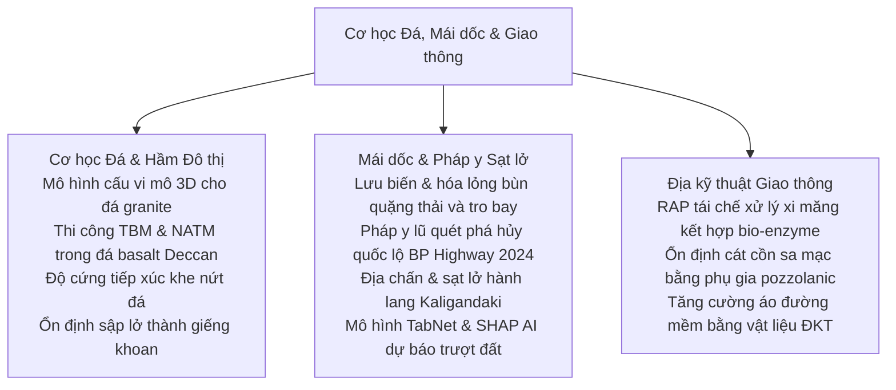
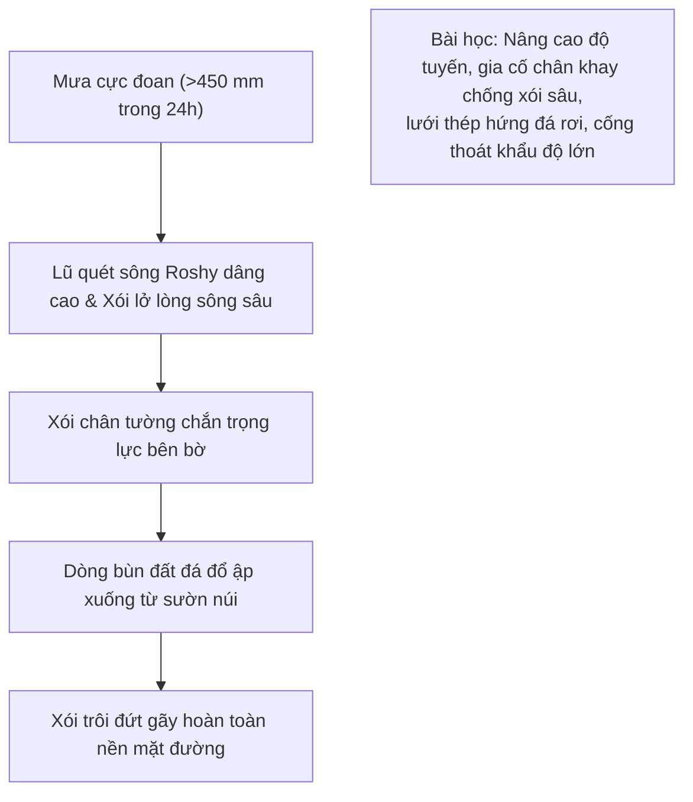

# Chương 6: Cơ học Đá, Mái dốc, Sạt lở & Địa kỹ thuật Giao thông

!!! info "Bối cảnh chuyên đề & Tài liệu nguồn"
    Chương này tổng hợp các bài báo khoa học thuộc **Phiên 7 (Thực hành, Rủi ro & Đào tạo)**, **Phiên 8 (Cơ học Đá & Kỹ thuật Thi công Hầm)**, **Phiên 9 (Ổn định Mái dốc & Sạt lở)**, và **Phiên 10 (Địa kỹ thuật Giao thông)** được trình bày tại GAIC 2025 và xuất bản trong *GeoVadis: The Future of Geotechnical Engineering (Volume 3)*, CRC Press / Taylor & Francis (2026), DOI: [10.1201/9781003645955](https://doi.org/10.1201/9781003645955).

---

## 1. Tóm tắt Tổng quan & Phạm vi Hạ tầng

Chương này tổng hợp các đột phá hạ tầng trọng điểm bao gồm công trình ngầm trong đá, hầm metro đô thị, tai biến trượt lở hiểm trở và mạng lưới giao thông thích ứng biến đổi khí hậu:

---

## 2. Cơ học Đá Nâng cao & Kỹ thuật Thi công Hầm

### 2.1 Mô hình Cấu vi mô 3D Ẩn cho Đá Granite (Naveen, Kumar, Gokulnath, Juneja)
K.J. Naveen, Ankesh Kumar, C. Gokulnath, và GS. Ashish Juneja phát triển mô hình đàn dẻo 3 chiều ẩn mô tả ứng xử tăng bền phi tuyến trước đỉnh và mềm hóa biến dạng sau đỉnh của đá granite kết tinh:

*   **Tiêu chuẩn Chảy & Quy tắc Dẻo:** Tích hợp góc giãn nở thể tích phụ thuộc ứng suất $\psi(\sigma_3, \varepsilon_p)$ và hàm thế dẻo không kết hợp $g$:

$$f(\boldsymbol{\sigma}, \kappa) = \sqrt{J_{2D}} - \alpha(\kappa) I_1 - k(\kappa) = 0$$

trong đó $I_1$ là bất biến thứ nhất của ứng suất, $J_{2D}$ là bất biến thứ hai của ten-xơ lệch, và $\kappa$ đại diện cho sự tiến triển hư hại dẻo.
*   **Kiểm chứng:** Tái hiện chính xác hiện tượng chuyển tiếp từ giòn sang dẻo trên số liệu thí nghiệm ba trục thực tế dưới áp lực buồng đến $150\text{ MPa}$.

### 2.2 Hiệu năng Máy Khiên đào TBM trong Đá Basalt Deccan Trap (Rao, Kulkarni, Kulkarni)
G.V. Rao, Uday Kulkarni, và Renu Kulkarni ghi nhận quá trình vận hành máy khiên đào TBM cân bằng áp lực đất (EPB) và TBM đá cứng qua khối đá basalt Deccan Trap không đồng nhất (đá xốp có lỗ khí, đá hạnh nhân và đá basalt đặc chắc có cường độ nén $UCS = 40 - 160\text{ MPa}$):

*   **Mòn Đĩa Cắt (Disc Cutters):** Hiện tượng mài mòn mạnh diễn ra tại ranh giới chuyển tiếp giữa đá basalt hạnh nhân mềm và đá đặc cứng, đòi hỏi phải sử dụng đĩa cắt gắn hợp kim tungsten carbide và giám sát mô-men xoắn đầu cắt thời gian thực.
*   **Tốc độ Đào ($ROP$):** Chỉ số đâm xuyên hiện trường $FPI = F_N / p$ dự báo chính xác tốc độ đào tiến gương ($ROP = 1.8 - 2.8\text{ m/h}$).

### 2.3 Thi công Hầm NATM Qua Đới Địa chất Nguy hiểm (Mehta, Kulkarni, Kulkarni)
Ameya Suhas Mehta và các tác giả phân tích thi công đào nổ theo Phương pháp Đào hầm Tân Áo (NATM) qua các đới đứt gãy kiến tạo và đá nứt nẻ dạng cột:

*   **Tối ưu Hệ Chống đỡ:** Ứng dụng ô dù ống thép khoan cắm tự khoan (forepoling), vì kèo thép dạng giàn và bê tông phun gia cường sợi thép (SFRS) khống chế độ hội tụ vòm hầm dưới $18\text{ mm}$.

### 2.4 Độ Cứng và Sức Kháng Cắt của Khe Nứt Đá (Kumar & Pandey)
Rajeev Kumar và Vinay Kumar Pandey hiệu chuẩn ứng xử giãn nở cắt phi tuyến và sức kháng cắt đỉnh bằng hệ số độ nhám khe nứt ($JRC$) và cường độ nén thành khe nứt ($JCS$) của Barton:

$$\tau = \sigma_n \tan \left[ JRC \log_{10}\left(\frac{JCS}{\sigma_n}\right) + \phi_b \right]$$

Thí nghiệm cắt phẳng mẫu lớn trên các khe nứt đá basalt tự nhiên xác nhận khi ứng suất pháp $\sigma_n > 0.3 JCS$, hiện tượng cắt đứt các gờ nhấp nhô chiếm ưu thế thay vì trượt giãn nở, làm giảm góc ma sát hiệu dụng.

---

## 3. Pháp y Ổn định Mái dốc & Cảnh báo Sớm Tai biến Trượt lở

### 3.1 Lưu biến Học & Dòng Chảy Hóa lỏng Bùn Thải Quặng và Tro Bay (Fatema, Bhatia, Palomino)
N. Fatema, S.K. Bhatia, và A.M. Palomino nghiên cứu sự cố hóa lỏng dòng chảy bùn quặng đuôi tuyển đồng và tro bay nhiệt điện:

*   **Hóa lỏng Tĩnh:** Bùn thải bão hòa bị xáo động nhỏ chuyển ngay sang trạng thái co ngót thể tích đột ngột, sụp đổ thành dòng lũ bùn tốc độ cao.
*   **Mô hình Lưu biến:** Dòng chảy tuân theo quy luật Herschel-Bulkley giả dẻo giảm độ nhớt khi tăng tốc độ cắt:

$$\tau = \tau_0 + k \dot{\gamma}^n \quad (n < 1.0)$$

Ứng suất chảy $\tau_0$ suy giảm hơn 90% khi hàm lượng hạt rắn chỉ giảm 6%, giải thích cự ly dòng chảy trôi xa hàng km khi đập thải quặng bị vỡ.

### 3.2 Thiết kế Đường Thích ứng Khí hậu: Bài học Pháp y Lũ Lụt BP Highway 2024 ở Nepal (KC Rajan, Subedi và cộng sự)
KC Rajan, Mandip Subedi, và nhóm nghiên cứu thực hiện đánh giá pháp y sau trận lũ quét lịch sử tháng 09/2024 tại Nepal cuốn trôi nhiều đoạn tuyến trên quốc lộ huyết mạch BP Highway:

*   **Khuyến nghị Thiết kế:** Nền đường ven sông đòi hỏi chân khay đá hộc sâu vượt qua chiều sâu xói lở dự kiến ($d_s > 3.5\text{ m}$) và lưới thép linh hoạt giảm năng lượng tại các phễu tụ thủy.

### 3.3 AI Diễn giải được trong Dự báo Sạt lở: TabNet & SHAP (Congress và cộng sự)
Surya Sarat Chandra Congress, Ambikesh Dwivedi, Raul Velasquez, Prince Kumar, và Ujwalkumar Patil ứng dụng mạng nơ-ron học sâu TabNet kết hợp phương pháp giải thích SHAP:

*   **Độ Chính xác Mô hình:** TabNet đạt chỉ số diện tích dưới đường cong ROC ($AUC = 0.94$), vượt trội so với Random Forest và SVM.
*   **Khả năng Diễn giải Vật lý SHAP:** Tách biệt rõ nét các trọng số chi phối bao gồm độ dốc sườn núi ($> 28^\circ$), chỉ số độ ẩm địa hình ($TWI$) và hệ số thấm của đất, giúp cơ quan quản lý hiểu rõ nguyên nhân gây trượt thay vì chấp nhận mô hình hộp đen.

### 3.4 Gia cố Sườn dốc Bằng Cọc Micro-pile Tại Thung lũng Jhyaple Khola (Neupane, Ghimire, Sharma)
Udaya Raj Neupane, Saurav Ghimire, và Jenish Sharma ghi nhận phương án xử lý sạt trượt khẩn cấp cung trượt Jhyaple Khola trên tuyến quốc lộ Nagdhungha-Naubise:

*   **Mạng lưới Chắn giữ:** Hai hàng cọc thép micro-pile khoan nhồi ($d = 200\text{ mm}$, dài $12\text{ m}$) liên kết bằng dầm mũ bê tông cốt thép liên tục đã tạo chốt chống cắt vững chắc, nâng hệ số an toàn mái dốc từ $0.92$ lên $1.48$.

---

## 4. Địa kỹ thuật Giao thông Hiện đại

### 4.1 Hỗn hợp Bê tông Nhựa Tái chế (RAP) Xử lý Bio-Enzyme và Xi măng (Mishra, Pydi, Guzzarlapudi)
Ashish Mishra, Rakesh Pydi, và S.D. Guzzarlapudi gia tăng độ bền cho lớp móng đường sử dụng 100% cốt liệu cào bóc tái chế (RAP):

*   **Tác động Bio-Enzyme:** Phụ gia Terrazyme kích hoạt trao đổi ion và trung hòa màng nhựa đường thụ động, giúp xi măng bám dính thủy hóa mạnh mẽ.
*   **Độ Bền Ngâm Nước:** Tổn thất khối lượng sau chu kỳ sấy - ngâm giảm từ 28% xuống dưới 6,5%, đáp ứng tiêu chuẩn AASHTO cho lớp móng đường cấp cao.

### 4.2 Ổn định Cát Cồn Sa mạc Bằng Phụ gia Pozzolan Bền vững (Shah & Kori)
M.V. Shah và Sandipkumar Kori gia cố cát cồn gió sa mạc:

*   **Hỗn hợp Chất kết dính:** Tro bay canxi cao và xỉ lò cao nghiền mịn được kích hoạt bằng vôi tôi.
*   **Cường độ Sau 7 và 28 Ngày:** Cường độ nén đơn đạt trên $2.4\text{ MPa}$, cho phép sử dụng trực tiếp cát cồn tại chỗ làm móng đường mà không phải vận chuyển đá dăm từ xa.

### 4.3 Tăng Cường Mặt Đường Bằng Vật liệu Địa kỹ thuật Dưới Tải Trọng Trùng Phục (Saride, Ram, Jain)
GS. Sireesh Saride, A.K. Ram, và S. Jain thực hiện thí nghiệm gia tải chu kỳ mặt đường quy mô lớn:

*   **Giảm Chiều Sâu Hằn Lún:** Lưới địa kỹ thuật tam giác (triaxial geogrid) đặt tại mặt phân cách móng - nền đất yếu đã giảm tới 52% độ sâu hằn lún vệt bánh xe sau 100.000 chu kỳ tải ($40\text{ kN}$).
*   **Hệ số Lợi ích Giao thông ($TBR$):**

$$TBR = \frac{N_{\text{reinforced}}}{N_{\text{unreinforced}}} = 2.4 - 3.8$$

khẳng định khả năng kéo dài tuổi thọ khai thác lên gấp hơn 2 đến 3 lần cho các tuyến đường cao tốc tải trọng nặng.
