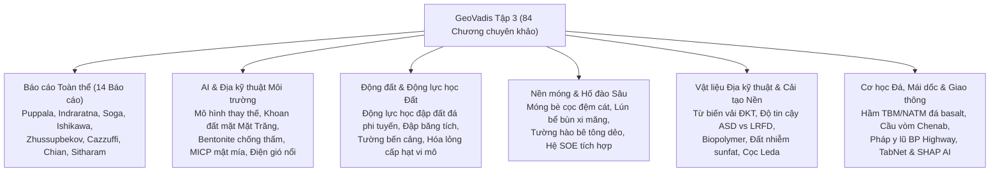

# GeoVadis: Tương lai của Kỹ thuật Địa kỹ thuật (Tập 3)

!!! info "Thông tin tài liệu & Giấy phép truy cập mở"
    Sổ tay tham khảo này cung cấp tài liệu kỹ thuật tổng hợp có cấu trúc từ ấn bản khoa học truy cập mở:  
    **GeoVadis: The Future of Geotechnical Engineering (Volume 3)**  
    *Kỷ yếu Hội nghị Quốc tế Địa kỹ thuật Châu Á lần thứ nhất (GAIC 2025), Goa, Ấn Độ.*  
    **Chủ biên:** Ashish Juneja, Anil Joseph, và Dasaka S. Murty.  
    **Nhà xuất bản:** CRC Press / Balkema, Tập đoàn Taylor & Francis, London & Boca Raton, 2026.  
    **Giấy phép:** [Creative Commons Ghi nhận công của tác giả - Phi thương mại - Không phái sinh (CC BY-NC-ND 4.0)](https://creativecommons.org/licenses/by-nc-nd/4.0/).  
    **DOI:** [10.1201/9781003645955](https://doi.org/10.1201/9781003645955) | **eBook ISBN:** 9781003645955 | **Hardback ISBN:** 9781041085546.

---

## Tổng quan và Phạm vi của Tập 3

Tiếp nối **Tập 1** (Báo cáo toàn thể, Cơ học tính toán, Môi trường/Vùng lạnh, Động lực học đất, Hố đào sâu, Vật liệu tổng hợp) và **Tập 2** (Cải tạo nền, Đánh giá rủi ro & Thí nghiệm hiện trường, Cơ học đá & Hầm ngầm, Mái dốc & Sạt lở, Địa kỹ thuật giao thông), **Tập 3** hoàn tất toàn bộ kỷ yếu GAIC 2025 với **84 bài báo khoa học và bài giảng toàn thể phản biện nghiêm ngặt**.

Tập 3 tổng hợp các tiến bộ đột phá trải rộng trên 19 chuyên đề kỹ thuật, nổi bật với 14 bài báo cáo toàn thể then chốt và 10 phiên chuyên đề chuyên sâu:

---

## Chi tiết xuất bản

| Hạng mục | Quy cách |
| --- | --- |
| **Tiêu đề gốc** | GeoVadis: The Future of Geotechnical Engineering (Volume 3) |
| **Chủ biên** | Ashish Juneja (IIT Bombay), Anil Joseph (Geostruct / IGS), Dasaka S. Murty (IIT Bombay) |
| **Hội nghị** | Kỷ yếu Hội nghị Quốc tế Địa kỹ thuật Châu Á lần thứ nhất (GAIC 2025), Goa, Ấn Độ |
| **Nhà xuất bản** | CRC Press / Balkema, Taylor & Francis Group |
| **Năm xuất bản** | 2026 |
| **DOI** | [10.1201/9781003645955](https://doi.org/10.1201/9781003645955) |
| **eBook ISBN** | 978-1-003-64595-5 |
| **Hardback ISBN** | 978-1-041-08554-6 |
| **Phương thức truy cập** | Truy cập Mở (Open Access) theo giấy phép CC BY-NC-ND 4.0 |

---

## Cấu trúc Sổ tay Tham khảo Tập 3

Sổ tay được biên soạn thành 6 chương kỹ thuật toàn diện, bao quát trọn vẹn 14 bài giảng toàn thể và 10 phiên chuyên đề:

| Chương | Tiêu đề chương | Nội dung kỹ thuật & Trọng tâm |
| :--- | :--- | :--- |
| **01** | [Báo cáo Toàn thể & Bài giảng Đầu ngành](chapter-01-plenary-lectures.md) | Vật liệu địa kỹ thuật địa nhiệt (Puppala); Tái chế phế thải làm nền đường sắt (Indraratna); Cơ học nở hông áp kế tự khoan trong sét cứng (Soga); Động lực học lũ bùn đá do mưa (Ishikawa); Móng cọc siêu công trình trên đất sập lở Kazakhstan (Zhussupbekov); Độ bền màng địa kỹ thuật trong đập (Cazzuffi); Địa chấn thăm dò trước gương hầm (Chian); Hóa lỏng dịch chuyển ngang động đất Noto 2024 (Hazarika); Hóa lỏng cát cấp vi mô (Latha); Động đất Nepal sau 10 năm Gorkha (Subedi); Đổi mới móng cọc & gia cố sườn đá cầu vòm Chenab (Sitharam). |
| **02** | [AI, Cơ học Địa kỹ thuật Tính toán & Môi trường](chapter-02-ai-computational-environmental.md) | Mô hình học máy thay thế tính sức chịu tải móng băng trên mái dốc; Cơ học lực khoan đất tầng mặt Mặt Trăng; Cơ hội và nút thắt của AI trong địa kỹ thuật; Neo đá chịu nhổ; Cường độ nén đơn UCS của hỗn hợp bentonite; Kiểm soát co ngót bentonite bằng bùn đỏ bauxite; Hạt nano giảm trương nở do kiềm; Vi sinh kết tủa canxit (MICP) bằng mật mía; Mô hình FEM trụ điện gió nổi ngoài khơi; Công nghệ chống thấm bãi chôn lấp. |
| **03** | [Kỹ thuật Địa chấn & Động lực học Đất](chapter-03-earthquake-soil-dynamics.md) | Phân tích động lực học phi tuyến đập đất đá vùng phân chia; Đánh giá nguy cơ hóa lỏng cấp hạt vi mô giản lược; Thiết kế kháng chấn theo hiệu năng cho tường bến cảng (so sánh tiêu chuẩn Ấn Độ và Nhật Bản); Ổn định địa chấn và nguy cơ vỡ đập băng tích (Hồ Imja, Nepal) dưới động đất Kobe và Chile; Hàm trở kháng động của móng tròn. |
| **04** | [Nền móng, Hố đào Sâu & Kết cấu Chắn giữ](chapter-04-foundations-deep-excavation.md) | Móng bè cọc đệm cát (móng bè cọc tách rời - DPRF); Giải pháp móng mố trụ cầu trong địa tầng phức tạp; Sức chịu nhổ của neo bản trong cát không bão hòa; Móng vòng có váy dưới tải trọng ngang động đất; Phân tích pháp y lún nghiêng bể bùn bê tông công nghiệp; Biến dạng của cọc lân cận hố đào sâu; Tường hào bê tông dẻo chống thấm; Ngưỡng lực dính tối thiểu neo đất; Hệ chống đỡ hố đào tích hợp (SOE); Tương tác hầm metro hiện hữu khi đào dỡ tải hố móng. |
| **05** | [Vật liệu Tổng hợp & Cải tạo Nền đất](chapter-05-geosynthetics-ground-improvement.md) | Hiện tượng từ biến của vải địa kỹ thuật dệt và không dệt; Phân tích độ tin cậy thiết kế tường chắn đất có cốt (MSE) theo ASD so với LRFD; Thí nghiệm kéo nhổ xác định hệ số MIF và LCR của lưới địa kỹ thuật hai trục; Kiểm soát trương nở khoáng ettringite trong đất nhiễm sunfat gia cố vôi; Cải thiện chỉ số CBR ngâm nước bằng sợi PP và lưới ĐKT; Cải tạo độ cứng sét nhạy cảm Leda; Khoan kích ngầm hầm nhỏ qua bùn sét mềm ven biển; Xỉ đồng và tro trấu trong hỗn hợp xi măng; Ổn định đất trương nở nhiễm sunfat bằng vôi và bột đá mỏ. |
| **06** | [Cơ học Đá, Mái dốc, Sạt lở & Địa kỹ thuật Giao thông](chapter-06-rock-slopes-transportation.md) | Neo đá chịu lực cao phục vụ thí nghiệm nén tĩnh cọc; Phương pháp Six Sigma trong thí nghiệm đất; Biopolymer keo guar gia cố mái dốc đường; Ứng xử động lực học hỗn hợp sét - cao su lốp phế thải; Tích hợp địa vật lý vào quy trình địa kỹ thuật; Tương quan SPT $(N_1)_{60}$; Giao diện GUI Extreme Learning Machine (ELM) phân tích rủi ro tường chắn; QA/QC khối đắp lớn bằng địa vật lý; Rủi ro diễn giải góc ma sát trong $\phi$ tầng Siwalik Nepal; Địa kỹ thuật đất carbonate ngoài khơi; Mô hình thể hiện cấu vi mô 3D cho đá granite; Biến dạng mặt đất do đào hầm; Thi công khiên đào TBM và đào hầm NATM trong đá basalt Deccan Trap; Độ cứng và sức kháng cắt khe nứt đá; Tính ổn định thành giếng khoan; Lưu biến học và hóa lỏng dòng chảy của bùn thải quặng và tro bay; Lập bản đồ nhạy cảm sạt lở bằng hồi quy logistic GIS; Bài học pháp y lũ quét phá hủy quốc lộ BP Highway 2024 ở Nepal; Tích hợp địa chấn & địa kỹ thuật hành lang Kaligandaki; Gia cố sườn dốc bằng cọc micro-pile tại thung lũng Jhyaple Khola; Mô hình TabNet và SHAP AI dự báo trượt lở; So sánh ổn định mái dốc LEM và FEM tại Chamoli; Vật liệu RAP tái chế xử lý xi măng kết hợp bio-enzyme; Ổn định cát cồn sa mạc bằng phụ gia pozzolanic; Tăng cường kết cấu mặt đường bằng vật liệu địa kỹ thuật dưới tải trọng trùng phục. |

---

## Chuẩn hóa Thuật ngữ Địa kỹ thuật

Tất cả các thuật ngữ địa kỹ thuật trong bản dịch tiếng Việt được đối chiếu và chuẩn hóa 1-đối-1 theo quy chuẩn:
- **Sister Bar** $\rightarrow$ *Thanh thép đo biến dạng phụ (Sister Bar)*
- **Piezometer** $\rightarrow$ *Áp kế*
- **Strain Gauge** $\rightarrow$ *Cảm biến đo biến dạng*
- **Inclinometer** $\rightarrow$ *Ống đo nghiêng*
- **Load Cell** $\rightarrow$ *Cảm biến đo tải trọng*
- **Earth Pressure Cell** $\rightarrow$ *Hộp đo áp lực đất*
- **Extensometer** $\rightarrow$ *Thiết bị đo biến dạng sâu*
- **Piled Raft Foundation** $\rightarrow$ *Móng bè cọc*
- **Disconnected Piled Raft Foundation** $\rightarrow$ *Móng bè cọc đệm cát (móng bè cọc tách rời)*
- **Soil-Cement Column / Deep Mixing** $\rightarrow$ *Cọc hỗn hợp xi măng - đất*
- **Plastic Concrete Cutoff Wall** $\rightarrow$ *Tường hào bê tông dẻo chống thấm*
- **Diaphragm Wall / Barrette** $\rightarrow$ *Tường vây barrette*
