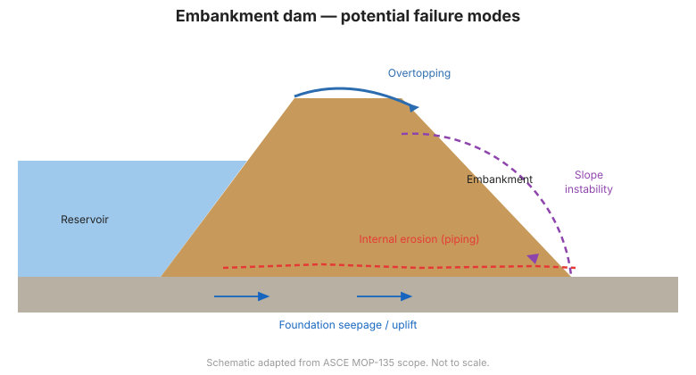

# Chương 2 — Hiệu năng Đập và Các Hình thức Hư hỏng Tiềm năng

## 2.1 Giám sát được tổ chức xoay quanh các hình thức hư hỏng

Các chương trình giám sát hiệu quả nhất được xây dựng **từ trên xuống, bắt nguồn
từ các hình thức hư hỏng tiềm năng (PFMs — potential failure modes)**, thay vì từ
dưới lên từ một danh sách thiết bị. Một *hình thức hư hỏng* là một cách đáng tin
cậy mà đập có thể hư hỏng, hoặc một điều kiện có thể dẫn đến hư hỏng. Một khi các
PFM đáng tin cậy đã được xác định, kỹ sư tự hỏi: *những phép đo nào sẽ bộc lộ sự
vận động hướng tới hình thức hư hỏng đó trước khi nó trở nên nguy hiểm?*

Đây là ý tưởng lập kế hoạch trung tâm, được triển khai trong [Chương 4](chapter-04-planning.md).

## 2.2 Tại sao đập hư hỏng

Hầu hết các vụ hư hỏng và sự cố đập bắt nguồn từ một tập hợp nhỏ các cơ chế vật lý:

| Cơ chế | Dấu hiệu điển hình | Các phép đo chính |
|-----------|------------------|---------------------|
| **Xói mòn trong (internal erosion) / ống dẫn (piping)** | Thấm mang theo đất, nước đục, hố sụt, đốm ướt | Lưu lượng & độ trong của thấm, mực nước piezometric, lún |
| **Tràn qua đỉnh (overtopping)** | Hồ chứa cao, không đủ miễn nhiễm sóng (freeboard) | Mực hồ, lượng mưa, dòng vào |
| **Trượt / mất ổn định mái** | Nứt, phình, chuyển động của mái | Khảo sát biến dạng, inclinometer, piezometer |
| **Hư hỏng nền móng** | Chuyển động hoặc thấm quá mức qua nền móng | Piezometer, biến dạng, thấm |
| **Sự cố bê tông/kết cấu** | Nứt, chuyển động của các monolith, rò rỉ tại khe | Crackmeter, joint meter, piezometer, khảo sát |
| **Thấm qua/dưới các công trình phụ trợ** | Các khu vực ướt gần đường ống dẫn, ống** | Thấm, piezometer gần các công trình |

!!! danger "Xói mòn trong là nguyên nhân hàng đầu"
    Một tỷ lệ lớn các vụ hư hỏng đập đất liên quan đến **xói mòn trong**
    (internal erosion) — sự vận chuyển dần dần các hạt đất bởi dòng thấm. Nó
    thường bắt đầu lặng lẽ và tăng tốc, nên việc phát hiện sớm thông qua giám sát
    thấm *và* áp lực lỗ rỗng là cực kỳ quan trọng.

## 2.3 Đập đất (embankment dams)

Đối với đập đất, những mối quan ngại chủ đạo là:

- **Xói mòn trong** qua thân đập, nền móng, hoặc tại giao diện với các đường ống dẫn và tường.
- **Trượt** mái thượng lưu hoặc hạ lưu, đặc biệt trong quá trình hạ mực nước nhanh
  hoặc đắp nhanh.
- **Thấm nền móng và piping**, đặc biệt qua các nền móng dễ xói mòn.
- **Hóa lỏng (liquefaction)** các nền móng hoặc thân đập không dính bão hòa dưới tải trọng động đất.
- **Tràn qua đỉnh** trong các trận lũ cực đoan.

Các dấu hiệu cảnh báo kinh điển — **hố sụt, mạch nước, thấm đục hoặc nhiều cặn,
lún không giải thích được, và nứt mái** — chính là những gì giám sát trực quan và
thiết bị quan trắc được triển khai để phát hiện sớm.

## 2.4 Đập bê tông và đá xây (masonry)

Đối với đập trọng lực bê tông, vòm và trụ chống, những mối quan ngại chuyển sang:

- **Nứt kết cấu** và chuyển động của các monolith.
- **Chuyển động nền móng** và áp lực đẩy lên (uplift pressure) bên dưới đáy đập.
- **Rò rỉ qua các khe, hầm, và màn phun vữa (grout curtain)**.
- **Lão hóa các công trình phụ trợ** (cửa xả, cống, đường ống dẫn).

Áp lực đẩy lên (uplift — áp lực lỗ rỗng bên dưới đáy đập) là một đại lượng thiết kế
và giám sát bậc nhất đối với đập trọng lực.

## 2.5 Giá trị của một đường cơ sở hiệu năng

Nhiều hình thức hư hỏng phát triển chậm. Những năm đầu vận hành thiết lập **đường
cơ sở** (baseline) — dải phản ứng bình thường trước các chu kỳ hồ chứa theo mùa và
nhiệt độ. Việc phát hiện độ lệch so với đường cơ sở đó dễ dàng hơn nhiều khi đường
cơ sở tồn tại ([Chương 11](chapter-11-data-management.md)).

## 2.6 Từ hình thức hư hỏng đến phép đo

Với mỗi PFM đáng tin cậy, kỹ sư xác định:

1. **Chỉ báo** (indicator — cái gì sẽ thay đổi, ví dụ: lưu lượng thấm, cột áp piezometric).
2. **Vị trí** nơi chỉ báo có nhiều thông tin nhất.
3. **Thiết bị** đo nó.
4. **Ngưỡng** (threshold) kích hoạt việc xem xét ([Chương 9](chapter-09-automated.md)).

Sự ánh xạ này là cầu nối từ Chương 2 đến Chương 4.

**Hình.** Các mode phá hoại tiềm ẩn của đập đắp: tràn qua đỉnh, xói mòn trong (piping), mất ổn định mái dốc và thấm qua nền (phạm vi ASCE MOP-135).

## 2.7 Các điểm chính cần nhớ

- Lập kế hoạch giám sát từ các hình thức hư hỏng đáng tin cậy, không phải từ một danh mục thiết bị.
- Xói mòn trong và mất ổn định mái chiếm ưu thế rủi ro đập đất.
- Áp lực đẩy lên và nứt kết cấu quan trọng nhất đối với đập bê tông.
- Thiết lập đường cơ sở sớm; độ lệch so với nó chính là tín hiệu.
