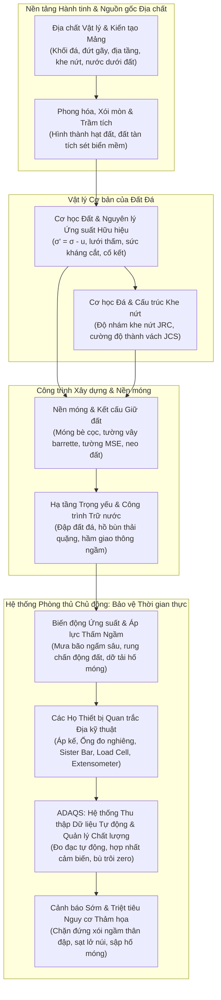
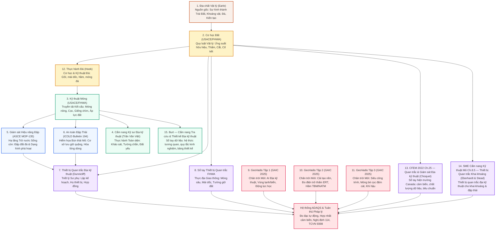
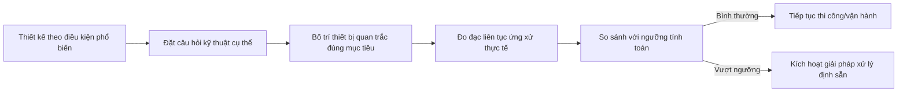
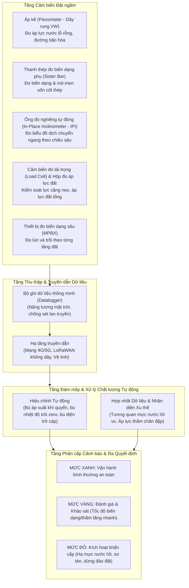
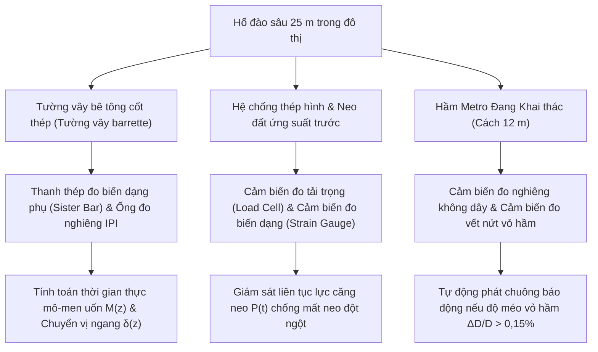
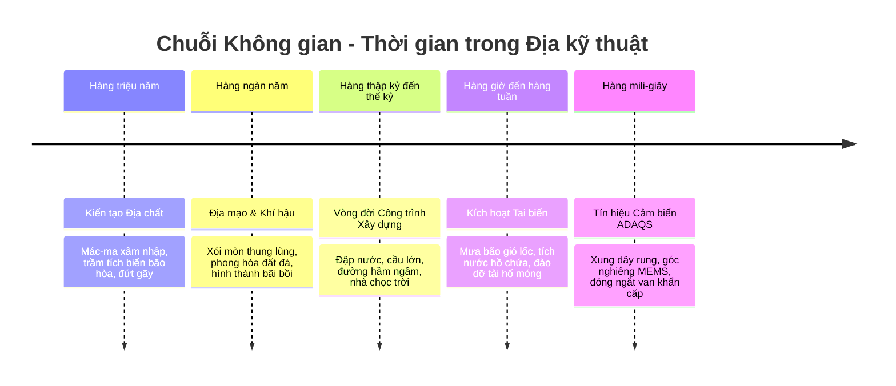

# Tầm nhìn Tổng thể: Từ Cấu trúc Trái đất đến Quan trắc Thời gian thực & Phòng ngừa Thảm họa

!!! info "Khung Tổng hợp Chiến lược & Nền tảng Kỹ thuật"
    Chương chuyên khảo tổng thể này liên kết và thống nhất toàn bộ kho tri thức địa kỹ thuật trên nền tảng—bao gồm **Địa chất Vật lý**, **Cơ học Đất**, **Kỹ thuật Móng**, **Thực hành Đá (Hoek)**, **An toàn Đập & Đập Thải**, **Thiết bị Quan trắc Nâng cao (Dunnicliff / FHWA)**, **CFEM 2022** và **Thiết bị Quan trắc Khai khoáng SME (Ch. 8.5)**, **Bảng tra cứu & Thiết kế của Burt**, cùng các tiến bộ mới nhất trong **GeoVadis (Tập 1–3)**. Tài liệu này kiến tạo tầm nhìn kỹ thuật toàn cảnh, kết nối từ tiến trình kiến tạo hàng triệu năm của vỏ Trái Đất đến từng xung tín hiệu cảm biến truyền theo thời gian thực (mili-giây), lý giải vì sao thiết bị quan trắc địa kỹ thuật và hệ thống **ADAQS** là chìa khóa then chốt để phòng chống thảm họa và bảo vệ sự bền vững trọn đời của các công trình hạ tầng quốc gia.

---

## 1. Tầm nhìn Toàn cảnh: Bức tranh Lớn Trước tiên

Các công trình kỹ thuật xây dựng không hề đặt trên những mặt phẳng toán học lý tưởng—chúng cắm rễ trực tiếp vào **lớp vỏ chuyển động không ngừng của Trái Đất**.

Mọi tòa nhà chọc trời, đập thủy điện khổng lồ, hầm metro xuyên đô thị, tuabin điện gió ngoài khơi hay hố đào sâu hàng chục mét đều tương tác trực tiếp với các địa tầng được kiến tạo qua hàng triệu năm biến đổi địa chất, đứt gãy kiến tạo, phong hóa, trầm tích và các chu kỳ biến đổi khí hậu:

### Nghịch lý Cốt lõi của Kỹ thuật Địa kỹ thuật
Khác với thép kết cấu hay bê tông cốt thép—những vật liệu nhân tạo được kiểm soát dung sai, giới hạn chảy và mô đun đàn hồi nghiêm ngặt trong nhà máy—**đất đá là vật liệu tự nhiên, dị hướng, mờ đục, phi tuyến và phụ thuộc sâu sắc vào lịch sử ứng suất**:

1. **Tính Bất khả tri (Invisibility):** Kỹ sư không thể bổ đôi lòng đất như một cỗ máy để nhìn thấu từng mét khối. Mạng lưới các lỗ khoan khảo sát chỉ lấy mẫu được chưa tới $0,001\%$ thể tích đất nền dưới công trình.
2. **Cơ học Tương hỗ Phi tuyến:** Sức chịu tải của đất không được quyết định bởi ứng suất tổng, mà chi phối bởi **nguyên lý ứng suất hữu hiệu** ($\sigma' = \sigma - u$). Một biến thiên nhỏ của áp lực nước lỗ rỗng $u$ có thể kéo ứng suất hữu hiệu $\sigma'$ về 0, biến nền đất vững chắc thành dòng bùn hóa lỏng mất hoàn toàn khả năng chịu lực.
3. **Phá hoại Tiến triển Ngầm:** Đất đá phá hoại tiến triển dọc theo các mặt trượt định hình ngầm hoặc các đường ống xói ngầm (piping) hoàn toàn không phát lộ dấu vết nào trên mặt đất cho tới khi xảy ra sụp đổ thảm khốc.

Thiết bị quan trắc địa kỹ thuật kết hợp hệ thống thu thập tự động (**ADAQS**) chính là **hệ thần kinh kỹ thuật số** biến những nguy cơ địa chất vô hình trở thành các đại lượng kỹ thuật có thể đo lường và kiểm soát được.

---

## 2. Dòng chảy Tri thức: Mối Liên kết Hữu cơ Giữa Các Bộ Sách

Mỗi bộ tài liệu tham khảo trong cơ sở tri thức này đóng vai trò như một tầng nền tảng trong kim tự tháp kỹ thuật địa kỹ thuật toàn diện:

### Tiến trình Khái niệm:
1. **Khởi nguyên Địa tầng (*Địa chất Vật lý*):** Giúp người kỹ sư thấu hiểu cách thức các khối đá basalt mác-ma, đới dập vỡ đứt gãy, trầm tích sét hồ bão hòa và sông băng đã tạo dựng nên môi trường đất đá ngầm và cơ chế thủy văn.
2. **Quy luật Cơ học (*Cơ học Đất* & *Thực hành Đá*):** Chuyển hóa các cấu trúc địa chất thành các phương trình cơ học: cấp phối hạt, giới hạn Atterberg, hệ số thấm $k$, chỉ số nén $C_c$, sức kháng cắt không thoát nước $s_u$, và ten-xơ ứng suất hữu hiệu. *Thực hành Đá (Hoek)* mở rộng nguyên lý này sang **cơ học đá** — GSI, cắt mặt bất liên tục, ứng suất nguyên sinh, và triết lý thiết kế chấp nhận được cho mái dốc đá, hầm và móng đá.
3. **Truyền lực Nền móng (*Kỹ thuật Móng*, *Cẩm nang Trần Văn Việt* & *Burt*):** Hướng dẫn tính toán phân bố tải trọng siêu công trình xuống tầng đất đỡ thông qua móng đơn, móng băng, móng bè cọc, cọc khoan nhồi, tường vây barrette và tường đất có cốt (MSE). *Cẩm nang Tra cứu & Thiết kế Địa kỹ thuật của Burt* cung cấp **các hệ thức tương quan và bảng thiết kế** (SPT → cường độ, CPT → loại đất, RQD → sức chịu tải đá, PI → mô đun) để biến lý thuyết thành những con số sẵn sàng nhập bảng tính.
4. **Hạ tầng Rủi ro Cực đại (*An toàn Đập & Đập Thải*):** Làm rõ các cơ chế phá hoại thảm khốc: xói ngầm thân đập, bục đáy do áp lực ngược, mất ổn định trượt mái đập khi rút nước nhanh, và hóa lỏng dòng chảy của bùn quặng thải.
5. **Triết lý Chẩn đoán (*Dunnicliff, FHWA, CFEM 2022* & *Thiết bị Quan trắc Khai khoáng SME*):** Đưa ra **Phương pháp Quan sát (Observational Method)** của Ralph B. Peck, dạy kỹ sư cách đặt câu hỏi địa kỹ thuật cụ thể để lựa chọn đúng chủng loại cảm biến đo đạc — được mở rộng bởi sổ tay hiện trường **CFEM 2022 Ch.25** (Canada) về quan trắc & giám sát và chương **SME Cẩm nang Kỹ thuật Mỏ Ch.8.5** về thiết bị quan trắc địa kỹ thuật cho khai khoáng và đập thải.
6. **Công nghệ Tiên phong (*GeoVadis Tập 1, 2, 3*):** Mở rộng tầm nhìn sang mô hình học máy thay thế (surrogate models), mạng nơ-ron thông tin vật lý (PINNs), vật liệu sinh học biopolymer, kết tủa canxit vi sinh (MICP), thăm dò địa chấn trước gương hầm, và thiết kế đường thích ứng biến đổi khí hậu.
7. **Trung tâm Điều hành Thời gian thực (*ADAQS & Khung Pháp lý*):** Kết nối cảm biến ngầm với mạng lưới đo đạc tự động, máy chủ đám mây, bộ lọc dữ liệu thông minh và đối chiếu với tiêu chuẩn pháp luật (Nghị định 114/2018/NĐ-CP và TCVN 9398:2012).

---

## 3. Vì sao Quan trắc là Huyết mạch Phòng ngừa Thảm họa

### 3.1 Sự Giới hạn của Các Mô hình Tính toán
Các phép tính giải tích hay mô hình số phần tử hữu hạn (2D/3D FEM) dù hiện đại đến đâu cũng chỉ là **giả định lý thuyết**. Chúng dựa trên các mẫu đất cục bộ và các hàm toán học lý tưởng hóa (Mohr-Coulomb, Cam-Clay, Hardening Soil), không thể bao quát hết các dị thường địa chất ngầm:
- Các thấu kính sét mềm hữu cơ bị bỏ sót giữa hai hố khoan.
- Các tầng ngậm nước có áp nằm kẹp giữa các lớp sét không thấm.
- Các khe nứt trơn nhẵn có phương thuận lợi gây trượt nêm trong khối đá.
- Hiện tượng rửa trôi hạt mịn tạo thành hang hốc rỗng ngầm (piping) trong tim đập.

### 3.2 Phương pháp Quan sát: Quản lý Rủi ro Chủ động
Phương pháp Quan sát (Peck, 1969) không bắt buộc kỹ sư phải thiết kế công trình với hệ số an toàn khổng lồ lãng phí kinh phí để đối phó với mọi tình huống bất lợi hiếm gặp. Thay vào đó:
1. Thiết kế theo điều kiện địa chất có xác suất xảy ra cao nhất.
2. Nhận diện các kịch bản bất lợi nguy hiểm nhất có thể xảy ra.
3. Đặt ra câu hỏi kỹ thuật trọng tâm (ví dụ: *"Áp lực nước lỗ rỗng trong lõi đập có tiêu tán kịp tiến độ đắp đất hay không?"*).
4. Lắp đặt đúng hệ thống thiết bị quan trắc để theo dõi thông số cốt lõi đó.
5. Lập sẵn kế hoạch hành động ứng phó tương ứng với từng ngưỡng giá trị đo được.

### 3.3 Thảm họa Không Bao giờ Xảy ra Đột ngột mà Không Có Dấu vết Ngầm
Một con đập không bao giờ vỡ mà không xuất hiện dòng thấm bất thường trước đó hàng tuần. Một sườn núi không bao giờ sạt lở mà không có hiện tượng gia tăng tốc độ dịch chuyển cắt ngầm. Một hố đào sâu đô thị không bao giờ sụp đổ mà không có sự phình ngang của tường vây và sụt giảm lực căng của neo đất.

Tất cả những tiền triệu chứng này **hoàn toàn vô hình đối với mắt thường**. Khi vết nứt xuất hiện trên đỉnh đập hay mặt đường nhựa bị lún sụt thì thảm họa sụp đổ chỉ còn tính bằng phút. Thiết bị quan trắc phát hiện những dấu hiệu này từ trước đó hàng tuần, hàng tháng, giúp biến một thảm họa tiềm tàng thành một đợt can thiệp bảo trì định kỳ.

---

## 4. Vai trò Đột phá của Hệ thống ADAQS: Hệ Thần kinh Tự động

Phương pháp đo thủ công truyền thống (kỹ thuật viên cầm máy đo định kỳ mỗi tuần hoặc mỗi tháng) bộc lộ những nhược điểm chí mạng:
*   **Vùng mù thời gian:** Tai biến thường xảy ra vào thời điểm mưa bão cực đoan, lũ quét, tích nước khẩn cấp—chính là lúc con người không thể tiếp cận hiện trường để đo thủ công.
*   **Sai số thao tác:** Lỗi thị giác, xoắn cáp, ghi nhầm số liệu và chậm trễ báo cáo khiến cơ hội ngăn chặn sự cố bị bỏ lỡ.
*   **Thiếu khả năng phân tích gia tốc:** Sự cố sụp đổ công trình không phụ thuộc vào độ dịch chuyển tuyệt đối, mà quyết định bởi **gia tốc chuyển vị** ($\frac{d^2\delta}{dt^2}$). Đo thủ công hàng tháng hoàn toàn bỏ qua các đợt tăng tốc chuyển vị đột biến.

### Kiến trúc Hệ thống ADAQS:
Hệ thống **ADAQS (Automated Data Acquisition & Quality System)** tự động hóa toàn diện quy trình quan trắc:

---

## 5. Ứng dụng Bảo vệ Các Công trình Hạ tầng Trọng yếu

### 5.1 Giám sát An toàn Đập Nước & Đập Thải Quặng Mỏ
Đập thủy điện và hồ bùn thải quặng giữ hàng triệu mét khối nước và chất thải độc hại lơ lửng phía trên các đô thị hạ du:

| Chế độ Phá hoại Nguy hiểm | Cơ chế Vật lý Gốc rễ | Chủng loại Thiết bị Cốt lõi | Vai trò của ADAQS & Phòng ngừa Thảm họa |
| :--- | :--- | :--- | :--- |
| **Xói ngầm & Tạo phễu ngầm (Piping)** | Vận tốc thấm vượt gradient tới hạn, cuốn trôi hạt mịn từ lõi sét. | **Áp kế (Piezometers)** & Đập đo lưu lượng thấm đáy | Phát hiện sự dâng cao bất thường của cột áp thủy lực và độ đục của nước thấm trước khi đất bị sập rỗng. |
| **Mất ổn định Mái dốc (Rút nước nhanh)** | Nước hồ rút đột ngột nhưng áp lực nước trong thân đập chưa kịp tiêu tán. | **Áp kế (Piezometers)** & **Ống đo nghiêng (Inclinometers)** | Khống chế tốc độ hạ mực nước hồ để đảm bảo tỷ số áp lực nước lỗ rỗng duy trì $r_u \le 0,35$. |
| **Hóa lỏng Tĩnh & Động đập thải** | Bùn quặng bão hòa bị nén đột ngột biến thành chất lỏng mất sạch sức kháng cắt. | **Áp kế (Piezometers)** & Cảm biến gia tốc địa chấn | Phát hiện tích lũy áp lực nước thặng dư $r_u > 0,8$, kích hoạt khẩn cấp hệ thống bơm hạ thấp đường bão hòa. |
| **Lún Lệch & Nứt gãy Thân đập** | Chênh lệch lún giữa đáy thung lũng và bờ vai đập gây nứt ngang thân đập. | **Thiết bị đo biến dạng sâu (Extensometers)** | Đo đạc biến dạng kéo dọc trục thân đập, ngăn chặn nguy cơ bục nước do nứt thủy lực (hydraulic fracturing). |

### 5.2 Hố Đào Sâu Đô thị & Nền móng Siêu Công trình
Thi công hố đào sâu 20 đến 35 mét ngay sát vách các tòa nhà di sản, hệ thống hạ tầng ngầm và tuyến metro đang khai thác:

*   **Thanh thép đo biến dạng phụ (Sister Bar):** Được buộc song song với cốt thép chủ trong lồng thép tường vây barrette để tính toán mô-men uốn thực tế $M(z) = \frac{E \cdot I \cdot \varepsilon(z)}{y}$, cảnh báo từ sớm nếu mặt cắt bê tông tiến gần đến giới hạn chảy dẻo.
*   **Áp kế (Piezometer):** Giám sát mực nước ngầm phía ngoài tường chắn để đảm bảo việc bơm hạ nước ngầm bên trong hố móng không làm tụt mực nước ngầm khu vực xung quanh, ngăn ngừa thảm họa lún võng mặt đường và nứt sập nhà dân lân cận.

### 5.3 Địa kỹ thuật Khai khoáng & Thiết bị Quan trắc Đập Thải
Khai khoáng lộ thiên và bán lộ thiên đẩy cùng một nguyên lý vật lý vào những hình học cực đoan nhất — tường mỏ cao hàng trăm mét và đập thải đắp trên nền mềm, bão hòa, đôi khi đang tan băng:

*   **SME Cẩm nang Kỹ thuật Mỏ (Ch. 8.5):** Đặt khung thiết bị quan trắc địa kỹ thuật chuyên cho vòng đời khai khoáng — chuyển vị tường mỏ, rung chấn nổ mìn và giám sát công trình bùn thải — mở rộng triết lý Dunnicliff/FHWA sang lĩnh vực khai thác.
*   **Thực hành Đá (Hoek):** Cung cấp xương sống thiết kế mái dốc đá và hầm quy mô lớn (GSI, phân tích động lực học, hệ số an toàn chấp nhận được) đứng sau những tường mỏ ổn định.
*   **Nghiên cứu tình huống — Đập trong hố móng bùn thải, mỏ Muskeg River (2013):** Một nghiên cứu tình huống đã công bố cho thấy dữ liệu quan trắc (áp kế, ống đo nghiêng, thiết bị đo lún) được dùng để kiểm chứng các đợt đắp nâng đập thải trong hố móng so với chuyển vị dự báo của thiết kế — Phương pháp Quan sát trong bối cảnh khai khoáng. Xem các trang ứng dụng [Địa kỹ thuật Khai khoáng](../applications/mining/index.md).

---

## 6. Tổng kết: Từ Thời gian Địa chất Đến Mili-giây Dữ liệu

Kỹ thuật địa kỹ thuật là cây cầu kết nối giữa hai thái cực không gian và thời gian:

Không có **Địa chất**, kỹ sư không thể hiểu được nguồn gốc và thế nằm của địa tầng.  
Không có **Cơ học Đất**, kỹ sư không thể định lượng được trạng thái ứng suất và dòng thấm.  
Không có **Kỹ thuật Móng**, công trình không thể đứng vững trên nền đất.  
Không có **Thiết bị Quan trắc và Hệ thống ADAQS**, kỹ sư sẽ hoàn toàn mù quáng trước những biến đổi ngầm, đẩy công trình vào nguy cơ thảm họa.

Sự gắn kết hữu cơ của toàn bộ 15 bộ tài liệu trong cơ sở tri thức này biến kỹ thuật địa kỹ thuật từ một bộ môn đầy bất định thành một **khoa học dự báo, định lượng và chủ động bảo vệ tính mạng con người**.
