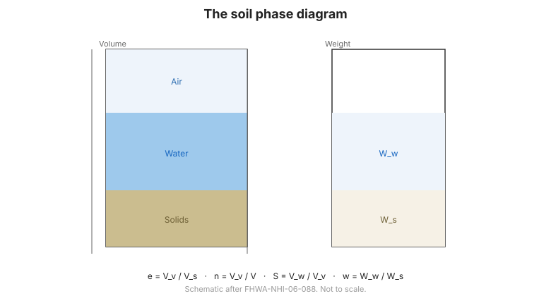

# Chương 2 — Thành phần & Chỉ tiêu cơ lý

## 2.1 Sơ đồ ba pha

Đất được mô tả bằng **sơ đồ ba pha**, tách thể tích thành hạt rắn, nước và không khí. Các
tỷ số thể tích then chốt:

- **Hệ số rỗng** $e = V_v / V_s$ — thể tích lỗ rỗng trên một đơn vị thể tích hạt rắn.
- **Độ rỗng** $n = V_v / V$ — phần thể tích là lỗ rỗng.
- **Độ bão hòa** $S = V_w / V_v$ — phần lỗ rỗng chứa nước.

**Hình.** Sơ đồ ba pha của đất: thể tích và trọng lượng hạt rắn, nước và không khí, cùng quan hệ giữa hệ số rỗng, độ rỗng và độ bão hòa (theo FHWA-NHI-06-088).

## 2.2 Dung trọng và độ ẩm

- **Độ ẩm** $w = W_w / W_s$ — khối lượng nước trên một đơn vị khối lượng hạt rắn.
- **Dung trọng tự nhiên** $\gamma$ — tổng trọng lượng trên một đơn vị thể tích.
- **Dung trọng khô** $\gamma_d = \gamma / (1 + w)$ — trọng lượng hạt rắn trên đơn vị thể
  tích; thông số kiểm soát đầm chặt then chốt.
- **Dung trọng bão hòa** $\gamma_{sat}$ — khi mọi lỗ rỗng chứa nước.
- **Dung trọng đẩy nổi** $\gamma' = \gamma_{sat} - \gamma_w$.

## 2.3 Phân bố cỡ hạt

**Phân tích rây** (đất hạt thô) và **phân tích tỷ trọng kế** (hạt mịn) cho **đường cong
cấp phối**. Từ đó:

- **$D_{10}$, $D_{30}$, $D_{60}$** — cỡ hạt mà 10%, 30% và 60% lọt qua.
- **Hệ số đồng đều** $C_u = D_{60}/D_{10}$ — mức độ cấp phối tốt.
- **Hệ số cong** $C_c$ — hình dạng đường cong.

Đất **cấp phối tốt** (dải cỡ hạt rộng) đầm chặt đặc hơn và thoát nước tốt hơn đất **cấp
phối đều**.

## 2.4 Giới hạn Atterberg và độ sệt

Với đất hạt mịn, **giới hạn Atterberg** xác định các độ ẩm mà tại đó đất đổi độ sệt:

- **Giới hạn chảy (LL)** — từ dẻo sang lỏng.
- **Giới hạn dẻo (PL)** — từ nửa cứng sang dẻo.
- **Chỉ số dẻo** $PI = LL - PL$ — dải độ ẩm mà đất ở trạng thái dẻo.

$PI$ cao cho thấy **sét dẻo, nén được**; $PI$ thấp cho thấy **bụi hoặc đất ít dẻo**. Các
giới hạn được dùng trực tiếp trong phân loại ([Chương 3](chapter-03-classification.md)).

## 2.5 Các điểm then chốt cần ghi nhớ

- **Sơ đồ ba pha** liên hệ lỗ rỗng, nước và hạt rắn; $e$, $n$ và $S$ mô tả cách sắp xếp.
- **Dung trọng khô** là thông số đầm chặt then chốt.
- **Cấp phối** ($C_u$, $C_c$) cho biết đất hạt thô cấp phối tốt và thoát nước ra sao.
- **Giới hạn Atterberg** ($LL$, $PL$, $PI$) mô tả tính dẻo của hạt mịn.
- Chỉ tiêu cơ lý rẻ, nhanh và **tương quan mạnh** với ứng xử kỹ thuật.
