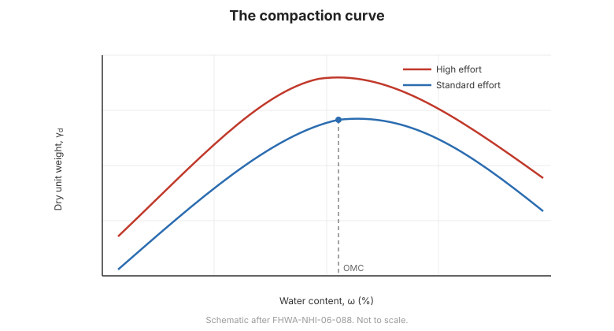

# Chương 4 — Đầm chặt

## 4.1 Đầm chặt là gì

**Đầm chặt** là làm đặc đất bằng cách loại bỏ lỗ rỗng khí nhờ nỗ lực cơ học — lu, đầm
hoặc rung. Nó **tăng dung trọng khô**, cùng với đó là **tăng cường độ và độ cứng**, đồng
thời **giảm tính thấm và tính nén**. Nó không loại bỏ nước, nên đầm chặt và cố kết là hai
quá trình khác nhau.

## 4.2 Quan hệ ẩm–dung trọng

Với một nỗ lực đầm chặt cho trước, tồn tại một **độ ẩm tối ưu** $w_{opt}$ mà tại đó đất
đạt **dung trọng khô lớn nhất** $\gamma_{d,max}$:

- **Khô hơn tối ưu** — đất cứng, khó đầm; hạt chống lại sự sắp xếp lại.
- **Ướt hơn tối ưu** — nước bôi trơn hạt nhưng chiếm lỗ rỗng; dung trọng lại giảm.

**Đường cong đầm chặt** (dung trọng khô theo độ ẩm) là cơ sở kiểm soát hiện trường.

**Hình.** Đường cong đầm chặt: dung trọng khô đạt cực đại tại độ ẩm tối ưu; nỗ lực đầm chặt cao hơn nâng đường cong lên (theo FHWA-NHI-06-088).

## 4.3 Proctor tiêu chuẩn và cải tiến

Hai nỗ lực phòng thí nghiệm chuẩn được dùng:

- **Proctor tiêu chuẩn** — năng lượng thấp hơn; dùng cho hầu hết nền đắp.
- **Proctor cải tiến** — năng lượng cao hơn (búa nặng hơn, chiều cao rơi lớn hơn); dùng
  cho nền đắp chịu tải nặng, sân bay và mặt đường.

Năng lượng cao hơn cho **dung trọng khô lớn nhất cao hơn** và **độ ẩm tối ưu thấp hơn**.

## 4.4 Kiểm soát hiện trường

Đầm chặt hiện trường được kiểm soát bằng cách quy định **phần trăm dung trọng khô lớn
nhất** (ví dụ 95% Proctor tiêu chuẩn) và một **dải độ ẩm** quanh tối ưu. Kiểm chứng dùng:

- **Thí nghiệm dung trọng hiện trường** — nón cát, bóng bay hoặc thiết bị hạt nhân; và
- **Độ ẩm** — tủ sấy, speedy hoặc hạt nhân.

## 4.5 Đầm chặt, cấu trúc và ứng xử

Đầm chặt không chỉ là dung trọng:

- **Đầm khô hơn tối ưu** — cấu trúc tạo bông (flocculated), thấm và độ cứng cao hơn,
  cường độ ở biến dạng lớn thấp hơn.
- **Đầm ướt hơn tối ưu** — cấu trúc phân tán, thấm thấp hơn, cường độ cao hơn nhưng tiềm
  năng co ngót lớn hơn.
- **Phương pháp** (nhào trộn so với tĩnh) cũng thay đổi cấu trúc.

Điều này quan trọng với sét dùng làm **lớp lót** hoặc **màng chắn**, nơi tính thấm chứ
không phải dung trọng chi phối thiết kế.

## 4.6 Các điểm then chốt cần ghi nhớ

- Đầm chặt loại bỏ **khí**, tăng dung trọng khô, cường độ và độ cứng, giảm thấm và nén.
- Tồn tại một **độ ẩm tối ưu** cho dung trọng khô lớn nhất.
- **Proctor tiêu chuẩn** và **cải tiến** khác nhau về năng lượng.
- Kiểm soát hiện trường quy định **phần trăm đầm chặt và dải độ ẩm**.
- **Cấu trúc** (khô so với ướt hơn tối ưu) ảnh hưởng thấm và cường độ.
